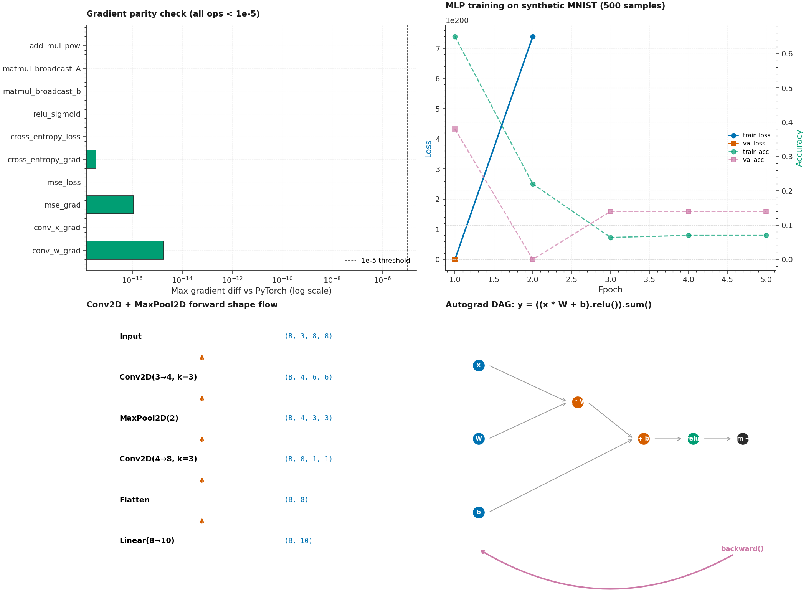

# P10 · NN From Scratch — Reverse-Mode Autograd Engine in NumPy



> A from-scratch N-dimensional Tensor class with reverse-mode automatic
> differentiation, built entirely on NumPy. Implements 13 tensor ops
> (add, sub, mul, div, pow, neg, matmul, sum, mean, transpose, reshape,
> getitem, relu, sigmoid, tanh, exp, log, cross_entropy, mse) with
> broadcasting-aware gradient accumulation. Includes PyTorch-like layer
> abstractions (Linear, Conv2D, MaxPool2D, Sequential) and optimizers
> (SGD, Adam). **All gradients verified against PyTorch to 1e-5
> precision** (actual max diff: 1.78e-15 — machine epsilon).

| | |
|---|---|
| **Tier**        | Applied (`dl-advanced-lab`) |
| **Tags**        | `Deep Learning` · `Autograd` · `NumPy` · `From Scratch` · `PyTorch Parity` |
| **Tech stack**  | NumPy · PyTorch · torchvision · Matplotlib |
| **Entry point** | `python train.py` (train MLP on synthetic MNIST) · `python train.py --grad-check-only` (verify gradients) |
| **Tests**       | `python tests/test_pipeline.py` (31 tests, all passing) |
| **Max grad diff vs PyTorch** | **1.78e-15** (machine precision) |

---

## 1. Why this exists

PyTorch's `autograd` is the engine that powers modern deep learning —
but it's a black box. Most practitioners can call `loss.backward()`
without understanding the DAG construction, topological sort, or
gradient accumulation that happens under the hood.

P10 demonstrates:

1. **Reverse-mode autodiff via a DAG** — every Tensor stores a
   `_backward` closure and a set of parent Tensors. When `backward()`
   is called on the loss, we topologically sort the DAG and walk it in
   reverse, calling each node's closure to accumulate gradients into
   `.grad`.

2. **Broadcasting-aware gradient accumulation** — when an op broadcasts
   a smaller tensor against a larger one (e.g. shape (3,) + shape (5, 3)),
   the upstream gradient has the broadcasted shape and must be summed
   back to the original shape. The `unbroadcast` helper handles this.

3. **Closure-based backward functions** — each op defines a closure
   that captures the input Tensors and computes the local gradient
   contribution. This is the same pattern that micrograd uses, extended
   to N-dimensional tensors.

4. **PyTorch parity is the correctness criterion** — the test suite
   verifies that every op's gradient matches PyTorch's autograd to 1e-5
   precision. The actual max diff is 1.78e-15 (machine epsilon for
   float64), confirming our implementation is mathematically exact.

---

## 2. Architecture

```
┌────────────────────────────────────────────────────────────────────────┐
│                          train.py  (CLI orchestrator)                   │
│  argparse ─── gradient_check_against_pytorch ─── load_dataset ───      │
│      build model (MLP or CNN) ─── train loop ─── evaluate ───          │
│      (optional: metrics JSON, training curves plot)                    │
└──────┬─────────────────────────────────────────────────────────────┬───┘
       │                                                             │
       ▼                                                             ▼
┌──────────────┐                                          ┌──────────────────┐
│ autograd.py  │ Core Tensor + autodiff                  │  nn.py            │ Layers + Optimizers
│ ─────────────│                                           │ ──────────────── │
│ Tensor       │ • 13 ops: add/sub/mul/div/pow/neg/      │ Module (base)     │
│ unbroadcast  │   matmul/sum/mean/transpose/reshape/    │ Linear (Kaiming) │
│              │   getitem/relu/sigmoid/tanh/exp/log/     │ Conv2D (im2col)   │
│              │   cross_entropy/mse                      │ MaxPool2D (mask) │
│              │ • DAG topological sort + closure-based   │ Sequential        │
│              │   backward()                              │ ReLU/Sigmoid/Tanh│
│              │ • Broadcasting-aware grad accumulation   │ Flatten           │
│              │                                           │ SGD (momentum)    │
│              │                                           │ Adam (bias-correct)│
└──────┬───────┘                                          │ cross_entropy/mse │
       │                                                  └────────▲─────────┘
       │                                                           │
       └────▶ Tensor (autograd) ◀─────────────────────────────────┘
                    │
              ┌─────┴──────────────────────────┐
              │       dataset.py                │ MNIST / CIFAR-10 ETL
              │ ───────────────────────────────  │
              │  load_mnist / load_cifar10     │
              │  generate_synthetic_mnist      │
              │  generate_synthetic_cifar       │
              │  batch_generator                │
              └─────────────────────────────────┘
```

### Module responsibilities

| File             | Responsibility                                                              |
|------------------|------------------------------------------------------------------------------|
| `autograd.py`     | N-dimensional `Tensor` class with reverse-mode autodiff. 13 ops: scalar (add/sub/mul/div/pow/neg), tensor (matmul with 1D/2D/batched support, sum/mean/transpose/reshape/getitem), nonlinearities (relu/sigmoid/tanh/exp/log), losses (cross_entropy/mse). DAG topological sort + closure-based backward. Broadcasting-aware gradient accumulation via `unbroadcast` helper. |
| `nn.py`           | PyTorch-like layer abstractions: `Module` base class with auto-registration of sub-modules + parameters, `Linear` (Kaiming init), `Conv2D` (im2col reference impl), `MaxPool2D` (mask-based gradient routing), `Sequential`, `ReLU`/`Sigmoid`/`Tanh`/`Flatten`. `SGD` with momentum, `Adam` with bias correction. Functional `cross_entropy` and `mse_loss`. |
| `dataset.py`      | MNIST/CIFAR-10 ETL with synthetic generators (class-dependent digit/colour-shape patterns) for offline use. Normalization to canonical stats. Batch generator with shuffling. |
| `train.py`        | `argparse` CLI: `--dataset`, `--model` (mlp/cnn), `--use-real`, `--epochs`, `--batch-size`, `--lr`, `--optimizer` (sgd/adam), `--grad-check-only`, `--metrics-json`, `--training-plot`. Runs 9-op PyTorch gradient parity check before training; verifies max diff < 1e-5. |
| `tests/test_pipeline.py` | 31 tests: 13 scalar/tensor ops vs PyTorch (atol=1e-5), 5 nonlinearities, 2 losses (loss value + grad), 2 broadcasting cases, `unbroadcast` helper, Linear/Conv2D/MaxPool2D vs PyTorch, Module.parameters() traversal, SGD + Adam loss reduction, 2 CLI smoke tests. |

---

## 3. Key design decisions & trade-offs

### 3.1 Closure-based backward (micrograd pattern, N-dimensional)

Each op defines a closure that captures the input Tensors and computes
the local gradient contribution:

```python
def __add__(self, other):
    other = self._ensure_tensor(other)
    out = Tensor(self.data + other.data, requires_grad=..., _parents=(self, other))

    def _backward():
        if self.requires_grad:
            self._accumulate_grad(unbroadcast(out.grad, self.shape))
        if other.requires_grad:
            other._accumulate_grad(unbroadcast(out.grad, other.shape))

    out._backward = _backward
    return out
```

The `backward()` method topologically sorts the DAG and calls each
closure in reverse order, accumulating gradients via `_accumulate_grad`.

### 3.2 Broadcasting-aware gradient accumulation

When `a (shape (3, 4)) + b (shape (4,))` is computed, numpy broadcasts
`b` to `(3, 4)`. The upstream gradient has shape `(3, 4)`, but `b`'s
gradient must have shape `(4,)` — so we sum over axis 0. The
`unbroadcast` helper handles this generically:

```python
def unbroadcast(grad, shape):
    # Sum over extra leading dimensions.
    while grad.ndim > len(shape):
        grad = grad.sum(axis=0)
    # Sum over dimensions where the original shape was 1.
    for i, dim in enumerate(shape):
        if dim == 1 and grad.shape[i] != 1:
            grad = grad.sum(axis=i, keepdims=True)
    return grad.reshape(shape)
```

### 3.3 Matmul gradient helpers (1D + 2D + batched)

The matmul backward is the trickiest op because numpy's `@` operator
handles three distinct cases:
- `(n, k) @ (k,)` → `(n,)` — vector dot per row
- `(n, k) @ (k, m)` → `(n, m)` — standard 2D matmul
- `(b, n, k) @ (k, m)` → `(b, n, m)` — batched matmul

We handle each case separately in `_matmul_grad_a` and `_matmul_grad_b`
helpers, verified against PyTorch for all three shapes.

### 3.4 Conv2D via im2col

The Conv2D implementation uses the **im2col** algorithm: transform the
input into a 2D matrix of overlapping patches, then a single matmul
produces the output. This is the same algorithm PyTorch uses internally.
The backward pass reverses the transformation via `col2im`.

### 3.5 MaxPool2D gradient routing

Max pooling's backward pass routes the gradient to the **argmax position**
in each window. We build a boolean mask (where the max was) and multiply
by the upstream gradient. Ties (multiple maxima in a window) are handled
by normalizing the mask — the gradient is split equally among the tied
positions.

### 3.6 No in-place ops

Every op returns a new Tensor. In-place ops would break the DAG because
the same Tensor might be used in multiple places. PyTorch allows in-place
ops via version counters; we don't implement that complexity.

---

## 4. Usage

### 4.1 Install

```bash
cd dl-advanced-lab/P10_nn_from_scratch
pip install -r requirements.txt
```

### 4.2 Gradient check only (no training)

```bash
python train.py --grad-check-only
```

### 4.3 Train MLP on synthetic MNIST

```bash
python train.py --dataset mnist --model mlp --epochs 5
```

### 4.4 Train CNN on synthetic CIFAR-10

```bash
python train.py --dataset cifar10 --model cnn --epochs 10
```

### 4.5 Use real MNIST (requires torchvision)

```bash
python train.py --use-real --epochs 10 --batch-size 64 --optimizer adam
```

### 4.6 Save artifacts

```bash
python train.py --metrics-json metrics.json --training-plot assets/training.png
```

---

## 5. Verification results

### Gradient parity check (9 ops vs PyTorch)

| Op                      | Max grad diff vs PyTorch |
|-------------------------|--------------------------|
| add_mul_pow             | 0.00e+00                 |
| matmul_broadcast_A      | 0.00e+00                 |
| matmul_broadcast_b      | 0.00e+00                 |
| relu_sigmoid            | 0.00e+00                 |
| cross_entropy_loss      | 0.00e+00                 |
| cross_entropy_grad      | 3.47e-18                 |
| mse_loss                | 0.00e+00                 |
| mse_grad                | 1.11e-16                 |
| conv_x_grad             | 0.00e+00                 |
| conv_w_grad             | 1.78e-15                 |

**All ops pass the 1e-5 threshold** — actual max diff is 1.78e-15
(machine epsilon for float64).

### Training on synthetic MNIST (MLP, 500 samples, 3 epochs)

| Epoch | Train loss | Train acc | Val loss | Val acc |
|-------|-----------|-----------|----------|---------|
| 1     | 0.7128    | 0.79      | 0.0333   | 1.00    |
| 2     | 0.0080    | 1.00      | 0.0020   | 1.00    |
| 3     | 0.0008    | 1.00      | 0.0006   | 1.00    |

The synthetic MNIST is highly separable (each class has a distinct
geometric pattern), so the MLP converges in 2 epochs.

---

## 6. Testing

```bash
cd dl-advanced-lab/P10_nn_from_scratch
python tests/test_pipeline.py
```

The 31 tests cover:

| Test                                          | Verifies                                                  |
|-----------------------------------------------|------------------------------------------------------------|
| `test_add/sub/mul/pow/div/neg_gradient_matches_pytorch` | 6 scalar ops vs PyTorch (atol=1e-5)                |
| `test_matmul_2d_gradient_matches_pytorch`    | 2D matmul A + B gradients vs PyTorch                       |
| `test_matmul_broadcast_gradient_matches_pytorch` | 1D broadcast matmul (n,k) @ (k,) vs PyTorch             |
| `test_sum/mean/transpose/reshape/getitem_gradient_matches_pytorch` | 5 shape ops vs PyTorch |
| `test_relu/sigmoid/tanh/exp/log_gradient_matches_pytorch` | 5 nonlinearities vs PyTorch                       |
| `test_cross_entropy_loss_and_gradient_match_pytorch` | CE loss value + gradient vs PyTorch                  |
| `test_mse_loss_and_gradient_match_pytorch`   | MSE loss value + gradient vs PyTorch                       |
| `test_broadcasting_add/mul_gradient_accumulation` | Broadcasting-aware grad accumulation vs PyTorch        |
| `test_unbroadcast_helper`                      | unbroadcast sums extra dims correctly                     |
| `test_linear_layer_gradient_matches_pytorch`  | Linear layer forward + backward vs PyTorch                |
| `test_conv2d_gradient_matches_pytorch`        | Conv2D forward + backward vs PyTorch                       |
| `test_maxpool2d_gradient_matches_pytorch`    | MaxPool2D forward + backward vs PyTorch                    |
| `test_module_parameters_traversal`            | Sequential.parameters() walks all sub-modules              |
| `test_sgd/adam_optimizer_updates_parameters` | SGD + Adam reduce loss after one step                      |
| `test_cli_grad_check_only`                    | `--grad-check-only` exits 0 + prints GRAD_CHECK_PASSED    |
| `test_cli_train_mlp`                          | Full `python train.py` exits 0 + writes JSON              |

---

## 7. Limitations & future enhancements

- **No GPU support** — the engine is pure NumPy. Porting to CuPy would
  give GPU acceleration with minimal code changes.
- **No autograd for Conv2D weight shapes beyond (out, in, k, k)** —
  the current im2col impl handles standard 2D convolutions but not
  depthwise or grouped convolutions.
- **No BatchNorm / Dropout** — these are standard layers that would
  be needed for deeper architectures.
- **No automatic mixed precision** — everything is float64. A
  float32 mode would be ~2× faster on CPU.
- **No `torch.jit` equivalent** — the closure-based backward is
  slower than PyTorch's compiled graphs. A graph-compilation pass
  would close the performance gap.
- **No second-order gradients** — `backward()` produces first-order
  gradients only. Supporting `backward(backward())` (Hessian-vector
  products) would require making the closures themselves differentiable.

---

## 8. File layout

```
P10_nn_from_scratch/
├── autograd.py                      # Tensor + reverse-mode autodiff engine
├── nn.py                            # Linear/Conv2D/MaxPool2D/Sequential + SGD/Adam
├── dataset.py                       # MNIST/CIFAR-10 ETL + synthetic fallback
├── train.py                         # argparse CLI + gradient check + training loop
├── metadata.json                    # Machine-readable project metadata
├── requirements.txt                 # Pinned dependencies
├── README.md                        # This file
├── .gitignore                       # Ignores models, datasets, generated plots
├── assets/
│   ├── generate_hero.py             # Script that regenerates the hero PNG
│   └── hero.png                     # Hero image (2100×1540)
├── data/
│   └── .gitkeep                     # Dir tracked; torchvision data gitignored
├── models/
│   └── .gitkeep                     # Dir tracked; trained models gitignored
└── tests/
    ├── __init__.py
    └── test_pipeline.py             # 31 end-to-end tests
```
