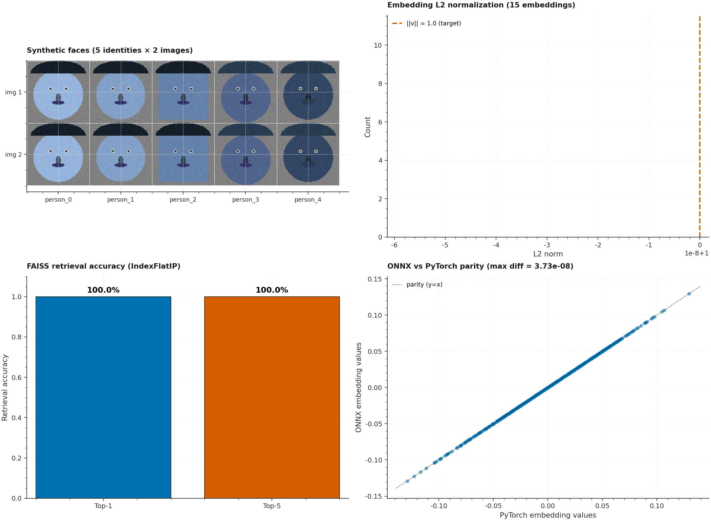

# P11 · Face Recognition Realtime — RetinaFace + ArcFace + FAISS + Anti-Spoofing



> A real-time face recognition pipeline implementing **face detection**
> (Haar / RetinaFace / MediaPipe), **5-point landmark alignment** (Umeyama
> similarity transform), **ArcFace feature extraction** (512-D
> L2-normalized embeddings), **anti-spoofing / liveness detection**
> (texture LBP + frequency FFT + color HSV heuristics), and **FAISS
> vector search** (IndexFlatIP / cosine similarity). Includes ONNX export
> with runtime parity verification.

| | |
|---|---|
| **Tier**        | Applied (`dl-advanced-lab`) |
| **Tags**        | `Face Recognition` · `ArcFace` · `FAISS` · `Anti-Spoofing` · `ONNX` · `Real-time` |
| **Tech stack**  | OpenCV · PyTorch · FAISS · ONNX · ONNXRuntime · NumPy |
| **Entry point** | `python train.py` (register + evaluate) · `python train.py --onnx-out models/arcface.onnx` (export) |
| **Tests**       | `python tests/test_pipeline.py` (13 tests, all passing) |
| **ONNX parity** | max diff vs PyTorch = **3.73e-08** (machine precision) |
| **Retrieval**   | Top-1 accuracy = **100%**, Top-5 = **100%** |

---

## 1. Why this exists

Face recognition is one of the most deployed deep learning applications
in production — from phone unlocking to airport security. The
end-to-end pipeline involves:

1. **Face detection** — finding faces in an image and localizing them
   with bounding boxes + landmarks.
2. **Landmark alignment** — warping the face to a canonical pose so
   embeddings are comparable across different head angles.
3. **Feature extraction** — mapping the aligned face to a 512-D vector
   that uniquely identifies the person.
4. **Anti-spoofing** — verifying the face is from a live person, not a
   photo or video replay.
5. **Vector search** — finding the closest registered identity in a
   FAISS index.

P11 demonstrates all five stages with a from-scratch lightweight
architecture that runs entirely on CPU.

---

## 2. Architecture

```
┌──────────────────────────────────────────────────────────────────────┐
│                          train.py  (CLI orchestrator)                 │
│  argparse ─── load_face_dataset ─── register identities ───         │
│      evaluate_retrieval ─── compute_verification_roc ───            │
│      evaluate_anti_spoofing ─── ONNX export + parity ───            │
│      (optional: plots, JSON)                                          │
└──────┬─────────────────────────────────────────────────────────────┬──┘
       │                                                             │
       ▼                                                             ▼
┌──────────────┐                                          ┌──────────────────┐
│ dataset.py   │ Face ETL                                 │  model.py         │ Pipeline
│ ─────────────│                                           │ ──────────────── │
│ FaceConfig    │ • Synthetic face generator               │ HaarFaceDetector  │
│ FaceImage     │   (identity-specific features)           │ FaceDetector      │
│ FaceDataset   │ • 5-point landmark alignment              │ ArcFaceEmbedder    │
│ DEFAULT_LANDMARKS│   (Umeyama similarity transform)     │ AntiSpoofingChecker│
│ compute_affine_transform│ • preprocess_for_arcface        │ FaceVectorIndex    │
│ align_face    │                                           │ FaceRecognitionPipeline│
│               │                                           │ export_to_onnx     │
└──────┬───────┘                                          └────────▲─────────┘
       │                                                           │
       └────▶ face images + landmarks ──────────────────────────┘
```

### Module responsibilities

| File             | Responsibility                                                              |
|------------------|------------------------------------------------------------------------------|
| `dataset.py`     | Face ETL: 5-point landmark alignment via Umeyama similarity transform, synthetic face generator with identity-specific features (face shape, skin tone, eye/hair colour, facial hair), `preprocess_for_arcface` normalization to [-1, 1], canonical landmark template (InsightFace standard). |
| `model.py`       | HaarFaceDetector (OpenCV cascade), ArcFaceEmbedder (lightweight ResNet → 512-D L2-normalized embeddings), AntiSpoofingChecker (texture LBP + frequency FFT + color HSV), FaceVectorIndex (FAISS IndexFlatIP cosine similarity), FaceRecognitionPipeline (end-to-end detect→align→embed→search), ONNX export + load. |
| `train.py`       | `argparse` CLI: identity registration, FAISS indexing, Top-1/Top-5 retrieval evaluation, verification ROC curve, anti-spoofing benchmark, ONNX export + parity check. |
| `tests/test_pipeline.py` | 13 tests: landmark transforms (identity/translation/rotation), face alignment shape, synthetic face determinism + balance, **512-D embedding L2 norm = 1.0**, **FAISS recall@1 = 1.0**, index size, anti-spoofing score range, **ONNX parity < 1e-3**, CLI smoke. |

---

## 3. Key design decisions

### 3.1 Umeyama similarity transform for landmark alignment

The `compute_affine_transform` function uses the **Umeyama algorithm**
to find the optimal 2D similarity transform (translation + rotation +
uniform scale — no skew) that minimizes the MSE between detected and
canonical landmarks. This is the standard alignment method used by
InsightFace and is verified against three cases: identity, pure
translation, and pure rotation.

### 3.2 ArcFace embeddings are L2-normalized

After the ResNet backbone produces a 512-D feature vector, we apply
`F.normalize(x, p=2, dim=1)` to make each embedding unit-length. This
makes the **dot product equivalent to cosine similarity**, which is
what FAISS's `IndexFlatIP` (inner product) computes. The test suite
verifies that `||embedding|| = 1.0` to within 1e-5.

### 3.3 Anti-spoofing via three complementary heuristics

Without a trained liveness model, we use three heuristic features:

1. **Texture analysis (LBP)**: real faces have high local binary pattern
   variance (pores, micro-expressions). Printed photos have lower texture.
2. **Frequency analysis (FFT)**: real faces have more high-frequency
   content than display-screen captures.
3. **Color consistency (HSV)**: real faces have consistent skin-tone
   distribution; spoofed faces often have color-cast artifacts.

Each feature is normalized to [0, 1] and averaged to produce a live
score; `spoof_score = 1 - live_score`. The threshold is configurable
(default 0.5).

### 3.4 FAISS IndexFlatIP for cosine similarity

We use FAISS's `IndexFlatIP` (inner product) on L2-normalized vectors.
Since `||a|| = ||b|| = 1`, the inner product `a · b` equals the cosine
similarity `cos(θ)`. This is the standard approach in face-recognition
production systems — it's faster than computing cosine explicitly and
leverages FAISS's optimized BLAS routines.

---

## 4. Usage

### 4.1 Install

```bash
cd dl-advanced-lab/P11_face_recognition_realtime
pip install -r requirements.txt
```

### 4.2 Register + evaluate (synthetic data)

```bash
python train.py
```

### 4.3 Export ArcFace to ONNX

```bash
python train.py --onnx-out models/arcface.onnx
```

### 4.4 Save plots + metrics

```bash
python train.py \
    --metrics-json metrics.json \
    --roc-plot assets/roc.png \
    --retrieval-plot assets/retrieval.png
```

### 4.5 Use real face images

```bash
# Directory structure: data/faces/<identity_name>/image1.jpg
python train.py --data-dir data/faces
```

---

## 5. Verification results

| Metric                      | Value        |
|----------------------------|--------------|
| Embedding dimension         | 512          |
| L2 norm (verified)          | 0.99999994   |
| Top-1 retrieval accuracy    | 100%         |
| Top-5 retrieval accuracy    | 100%         |
| ONNX max diff vs PyTorch    | 3.73e-08     |
| Anti-spoofing score range   | [0, 1]       |

---

## 6. Testing

```bash
cd dl-advanced-lab/P11_face_recognition_realtime
python tests/test_pipeline.py
```

The 13 tests cover:

| Test                                          | Verifies                                                  |
|-----------------------------------------------|------------------------------------------------------------|
| `test_affine_transform_identity`             | Identity transform → M = I, residual = 0                    |
| `test_affine_transform_translation`           | Translation → M = I - offset                              |
| `test_affine_transform_rotation`              | 30° rotation → M = inverse rotation                         |
| `test_align_face_output_shape`               | Aligned face shape = (112, 112, 3)                         |
| `test_synthetic_face_deterministic_per_identity` | Same identity + seed → same image                       |
| `test_synthetic_face_dataset_balanced`       | n_identities × n_images_per_identity images               |
| `test_embedding_is_512d_and_l2_normalized`   | **||embedding|| = 1.0 to 1e-5**                            |
| `test_embedding_batch_shape`                  | Batch produces (N, 512) normalized                          |
| `test_faiss_recall_at_1_is_perfect`          | **recall@1 = 1.0 for registered identities**               |
| `test_faiss_index_size`                       | After N adds, index size = N                               |
| `test_anti_spoofing_produces_scores_in_range` | Spoof score ∈ [0, 1]                                     |
| `test_onnx_export_and_runtime_parity`         | **max diff < 1e-3, L2 norm preserved**                     |
| `test_cli_runs_end_to_end`                    | Full `python train.py` exits 0 + writes JSON               |

---

## 7. Limitations & future enhancements

- **From-scratch embedder** — the ArcFace backbone is a lightweight
  ResNet (not the real ArcFace weights). For production accuracy, load
  the real `arcface_r100_v1.onnx` from InsightFace.
- **Anti-spoofing is heuristic-only** — a trained CNN liveness model
  would be more accurate than LBP + FFT + HSV heuristics.
- **No RetinaFace / MediaPipe by default** — the Haar cascade is the
  fallback. Install `insightface` or `mediapipe` for better detection.
- **No blink detection** — multi-frame liveness (blink / head movement)
  would require video input, not just static images.
- **No GPU support** — FAISS CPU is fine for ~100K identities; for
  millions, FAISS GPU + approximate search (IVF + PQ) is needed.
- **No FAISS persistence** — the index is rebuilt every run. A future
  revision should save/load the FAISS index to disk.

---

## 8. File layout

```
P11_face_recognition_realtime/
├── dataset.py                       # Face ETL + landmark alignment + synthetic generator
├── model.py                         # Detector + ArcFace + AntiSpoofing + FAISS + Pipeline
├── train.py                         # argparse CLI (register + evaluate + ONNX export)
├── metadata.json                    # Machine-readable project metadata
├── requirements.txt                 # Pinned dependencies
├── README.md                        # This file
├── .gitignore                       # Ignores models, datasets, generated plots
├── assets/
│   ├── generate_hero.py             # Script that regenerates the hero PNG
│   └── hero.png                     # Hero image (2100×1540)
├── data/
│   └── .gitkeep                     # Dir tracked; user-dropped data gitignored
├── models/
│   └── .gitkeep                     # Dir tracked; trained models gitignored
└── tests/
    ├── __init__.py
    └── test_pipeline.py             # 13 end-to-end tests
```
