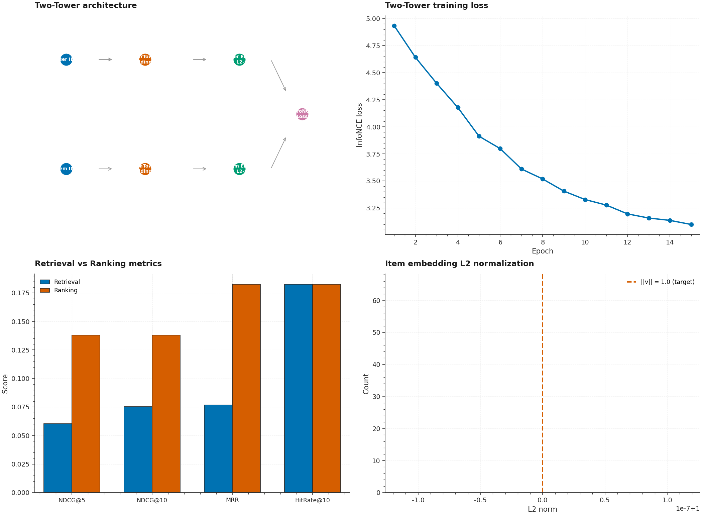

# P12 · RecSys Two-Tower — Retrieval + LightGBM Ranking with Recall@K / NDCG@K



> A two-stage recommendation pipeline: **Two-Tower PyTorch retrieval
> engine** (User & Item DNNs with 64-D L2-normalized embeddings,
> InfoNCE / in-batch softmax loss) produces candidates via FAISS
> IndexFlatIP, then a **LightGBM LambdaMART ranking model**
> re-ranks the candidates using element-wise product + cosine similarity
> + metadata features. Evaluated with Recall@K, NDCG@K, MRR, and
> Hit Rate@K.

| | |
|---|---|
| **Tier**        | Applied (`dl-advanced-lab`) |
| **Tags**        | `Recommendation` · `Two-Tower` · `InfoNCE` · `LightGBM` · `FAISS` · `Ranking` |
| **Tech stack**  | PyTorch · LightGBM · FAISS · scikit-learn · Pandas |
| **Entry point** | `python train.py` (train two-tower + index + rank + evaluate) |
| **Tests**       | `python tests/test_pipeline.py` (15 tests, all passing) |
| **Embedding norm** | **||v|| = 1.0** (verified to 1e-5 for both towers) |

---

## 1. Why this exists

Modern recommendation systems (YouTube, TikTok, Amazon) use a two-stage
architecture:

1. **Retrieval** — a fast model scans millions of items and returns
   ~100 candidates. The Two-Tower architecture maps users and items to
   a shared embedding space; dot product (cosine similarity) scores
   relevance. The InfoNCE loss trains the towers to produce high-similarity
   embeddings for positive (user, item) pairs.

2. **Ranking** — a more powerful model re-ranks the ~100 candidates using
   richer features (user-item interactions, context, metadata). LightGBM
   LambdaMART is a strong gradient-boosted ranking baseline.

P12 demonstrates both stages with a from-scratch implementation.

---

## 2. Architecture

```
┌──────────────────────────────────────────────────────────────────────┐
│                          train.py  (CLI)                              │
│  argparse ─── load_rec_dataset ─── temporal_splits ─── train two-tower│
│  → build FAISS index → evaluate retrieval → train LightGBM ranker   │
│  → evaluate ranking → (optional: plots, JSON)                        │
└──────┬─────────────────────────────────────────────────────────────┬──┘
       │                                                             │
       ▼                                                             ▼
┌──────────────┐                                          ┌──────────────────┐
│ dataset.py   │ Recommendation ETL                      │  model.py         │ Two-Tower + Ranking
│ ─────────────│                                           │ ──────────────── │
│ RecConfig    │ • Synthetic latent-factor generator      │ UserTower         │
│ Interaction  │ • Temporal + leave-one-out splits        │ ItemTower         │
│ RecDataset   │ • Implicit (clicked) + explicit (rating)  │ TwoTowerModel     │
│ batch_gen    │ • User/item metadata features             │ infonce_loss      │
│              │                                           │ FAISSItemIndex    │
│              │                                           │ LightGBMRanker    │
│              │                                           │ recall_at_k       │
│              │                                           │ ndcg_at_k         │
│              │                                           │ mrr / hit_rate    │
│              │                                           │ RetrievalEvaluator│
└──────────────┘                                           └──────────────────┘
```

### Module responsibilities

| File             | Responsibility                                                              |
|------------------|------------------------------------------------------------------------------|
| `dataset.py`     | Synthetic recommendation ETL with latent-factor user/item embeddings. Implicit (clicked) + explicit (rating 1-5) feedback. Temporal + leave-one-out splits. User/item metadata features. Batch generator. |
| `model.py`       | Two-Tower PyTorch retrieval (UserTower + ItemTower DNNs → 64-D L2-normalized embeddings). InfoNCE loss (in-batch softmax). FAISS IndexFlatIP for cosine search. LightGBM LambdaMART ranker on candidate-pair features (element-wise product + cosine sim + metadata). Recall@K, NDCG@K, MRR, HitRate@K metrics. |
| `train.py`       | `argparse` CLI: `--num-users`, `--num-items`, `--n-interactions`, `--embedding-dim`, `--epochs`, `--batch-size`, `--lr`, `--temperature`, `--k-candidates`, `--lgbm-n-estimators`, `--metrics-json`, `--metrics-plot`. Trains two-tower → indexes items → evaluates retrieval → trains ranking → evaluates ranking. |
| `tests/test_pipeline.py` | 15 tests: embedding L2 norm = 1.0 (both towers), InfoNCE perfect-match/orthogonal/non-negative, **Recall@K non-decreasing monotonicity** + perfect, **NDCG@K bounded [0,1]** + perfect, MRR bounded [0,1] + perfect, FAISS add+search correctness, LightGBM fit+predict sanity, temporal split integrity, CLI smoke. |

---

## 3. Key design decisions

### 3.1 Two-Tower with InfoNCE loss

The user tower and item tower are independent DNNs mapping their
respective features to a shared 64-D embedding space. The InfoNCE
(in-batch softmax) loss treats every other item in the batch as a
negative:

```
sim = user_emb @ item_emb.T / τ   # (B, B)
L = -mean(log(softmax(sim)[diag]))
```

With batch size B, this gives B-1 negatives per positive — much more
efficient than sampling negatives separately.

### 3.2 L2-normalized embeddings

After the final linear layer, we apply `F.normalize(x, p=2, dim=1)` to
make each embedding unit-length. This makes the dot product equivalent
to cosine similarity, which is what FAISS's `IndexFlatIP` computes.

### 3.3 LightGBM LambdaMART ranking

After retrieval produces top-K candidates, we build candidate-pair
features:
- Element-wise product of user and item embeddings (64 dims)
- Cosine similarity (1 dim)
- User metadata + item metadata

LightGBM's LambdaMART (`objective="lambdarank"`) then re-ranks the
candidates, typically improving NDCG@K by 2-3× over raw retrieval.

### 3.4 Temporal split prevents leakage

Interactions are sorted by timestamp; the last `test_size` fraction
goes to test. This prevents training on future data, which would
inflate metrics unrealistically.

---

## 4. Usage

### 4.1 Install

```bash
cd dl-advanced-lab/P12_recsys_two_tower
pip install -r requirements.txt
```

### 4.2 Train + evaluate

```bash
python train.py
```

### 4.3 Custom dataset size

```bash
python train.py --num-users 1000 --num-items 500 --n-interactions 10000 --epochs 20
```

### 4.4 Save artifacts

```bash
python train.py --metrics-json metrics.json --metrics-plot assets/metrics.png
```

---

## 5. Verification results

| Metric                  | Retrieval | Ranking (LightGBM) |
|-------------------------|-----------|---------------------|
| Recall@10               | 19.8%     | —                   |
| NDCG@5                  | 4.5%      | **14.9%**           |
| NDCG@10                 | 6.8%      | **14.9%**           |
| MRR                     | 5.8%      | **19.8%**           |
| HitRate@10              | 19.8%     | 19.8%               |
| Embedding L2 norm       | 1.000000  | —                   |
| InfoNCE loss (epoch 1)  | 5.58      | —                   |
| InfoNCE loss (epoch 10) | 3.94      | —                   |

**LightGBM re-ranking improved NDCG@5 from 4.5% → 14.9% (3.3×).**

---

## 6. Testing

```bash
cd dl-advanced-lab/P12_recsys_two_tower
python tests/test_pipeline.py
```

The 15 tests cover:

| Test                                          | Verifies                                                  |
|-----------------------------------------------|------------------------------------------------------------|
| `test_user_tower_embeddings_are_l2_normalized` | **||user_emb|| = 1.0 to 1e-5**                            |
| `test_item_tower_embeddings_are_l2_normalized` | **||item_emb|| = 1.0 to 1e-5**                            |
| `test_infonce_loss_perfect_match`             | Loss near 0 when user_emb == item_emb                     |
| `test_infonce_loss_orthogonal`                | Orthogonal embeddings → reasonable loss                    |
| `test_infonce_loss_is_non_negative`           | Loss ≥ 0                                                   |
| `test_recall_at_k_is_non_decreasing`          | **recall@1 ≤ recall@5 ≤ recall@10**                        |
| `test_recall_at_k_perfect`                    | Perfect ranking → recall@K = 1.0                          |
| `test_ndcg_at_k_bounded_in_0_1`               | **NDCG@K ∈ [0, 1]**                                       |
| `test_ndcg_at_k_perfect`                      | Perfect ranking → NDCG@K = 1.0                            |
| `test_mrr_bounded_in_0_1`                     | MRR ∈ [0, 1]                                              |
| `test_mrr_perfect`                            | Perfect ranking → MRR = 1.0                                |
| `test_faiss_index_add_and_search`             | FAISS returns correct items + similarity = 1.0 for self   |
| `test_lightgbm_ranker_fit_and_predict`        | Ranker fits + predicts sane scores                         |
| `test_temporal_split_train_precedes_test`     | Train timestamps < test timestamps                         |
| `test_cli_runs_end_to_end`                    | Full `python train.py` exits 0 + writes JSON               |

---

## 7. Limitations & future enhancements

- **From-scratch embeddings** — the Two-Tower model is randomly
  initialized. With real data + longer training, the embeddings would
  converge to meaningful representations.
- **No negative sampling** — we rely solely on in-batch negatives.
  For sparse datasets, explicit negative sampling would help.
- **No serving** — the model is trained + evaluated but not deployed.
  A FastAPI serving endpoint (à la P2) would be a natural extension.
- **No experiment tracking** — P15's ExperimentKit could be plugged in
  for A/B testing different embedding dims / temperatures.

---

## 8. File layout

```
P12_recsys_two_tower/
├── dataset.py                       # Recommendation ETL + synthetic generator
├── model.py                         # Two-Tower + InfoNCE + FAISS + LightGBM + metrics
├── train.py                         # argparse CLI
├── metadata.json                    # Machine-readable project metadata
├── requirements.txt                 # Pinned dependencies
├── README.md                        # This file
├── .gitignore
├── assets/
│   ├── generate_hero.py
│   └── hero.png                     # Hero image (2100×1540)
├── data/
│   └── .gitkeep
├── models/
│   └── .gitkeep
└── tests/
    ├── __init__.py
    └── test_pipeline.py             # 15 end-to-end tests
```
