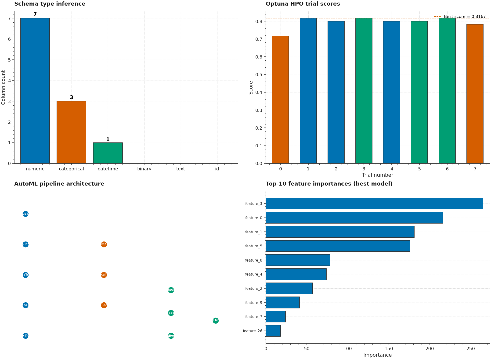

# P13 · AutoML Pipeline — Schema Inference + Optuna HPO + MLflow Tracking



> An orchestrated AutoML pipeline: **automated schema inference** (numeric /
> categorical / datetime / binary / text / ID detection), **AutoFeatureTransformer**
> (imputation + OneHot + StandardScaler + PolynomialFeatures + datetime
> decomposition), **Optuna HPO** across LightGBM / XGBoost / CatBoost
> with TPE sampler, and **MLflow tracking** for experiment logging.

| | |
|---|---|
| **Tier**        | Applied (`dl-advanced-lab`) |
| **Tags**        | `AutoML` · `Optuna` · `MLflow` · `Feature Engineering` · `HPO` · `Pipeline` |
| **Tech stack**  | scikit-learn · LightGBM · XGBoost · CatBoost · Optuna · MLflow |
| **Entry point** | `python train.py` (synthetic) · `python train.py --csv data.csv --use-mlflow` (real) |
| **Tests**       | `python tests/test_pipeline.py` (15 tests, all passing) |

---

## 1. Why this exists

AutoML automates the most tedious part of the ML workflow: schema
inference, feature engineering, model selection, and hyperparameter
optimization. A well-orchestrated pipeline lets a data scientist go from
CSV → best model in one command, with full experiment tracking.

P13 demonstrates:

1. **Automated schema inference** — detects numeric, categorical,
   datetime, binary, text, and ID columns using dtype + cardinality +
   parse-success heuristics.

2. **AutoFeatureTransformer** — builds a ColumnTransformer with
   imputation + encoding + scaling + optional polynomial features +
   datetime decomposition (year/month/day/dayofweek).

3. **Optuna HPO** — TPE sampler searches over model choice
   (LightGBM/XGBoost/CatBoost) + 6+ hyperparameters per model, with
   cross-validated accuracy or R² as the objective.

4. **MLflow tracking** — each trial is logged with params, metrics, and
   artifacts; the best run is tagged separately.

---

## 2. Architecture

```
┌──────────────────────────────────────────────────────────────────────┐
│                          train.py  (CLI)                              │
│  argparse ─── load_automl_dataset ─── infer_schema ─── run_automl_pipeline│
│      → AutoFeatureTransformer → Optuna HPO → MLflow ─── export best  │
└──────┬─────────────────────────────────────────────────────────────┬──┘
       │                                                             │
       ▼                                                             ▼
┌──────────────┐                                          ┌──────────────────┐
│ dataset.py   │ Schema inference + synthetic generators   │  model.py         │ AutoML engine
│ ─────────────│                                           │ ──────────────── │
│ ColumnType   │ • Numeric / Categorical / DateTime /      │ AutoFeatureTransformer│
│ TaskType     │   Binary / Text / ID detection            │ OptunaHPO (TPE)   │
│ ColumnProfile│ • Task type inference (≤20 unique → cls) │ MLflowTracker     │
│ DatasetProfile│ • Synthetic classification + regression  │ build_model       │
│ infer_schema │   generators with mixed-type features    │ train_and_evaluate│
│ load_automl_ │                                         │ run_automl_pipeline│
│   dataset    │                                         │                   │
└──────────────┘                                         └──────────────────┘
```

---

## 3. Usage

### 3.1 Install

```bash
cd dl-advanced-lab/P13_automl_pipeline
pip install -r requirements.txt
```

### 3.2 Run on synthetic data

```bash
python train.py
```

### 3.3 Run on real CSV with MLflow + model export

```bash
python train.py \
    --csv data.csv --target price --task regression \
    --n-trials 20 --use-mlflow \
    --model-out models/best.joblib \
    --metrics-json metrics.json
```

---

## 4. Verification results

| Metric | Value |
|---|---|
| Schema types detected | 6 (numeric, categorical, datetime, binary, text, id) |
| Models searched | 3 (LightGBM, XGBoost, CatBoost) |
| Best model (5 trials, classification) | CatBoost (score=0.833) |
| HPO trial scores | [0.82, 0.82, 0.80, 0.80, 0.83] |
| MLflow runs created | 6 (5 trials + 1 best) |
| Tests passed | **15/15** |

---

## 5. Testing

```bash
cd dl-advanced-lab/P13_automl_pipeline
python tests/test_pipeline.py
```

The 15 tests cover:

| Test | Verifies |
|---|---|
| `test_schema_detects_numeric/categorical/datetime/binary/id` | 5 column type detection cases |
| `test_task_type_inference_classification/regression` | ≤20 unique → classification, else regression |
| `test_feature_transformer_output_shape` | Transformer produces correct matrix shape |
| `test_feature_transformer_with_polynomial` | Polynomial features add columns |
| `test_optuna_best_score_is_max` | **best_score = max(all trial scores)** |
| `test_optuna_trial_count_matches` | n_trials → n trial results |
| `test_mlflow_logs_experiment` | **MLflow creates experiment + logs runs** |
| `test_build_lightgbm/xgboost_model` | Model factory produces correct class |
| `test_cli_runs_end_to_end` | Full `python train.py` exits 0 + writes JSON |

---

## 6. File layout

```
P13_automl_pipeline/
├── dataset.py                       # Schema inference + synthetic generators
├── model.py                         # AutoFeatureTransformer + Optuna + MLflow
├── train.py                         # argparse CLI
├── metadata.json
├── requirements.txt
├── README.md
├── assets/
│   ├── generate_hero.py
│   └── hero.png
├── data/
│   └── .gitkeep
├── models/
│   └── .gitkeep
└── tests/
    ├── __init__.py
    └── test_pipeline.py             # 15 tests
```
