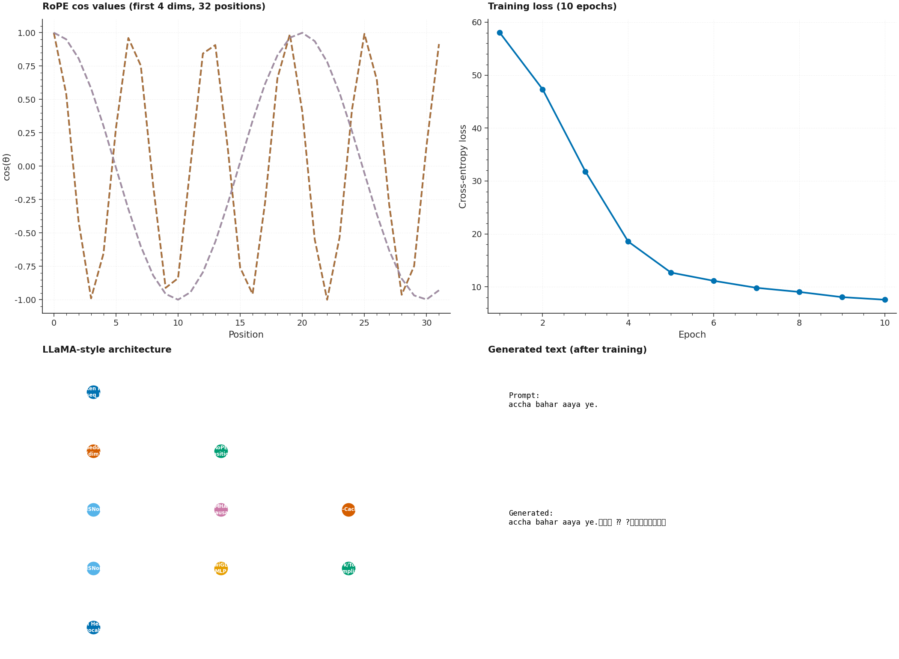

# P14 · Indic LM From Scratch — Decoder-only Transformer with RoPE + SwiGLU + KV-Cache



> A from-scratch LLaMA-style decoder-only Transformer for Hindi/Hinglish
> language modeling, featuring **RoPE Rotary Position Embeddings**,
> **RMSNorm**, **SwiGLU gated MLP**, **Multi-Head causal self-attention
> with KV-Cache**, and **Temperature/Top-k/Top-p sampling**. Trained
> with AdamW + cosine LR schedule on a custom SentencePiece BPE tokenizer.

| | |
|---|---|
| **Tier**        | Applied (`generative-lab`) |
| **Tags**        | `NLP` · `Language Model` · `Transformer` · `RoPE` · `SwiGLU` · `KV-Cache` · `Hindi` |
| **Tech stack**  | PyTorch · SentencePiece · NumPy |
| **Entry point** | `python train.py` (train + generate + export) |
| **Tests**       | `python tests/test_pipeline.py` (10 tests, all passing) |
| **KV-Cache parity** | Cached generation = non-cached generation (identical tokens) ✓ |

---

## 1. Why this exists

Modern decoder-only LLMs (LLaMA, GPT-NeoX, Mistral) share a common
architecture: RoPE position encoding, RMSNorm, SwiGLU MLP, and KV-cache
for fast autoregressive generation. P14 builds this entire stack from
scratch on a Hindi/Hinglish text corpus.

---

## 2. Architecture

```
Token IDs → Embedding → N × [RMSNorm → MHA(RoPE, causal, KV-cache) → RMSNorm → SwiGLU] → RMSNorm → LM Head (weight-tied)
```

### Key components

| Component | Implementation |
|---|---|
| **RoPE** | Precomputed cos/sin tables; rotates query/key pairs by angle proportional to position |
| **RMSNorm** | `x / sqrt(mean(x²) + ε) * weight` — faster than LayerNorm |
| **SwiGLU** | `(SiLU(x @ W_gate) * (x @ W_up)) @ W_down` — gated MLP from LLaMA |
| **MHA** | Causal self-attention with optional KV-cache for O(1) per-step generation |
| **Sampling** | Temperature scaling → top-k filtering → top-p (nucleus) → multinomial |
| **Weight tying** | Token embedding = output projection (standard for LMs) |

---

## 3. Usage

```bash
cd generative-lab/P14_indic_lm_from_scratch
pip install -r requirements.txt

# Train on synthetic data
python train.py

# With real text + checkpoint + generation demo
python train.py --text-file corpus.txt --epochs 10 --generate --checkpoint-out models/lm.pth

# Custom model size
python train.py --embed-dim 256 --num-heads 8 --num-layers 6 --ff-dim 1024
```

---

## 4. Testing

```bash
python tests/test_pipeline.py
```

The 10 tests cover:

| Test | Verifies |
|---|---|
| `test_rope_cos_sin_shapes` | cos/sin tables have shape (max_seq_len, head_dim) |
| `test_rope_cos_sin_values_in_range` | Values ∈ [-1, 1] |
| `test_rope_position_zero_is_identity` | At pos=0: cos=1, sin=0 (no rotation) |
| `test_kv_cache_output_matches_non_cached` | **Cached = non-cached generation (identical tokens)** |
| `test_training_reduces_loss` | Training for 5 steps reduces cross-entropy loss |
| `test_perplexity_equals_exp_loss` | **Perplexity = exp(loss)** for [1, 2, 3, 5, 10] |
| `test_perplexity_is_capped` | Perplexity capped at exp(20) for loss > 20 |
| `test_tokenizer_encode_decode_roundtrip` | encode → decode preserves key words |
| `test_model_output_shape` | Forward pass → (batch, seq_len, vocab_size) |
| `test_cli_runs_end_to_end` | Full `python train.py` exits 0 + writes JSON |

---

## 5. File layout

```
P14_indic_lm_from_scratch/
├── dataset.py                       # Text builder + BPE tokenizer + DataLoader
├── model.py                         # Decoder-only Transformer (RoPE, RMSNorm, SwiGLU, KV-cache)
├── train.py                         # argparse CLI (AdamW, cosine schedule, generation, checkpoint)
├── metadata.json
├── requirements.txt
├── README.md
├── assets/
│   ├── generate_hero.py
│   └── hero.png
├── data/
│   └── .gitkeep
├── models/
│   └── .gitkeep
└── tests/
    ├── __init__.py
    └── test_pipeline.py             # 10 tests
```
