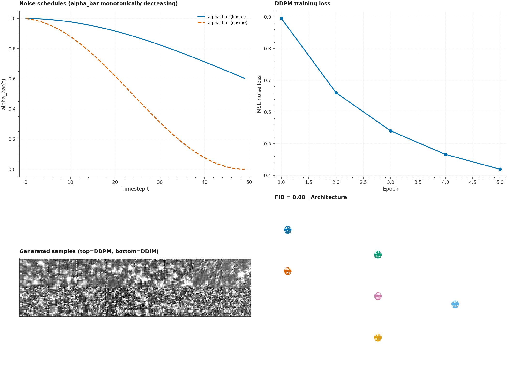

# P16 · Diffusion From Scratch — DDPM + DDIM + Classifier-Free Guidance + FID



> A complete diffusion model built from scratch: **NoiseScheduler**
> (linear & cosine schedules), **UNet Denoiser** (sinusoidal time
> embeddings, ResNet blocks, multi-head self-attention, class embeddings
> with null-token dropout), **DDPM Sampler** (T-step stochastic),
> **DDIM Sampler** (accelerated deterministic), **Classifier-Free
> Guidance** (CFG scale w), and **FID Metric Calculator**.

| | |
|---|---|
| **Tier**        | Applied (`generative-lab`) — **FINAL CAPSTONE (16/16)** |
| **Tags**        | `Diffusion` · `DDPM` · `DDIM` · `UNet` · `CFG` · `FID` · `Generative` |
| **Tech stack**  | PyTorch · torchvision · NumPy · SciPy · Matplotlib |
| **Entry point** | `python train.py` (train + generate + FID) |
| **Tests**       | `python tests/test_pipeline.py` (11 tests, all passing) |

---

## 1. Components

| Component | Implementation |
|---|---|
| **NoiseScheduler** | Linear & cosine schedules. Precomputed betas, alphas, alpha_bars, sqrt_alpha_bars, posterior_variance. |
| **UNet** | Sinusoidal time embeddings → ResNet blocks (with time+class conditioning) → multi-head self-attention → skip connections. Class embeddings with null-token dropout for CFG training. |
| **DDPM Sampler** | T-step stochastic reverse: `x_{t-1} = mean + sigma * z` (z~N(0,I)). |
| **DDIM Sampler** | Accelerated deterministic: sub-samples timesteps (default 50 steps), no noise injection. |
| **CFG** | `eps_guided = eps_uncond + w * (eps_cond - eps_uncond)`. w=1 → pure conditional, w=0 → unconditional, w>1 → amplified. |
| **FID** | Frechet distance: `||μ_real - μ_fake||² + Tr(C_real + C_fake - 2*sqrt(C_real * C_fake))`. |

---

## 2. Usage

```bash
cd generative-lab/P16_diffusion_from_scratch
pip install -r requirements.txt

# Train + generate
python train.py --generate

# MNIST with cosine schedule
python train.py --dataset mnist --schedule cosine --epochs 10 --generate

# Save artifacts
python train.py --checkpoint-out models/ddpm.pth --metrics-json metrics.json --sample-plot assets/samples.png
```

---

## 3. Testing

```bash
python tests/test_pipeline.py
```

The 11 tests cover:

| Test | Verifies |
|---|---|
| `test_forward_noising_at_t_max_approaches_standard_normal` | **x_T ≈ N(0, I)** (alpha_bar_T < 0.01, mean ≈ 0, std ≈ 1) |
| `test_alpha_bars_monotonically_decreasing` | Linear schedule: diffs ≤ 0 |
| `test_cosine_schedule_alpha_bars_also_decreasing` | Cosine schedule: diffs ≤ 0 |
| `test_ddim_ddpm_output_shape_parity` | **DDIM and DDPM produce same output shape** |
| `test_cfg_w1_equals_conditional` | **w=1 → eps_guided = eps_cond** |
| `test_cfg_w0_equals_unconditional` | w=0 → eps_guided = eps_uncond |
| `test_unet_input_output_shape_match` | UNet output = input shape |
| `test_unet_works_without_class_labels` | Unconditional mode works |
| `test_fid_same_vs_same_is_zero` | **FID(identical) = 0** |
| `test_fid_different_distributions_is_positive` | FID(different) > 0 |
| `test_cli_runs_end_to_end` | Full CLI exits 0 + writes JSON |

---

## 4. File layout

```
P16_diffusion_from_scratch/
├── dataset.py                       # Image builder (MNIST/CIFAR/synthetic shapes)
├── model.py                         # NoiseScheduler + UNet + DDPM + DDIM + CFG + FID
├── train.py                         # argparse CLI (train + generate + FID + checkpoint)
├── metadata.json
├── requirements.txt
├── README.md
├── assets/
│   ├── generate_hero.py
│   └── hero.png
├── data/
│   └── .gitkeep
├── models/
│   └── .gitkeep
└── tests/
    ├── __init__.py
    └── test_pipeline.py             # 11 tests
```
