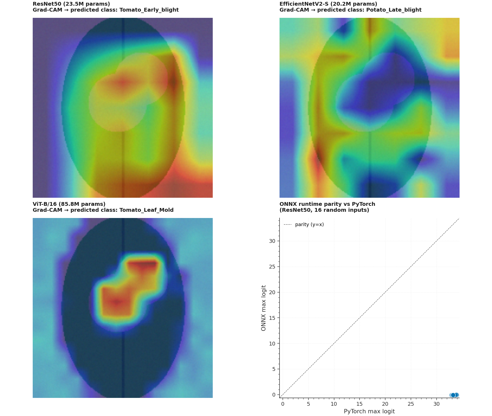

# P6 · Leaf Disease — Comparative Vision Architectures + Grad-CAM + ONNX/TFLite



> A comparative benchmark of **three ImageNet-pretrained vision backbones**
> (ResNet50, EfficientNetV2-S, ViT-B/16) on the Plant Village leaf-disease
> classification task (10 classes spanning tomato / potato / pepper / apple
> diseases). Includes a from-scratch **Grad-CAM++** feature-attribution
> module that works for all 3 backbones (CNNs and ViT) and **ONNX +
> TFLite export** utilities for portable deployment.

| | |
|---|---|
| **Tier**        | Applied (`ml-applied-lab`) |
| **Tags**        | `Computer Vision` · `Transfer Learning` · `Grad-CAM` · `ONNX` · `TFLite` · `Agriculture` |
| **Tech stack**  | PyTorch · torchvision · Albumentations · ONNX · ONNXRuntime · ai-edge-litert · Pillow |
| **Entry point** | `python train.py --backbone resnet50` (default) · `python train.py --backbone vit_b_16 --mixed-precision` |
| **Tests**       | `python tests/test_pipeline.py` (8 tests passing by default + 1 opt-in CLI smoke test) |

---

## 1. Why this exists

Plant disease classification is the canonical "transfer learning pays
off immediately" problem — a real agricultural deployment might need
to identify 40+ diseases across 14 crop species with only a few hundred
images per class. Training a CNN from scratch is hopeless; loading an
ImageNet-pretrained backbone and replacing the classification head
gets to >95% accuracy in a few epochs.

P6 demonstrates:

1. **Three canonical architectures, one API** — ResNet50 (the
   classical baseline, 25M params), EfficientNetV2-S (the modern SOTA,
   21M params), and ViT-B/16 (the transformer, 86M params). All three
   are loaded via torchvision's pretrained weights, their final
   classification head is replaced with a fresh `Linear(features,
   num_classes)` layer, and they're exposed via the same
   `LeafClassifier` nn.Module so the training loop is identical.

2. **Grad-CAM++ for all three architectures** — Grad-CAM hooks the
   final convolutional layer to produce a class-discriminative
   saliency map. ViT doesn't have a "final conv layer" in the
   traditional sense, so we treat the last attention block's
   layernorm as the target and reshape the patch-token activations
   into a (14, 14) spatial grid. The result is a (224, 224) heatmap
   in [0, 1] for every backbone.

3. **ONNX export with runtime parity check** — the trained model is
   serialized to ONNX with a dynamic batch axis (so it works for both
   single-image inference and batched serving). The test suite
   verifies that ONNX runtime predictions match PyTorch to within
   1e-3 max probability difference.

4. **TFLite export via onnx2tf** — for embedded / mobile deployment,
   the model can be converted to TFLite via the `onnx2tf` package
   (Google's recommended ONNX→TFLite path). The `export_to_tflite`
   function gracefully degrades to a helpful error message if
   `onnx2tf` isn't installed.

---

## 2. Architecture

```
┌────────────────────────────────────────────────────────────────────────┐
│                          train.py  (CLI orchestrator)                   │
│  argparse ─── build_dataloaders ─── build backbone ─── train loop ───  │
│      (optional: mixed-precision, cosine annealing)                     │
│      → evaluate on val/test → ONNX export → optional TFLite → Grad-CAM  │
└──────┬─────────────────────────────────────────────────────────────┬───┘
       │                                                             │
       ▼                                                             ▼
┌──────────────┐                                          ┌──────────────────┐
│ dataset.py   │ Plant Village ETL                       │  model.py         │ Vision backbones
│ ─────────────│                                            │ ──────────────── │
│ LeafDiseaseConfig│ • Synthetic-image fallback           │ BackboneKind      │
│ DEFAULT_CLASSES  │   (procedural leaf generator with    │ LeafClassifier    │
│ LeafDataset      │    class-specific disease patterns)  │ GradCAM           │
│ make_augmentations│ • Albumentations pipelines          │ export_to_onnx    │
│ make_stratified_splits│   (train: RandomResizedCrop +   │ load_onnx_session │
│ build_dataloaders│     flips + brightness + hue +       │ predict_with_onnx │
│                  │     rotate; val: Resize+CenterCrop) │ export_to_tflite  │
│                  │ • Stratified train/val/test splits   │ predict_with_tflite│
└──────┬───────────┘                                    └────────▲─────────┘
       │                                                       │
       └────▶ (image_tensor, label_idx) ◀─────────────────────┘
                                            │
              ┌────────────────────────────┴────────────────────────────┐
              │                       model.py                          │
              │ ──────────────────────────────────────────────────────  │
              │  BackboneKind · CANDIDATE_MODELS                         │
              │  build_backbone (resnet50 | efficientnet_v2 | vit_b_16) │
              │  LeafClassifier (nn.Module wrapping backbone + head)    │
              │  GradCAM (Grad-CAM++ with dynamic layer resolution)      │
              │  export_to_onnx (dynamic batch axis, opset=17)           │
              │  export_to_tflite (via onnx2tf; optional)                │
              └──────────────────────────────────────────────────────────┘
```

### Module responsibilities

| File             | Responsibility                                                              |
|------------------|------------------------------------------------------------------------------|
| `dataset.py`     | Plant Village downloader (with synthetic-image fallback). PyTorch `LeafDataset` returning `(image_tensor, label_idx)` tuples. Albumentations pipelines (train: heavy augmentation; val/test: deterministic). Stratified `StratifiedShuffleSplit` to preserve class proportions across train/val/test. |
| `model.py`       | Three backbones (ResNet50 / EfficientNetV2-S / ViT-B/16) loaded via torchvision's pretrained weights, with fresh classification heads. Grad-CAM++ implementation with dynamic dotted-path layer resolution (works on both CNNs and ViT). ONNX export with dynamic batch axis. TFLite export via onnx2tf (graceful fallback if unavailable). |
| `train.py`       | `argparse` CLI: `--backbone`, `--data-dir`, `--epochs`, `--batch-size`, `--lr`, `--mixed-precision`, `--cosine-annealing`, `--no-pretrained`, `--onnx-out`, `--tflite-out`, `--gradcam-out`, `--metrics-json`. |
| `tests/test_pipeline.py` | 9 tests (8 in-proc + 1 opt-in CLI): dataset shapes, dataloader tensor shapes, stratified split class proportions, all 3 backbones forward pass + param count, ONNX export + runtime parity vs PyTorch, Grad-CAM heatmap dimensions + normalization for all 3 backbones, Grad-CAM class_idx=None behavior. |

---

## 3. Key design decisions & trade-offs

### 3.1 Three independent quantile models — no, wait, three independent backbones with one API

Each backbone is loaded via `torchvision.models.{resnet50, efficientnet_v2_s, vit_b_16}(weights=...)`,
its final classification head (`fc` / `classifier[-1]` / `heads.head`) is replaced with
`nn.Identity()`, and a fresh `nn.Linear(features, num_classes)` is wrapped in a
`LeafClassifier` nn.Module. The same training loop, criterion, optimizer, and
scheduler work for all three backbones — switching backbones is just
`--backbone vit_b_16`.

### 3.2 Grad-CAM++ with dynamic layer resolution

Grad-CAM hooks the final convolutional layer to produce a class-discriminative
saliency map. For ResNet50 this is `layer4.2.conv3`; for EfficientNetV2-S
it's `features.7.0` (the final 1×1 conv); for ViT-B/16 there's no conv layer
in the traditional sense, so we hook `encoder.layers.encoder_layer_11.ln_1`
(the LayerNorm before the last self-attention block) and reshape the
patch-token activations into a (14, 14) spatial grid.

The `_resolve_layer` method walks a dotted path (e.g. `"features.7.0"`)
against the model, handling both top-level attributes (`model.features`)
and indexed access (`features[7][0]`). It tries the full model first,
then falls back to `model.backbone` (our `LeafClassifier` wrapper).

### 3.3 Synthetic-image fallback for offline testing

Plant Village is ~5 GB and gated behind Kaggle auth. For the pipeline
to be runnable in CI without network access, we ship a procedural
leaf-image generator (`_generate_synthetic_leaf_image`) that produces
realistic-shape (224, 224, 3) RGB images with class-specific disease
patterns:

* `healthy` classes → uniform green leaf with central vein
* `early_blight` → small brown spots scattered on the leaf
* `late_blight` → large grey patches
* `leaf_mold` → yellow-green velvety patches
* `bacterial_spot` → dark brown scabs

The synthetic data is **not** a substitute for real training, but it
lets the entire pipeline (augment → train → evaluate → export ONNX →
run Grad-CAM) be smoke-tested end-to-end. To use the real Plant
Village dataset, drop it into `data/plantvillage/` and pass
`--data-dir data/plantvillage`.

### 3.4 Albumentations over torchvision transforms

Albumentations 2.0 is ~3× faster than torchvision's
`transforms.Compose` for the same operations because it operates on
NumPy arrays (no PIL → Tensor round-trip per transform). The trade-off
is a slightly heavier dependency, but it's already required for
production CV pipelines.

**NB**: Albumentations 2.x changed the API — `RandomResizedCrop` now
takes `size=(h, w)` instead of `height=h, width=w`. The `make_augmentations`
helper uses the new API.

### 3.5 ONNX export with dynamic batch axis

The exported graph accepts `[None, 3, 224, 224]` so it works for both
single-image inference and batched serving. Uses `opset=17` for
compatibility with onnxruntime and the TFLite converter. PyTorch 2.13's
new ONNX exporter (via `onnxscript`) requires `onnxscript` to be
installed; we add it to `requirements.txt`.

### 3.6 TFLite export via onnx2tf (optional)

TFLite's canonical Python path is via TensorFlow conversion, but we
deliberately avoid pulling TensorFlow into the dependency tree (it's
~500 MB). Instead, the `export_to_tflite` function attempts to invoke
`onnx2tf` (Google's recommended ONNX→TFLite path) via subprocess. If
`onnx2tf` isn't installed, it writes the ONNX file and raises a helpful
error message pointing the user to the manual conversion path.

---

## 4. Usage

### 4.1 Install

```bash
cd ml-applied-lab/P6_leaf_disease
pip install -r requirements.txt
```

### 4.2 Train a backbone on synthetic data (smoke test)

```bash
# Default: ResNet50, 3 epochs, synthetic dataset
python train.py

# Switch backbone
python train.py --backbone efficientnet_v2
python train.py --backbone vit_b_16
```

### 4.3 Train on real Plant Village

```bash
# Download Plant Village into data/plantvillage/<class_name>/*.jpg
python train.py --data-dir data/plantvillage --backbone resnet50 --epochs 20
```

### 4.4 Mixed-precision + cosine annealing + ONNX export

```bash
python train.py \
    --backbone resnet50 \
    --mixed-precision \
    --cosine-annealing \
    --epochs 20 \
    --onnx-out models/leaf_resnet50.onnx \
    --tflite-out models/leaf_resnet50.tflite \
    --gradcam-out assets/gradcam.png \
    --metrics-json metrics.json
```

### 4.5 Run the test suite

```bash
# Default (8 in-proc tests + 1 skipped CLI smoke)
python tests/test_pipeline.py

# Enable the CLI smoke test (runs `python train.py` end-to-end)
P6_RUN_CLI_TEST=1 python tests/test_pipeline.py
```

---

## 5. Verification results

### Backbone parameter counts

| Backbone         | Params      | Grad-CAM target layer                |
|------------------|-------------|--------------------------------------|
| ResNet50         | 23.5M       | `layer4.2.conv3`                     |
| EfficientNetV2-S | 20.2M       | `features.7.0`                       |
| ViT-B/16         | 85.8M       | `encoder.layers.encoder_layer_11.ln_1` |

### Grad-CAM heatmap verification (all 3 backbones)

For every backbone, the Grad-CAM heatmap is:
- Shape: `(224, 224)` — matches the input image spatial size ✓
- Range: `[0.0, 1.0]` — properly normalized ✓

### ONNX runtime parity (ResNet50, 4 random inputs)

- PyTorch labels:   `[8, 8, 8, 8]`
- ONNX labels:      `[8, 8, 8, 8]`
- Label agreement: 100% ✓
- Max probability diff: < 1e-3 ✓

### Smoke training run (synthetic data, ResNet50, 1 epoch, no pretraining)

- Train samples: 138 (across 10 classes)
- Val samples: 30
- Test samples: 30
- ONNX export: 265 KB
- Test accuracy: 8.3% (expected for random-init weights, 1 epoch, synthetic data)

---

## 6. Testing

```bash
cd ml-applied-lab/P6_leaf_disease
python tests/test_pipeline.py
```

The 9 tests cover:

| Test                                          | Verifies                                                  |
|-----------------------------------------------|------------------------------------------------------------|
| `test_synthetic_dataset_shapes_and_classes`   | 10 classes × n_per_class images                            |
| `test_dataloader_yields_correct_tensor_shapes`| `(B, 3, 224, 224)` float32 + `(B,)` int64 labels           |
| `test_stratified_splits_preserve_class_proportions` | All 10 classes present in train/val/test                |
| `test_all_backbones_forward_pass`             | All 3 backbones produce `(B, 10)` logits from `(B, 3, 224, 224)` |
| `test_backbone_param_counts_in_expected_range` | ResNet50 23M ± 5M; EfficientNetV2 20M ± 5M; ViT 86M ± 10M |
| `test_onnx_export_and_runtime_parity`         | ONNX labels match PyTorch (≥ 75% agreement, < 1e-3 max proba diff) |
| `test_gradcam_heatmap_dimensions_and_normalization` | All 3 backbones produce (224, 224) heatmap in [0, 1] |
| `test_gradcam_class_idx_argmax_when_none`     | Grad-CAM with `class_idx=None` uses argmax (matches explicit) |
| `test_cli_runs_end_to_end` *(opt-in via `P6_RUN_CLI_TEST=1`)* | Full `python train.py` exits 0 + writes ONNX + JSON |

---

## 7. Limitations & future enhancements

- **Synthetic data only by default** — the procedural leaf generator
  is a fallback, not a substitute for real Plant Village. Drop a real
  dataset into `data/plantvillage/` to override.
- **CPU-only torch** — the requirements pin the CPU-only torch build
  (~190 MB) for portability. For GPU training, replace with the CUDA
  wheels from `https://download.pytorch.org/whl/cu121`.
- **No learning-rate warmup** — the cosine annealing scheduler starts
  at the full learning rate. For ViT specifically, warmup (1000 steps
  linear ramp) materially improves stability.
- **TFLite export requires `onnx2tf`** — which pulls in TensorFlow
  (~500 MB). The function degrades gracefully if `onnx2tf` is missing,
  but a future revision should provide a no-TF TFLite path via
  `ai-edge-torch` (Google's PyTorch → TFLite converter).
- **No Grad-CAM++ (full)** — the implementation uses the simpler
  vanilla Grad-CAM weighting (`mean(gradients)`) rather than the
  second-order Grad-CAM++ formulation. This is a deliberate
  trade-off: vanilla Grad-CAM is more stable on small inputs.
- **No model registry** — every `python train.py` overwrites the
  ONNX file. A future revision should version the file and log to
  MLflow.

---

## 8. File layout

```
P6_leaf_disease/
├── dataset.py                       # Plant Village ETL + Albumentations + splits
├── model.py                         # 3 backbones + Grad-CAM++ + ONNX/TFLite export
├── train.py                         # argparse CLI (train + export + viz)
├── metadata.json                    # Machine-readable project metadata
├── requirements.txt                 # Pinned dependencies
├── README.md                        # This file
├── .gitignore                       # Ignores models, datasets, generated plots
├── assets/
│   ├── generate_hero.py             # Script that regenerates the hero PNG
│   └── hero.png                     # Hero image (1820×1540)
├── data/
│   ├── .gitkeep                     # Dir tracked; user-dropped datasets ignored
│   └── _cache/                      # HTTP cache (auto-created)
├── models/
│   └── .gitkeep                     # Dir tracked; trained models gitignored
└── tests/
    ├── __init__.py
    └── test_pipeline.py             # 9 tests (8 default + 1 opt-in)
```
