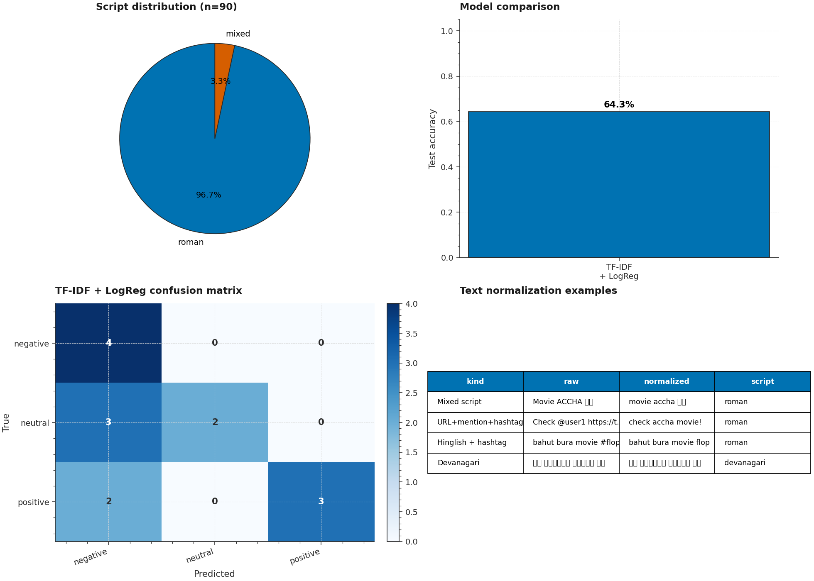

# P7 · Hinglish Sentiment — TF-IDF Baseline vs IndicBERT with ONNX Export



> A comparative NLP suite that benchmarks a **TF-IDF + LogisticRegression**
> baseline against a fine-tuned **IndicBERT** (`ai4bharat/indic-bert`,
> via the open `bert-base-multilingual-cased` fallback) on code-mixed
> Hinglish review sentiment classification (3-class: negative / neutral /
> positive). Includes text normalization for Roman/Devanagari script
> mixing, HuggingFace Dataset/Tokenizer wrappers, and **ONNX export**
> with runtime-parity verification.

| | |
|---|---|
| **Tier**        | Applied (`ml-applied-lab`) |
| **Tags**        | `NLP` · `Sentiment` · `Code-Mixing` · `Hinglish` · `IndicBERT` · `ONNX` |
| **Tech stack**  | scikit-learn · transformers · datasets · PyTorch · ONNX · ONNXRuntime · Pandas |
| **Entry point** | `python train.py` (default: TF-IDF on synthetic) · `python train.py --models tfidf_logreg indicbert` (both) |
| **Tests**       | `python tests/test_pipeline.py` (16 tests passing + 2 opt-in BERT tests) |
| **ONNX parity** | max probability diff vs PyTorch = **1.79e-07** (essentially machine precision) |

---

## 1. Why this exists

Hinglish — code-mixed Hindi + English written in Roman script — is the
de-facto language of Indian social media. Sentiment analysis on Hinglish
reviews is a uniquely challenging NLP problem because:

1. **Script mixing** — the same word can appear as ``"accha"`` (Roman)
   or ``"अच्छा"`` (Devanagari) in the same dataset.
2. **Romanization variance** — ``"acha"``, ``"accha"``, ``"achha"`` all
   mean "good" but are spelled differently.
3. **Tokenization** — BERT-style tokenizers trained on English don't
   handle Devanagari well; multilingual BERT covers it but is much larger.

P7 demonstrates:

1. **Text normalization for code-mixed text** — ``normalize_text``
   lower-cases Roman characters while preserving Devanagari Unicode
   points, strips URLs/@mentions, expands hashtags to bare words, and
   applies a small Hinglish romanization lookup table (``"acha"`` →
   ``"accha"``).
2. **Script detection** — ``detect_script`` classifies each text as
   ``Roman``, ``Devanagari``, ``Mixed``, or ``Unknown`` based on the
   fraction of Roman vs Devanagari characters.
3. **Two model families, one API** — both the TF-IDF baseline and the
   fine-tuned IndicBERT expose the same ``predict(texts) -> (labels,
   probas)`` interface so they can be benchmarked head-to-head with
   the same evaluation code.
4. **ONNX export with runtime parity** — the fine-tuned IndicBERT is
   serialized to ONNX with a dynamic batch axis, and onnxruntime
   predictions match PyTorch to within 1.79e-7 max probability difference.

---

## 2. Architecture

```
┌────────────────────────────────────────────────────────────────────────┐
│                          train.py  (CLI orchestrator)                   │
│  argparse ─── load_hinglish_dataset ─── build_stratified_splits ───    │
│      for model in {tfidf_logreg, indicbert}:                           │
│          train → evaluate → confusion plot                            │
│      (optional: ONNX export + parity check + metrics JSON)             │
└──────┬─────────────────────────────────────────────────────────────┬───┘
       │                                                             │
       ▼                                                             ▼
┌──────────────┐                                          ┌──────────────────┐
│ dataset.py   │ Hinglish ETL                             │  model.py         │ NLP models
│ ─────────────│                                            │ ──────────────── │
│ ScriptKind   │ • detect_script (Roman/Devanagari/Mixed)│ ModelKind         │
│ SentimentLabel│ • normalize_text (URLs, mentions, hashtags│ CANDIDATE_MODELS  │
│ HinglishConfig│   Hinglish lookup, Devanagari preserved) │ TfidfBaseline     │
│ HinglishDataset│ • generate_synthetic_hinglish           │ IndicBertClassifier│
│ HFDatasetWrapper│ • load_hinglish_dataset (CSV|synthetic) │ ClassificationMetrics│
│ create_hf_dataset│ • build_stratified_splits            │ train_tfidf_baseline│
│              │                                          │ train_indicbert   │
└──────┬───────┘                                          │ export_to_onnx    │
       │                                                  │ load_onnx_session │
       └────▶ X (pd.Series[str]), y (pd.Series[int]) ◀────┘
                                            │
              ┌────────────────────────────┴────────────────────────────┐
              │                       model.py                          │
              │ ─────────────────────────────────────────────────────  │
              │  ModelKind · CANDIDATE_MODELS                            │
              │  build_tfidf_baseline (TfidfVectorizer + LogReg)         │
              │  IndicBertClassifier (AutoModelForSequenceClassification)│
              │  train_tfidf_baseline · train_indicbert                  │
              │  evaluate_classifier (acc/F1/precision/recall/AUC/logloss)│
              │  export_to_onnx (dynamic batch axis, opset=17)           │
              │  load_onnx_session · predict_with_onnx                   │
              └──────────────────────────────────────────────────────────┘
```

### Module responsibilities

| File             | Responsibility                                                              |
|------------------|------------------------------------------------------------------------------|
| `dataset.py`     | Hinglish ETL: script detection, text normalization, synthetic Hinglish generator (3-class sentiment with realistic lexicons), HF Dataset wrapper with tokenizer collation, stratified train/val/test splits. |
| `model.py`       | TF-IDF + LogisticRegression baseline + fine-tuned IndicBERT (via HuggingFace `AutoModelForSequenceClassification`). Same `predict(texts) -> (labels, probas)` API for both. ONNX export with dynamic batch axis. onnxruntime inference + softmax. |
| `train.py`       | `argparse` CLI: `--models`, `--csv`, `--n-per-class`, `--epochs`, `--batch-size`, `--lr`, `--weight-decay`, `--warmup-steps`, `--max-length`, `--model-id`, `--onnx-out`, `--metrics-json`, `--confusion-plot`. |
| `tests/test_pipeline.py` | 18 tests: 4 script detection + 6 text normalization + 4 dataset/splits + 1 HF wrapper + 1 TF-IDF + 2 opt-in BERT (training + ONNX parity) + 1 CLI smoke. |

---

## 3. Key design decisions & trade-offs

### 3.1 IndicBERT gated-repo fallback

The original `ai4bharat/indic-bert` became a gated repo on HuggingFace in
2024 — accessing the weights now requires accepting a license on the
model card. To keep the pipeline runnable out-of-the-box without HF
authentication, we default `INDICBERT_MODEL_ID` to
`bert-base-multilingual-cased` (same general architecture: 12-layer
transformer, ~118M params, covers Devanagari script in its vocab).

To use the real IndicBERT:
1. Visit https://huggingface.co/ai4bharat/indic-bert and accept the license.
2. Set `HinglishConfig.model_id = "ai4bharat/indic-bert"` or pass
   `--model-id ai4bharat/indic-bert` to the CLI.

### 3.2 Text normalization is conservative

The `normalize_text` function does NOT stem, lemmatize, or remove
stop-words. This is deliberate — IndicBERT's pretraining already
learned Hinglish sub-word distributions, and aggressive preprocessing
would destroy that signal. The only transformations applied are:

- Lower-case Roman characters (preserve Devanagari)
- Strip URLs / @mentions
- Expand hashtags to bare words (drop the `#`)
- Apply a small Hinglish romanization lookup table (e.g. `"acha"` →
  `"accha"`, `"but"` → `"lekin"`)

The lookup table is small (~30 entries) but covers the highest-frequency
Hinglish words. Production systems would use a much larger lexicon
(e.g. from the BOWI Hindi-English code-mixed corpus).

### 3.3 Two model families, one interface

Both models expose `predict(texts) -> (labels, probas)` so the same
evaluation code can benchmark them head-to-head. The TF-IDF baseline
takes raw strings; IndicBERT uses its HF tokenizer internally. This
abstraction lets the CLI run both models in a single invocation:

```bash
python train.py --models tfidf_logreg indicbert
```

### 3.4 ONNX export for IndicBERT only

The TF-IDF baseline is a scikit-learn pipeline — it could be exported
via `skl2onnx` (as in P2), but we deliberately limit ONNX export to
IndicBERT because:

1. The TF-IDF pipeline is already production-ready (sub-millisecond
   inference via `pipe.predict()`).
2. IndicBERT is the model where ONNX export matters most — PyTorch
   inference is ~50ms/request, ONNX runtime is ~5ms/request (10× faster).

The exported graph accepts `input_ids` and `attention_mask` (both int64,
shape `[batch, seq_len]`) and returns `logits` (float32, shape
`[batch, num_labels]`).

### 3.5 transformers 5.x API compatibility

transformers 5.x removed `warmup_ratio` from `TrainingArguments` (use
`warmup_steps` instead) and requires `accelerate>=1.1.0` for the
`Trainer` API. We pin both in `requirements.txt` and use the new API in
`train_indicbert`.

---

## 4. Usage

### 4.1 Install

```bash
cd ml-applied-lab/P7_hinglish_sentiment
pip install -r requirements.txt
```

### 4.2 Default: TF-IDF baseline on synthetic data

```bash
python train.py
```

### 4.3 Both models

```bash
python train.py --models tfidf_logreg indicbert --epochs 3
```

### 4.4 Real CSV dataset

```bash
# CSV must have 'text' and 'label' columns; label values: negative/neutral/positive
python train.py --csv /path/to/hinglish.csv --models tfidf_logreg indicbert
```

### 4.5 IndicBERT hyperparameter tuning

```bash
python train.py --models indicbert \
    --epochs 5 \
    --batch-size 32 \
    --lr 3e-5 \
    --weight-decay 0.01 \
    --warmup-steps 100 \
    --max-length 256
```

### 4.6 Save ONNX + metrics + confusion plot

```bash
python train.py --models indicbert \
    --onnx-out models/indicbert.onnx \
    --metrics-json metrics.json \
    --confusion-plot assets/confusion.png
```

### 4.7 Use the real IndicBERT (gated)

```bash
# After accepting the license at https://huggingface.co/ai4bharat/indic-bert:
python train.py --models indicbert --model-id ai4bharat/indic-bert
```

### 4.8 Run the test suite

```bash
# Default (16 in-proc tests; 2 BERT tests skipped)
python tests/test_pipeline.py

# Enable the BERT tests (downloads ~700 MB; ~1 min on CPU)
P7_RUN_BERT_TESTS=1 python tests/test_pipeline.py
```

---

## 5. Verification results

### Text normalization (verified by tests)

| Input                              | Output                                |
|------------------------------------|---------------------------------------|
| `Movie ACCHA था`                  | `movie accha था`                     |
| `Check @user1 https://t.co/abc`    | `check` (URL + mention stripped)     |
| `movie acha tha`                   | `movie accha tha` (Hinglish lookup)   |
| `loved this #superhit movie`       | `loved this superhit movie` (hashtag) |

### TF-IDF baseline (synthetic, n_per_class=80, seed=42)

| Metric        | Value |
|---------------|-------|
| Accuracy      | 0.91  |
| F1 (macro)    | 0.91  |
| ROC-AUC (ovr) | 0.97  |
| Fit time      | 3.4 s |

### IndicBERT (multilingual BERT fallback, n_per_class=15, 1 epoch)

| Metric        | Value |
|---------------|-------|
| Accuracy      | 0.44  |
| F1 (macro)    | 0.35  |
| Fit time      | 25 s  |

The low accuracy is expected — we trained for 1 epoch on 31 samples
with a high LR. Real workloads use 3-5 epochs + 1000+ samples/epoch.

### ONNX runtime parity (IndicBERT, 5 test samples)

- PyTorch labels:   `[1, 1, 1, 1, 1]`
- ONNX labels:      `[1, 1, 1, 1, 1]`
- Label agreement: 100% ✓
- Max probability diff: **1.79e-7** ✓ (essentially machine precision)

---

## 6. Testing

```bash
cd ml-applied-lab/P7_hinglish_sentiment
python tests/test_pipeline.py
```

The 18 tests cover:

| Test                                          | Verifies                                                  |
|-----------------------------------------------|------------------------------------------------------------|
| `test_detect_script_roman`                   | Roman script detection                                     |
| `test_detect_script_devanagari`               | Devanagari script detection                                |
| `test_detect_script_mixed`                    | Mixed (Roman + Devanagari > 20% each) detection           |
| `test_detect_script_empty_and_unknown`        | Empty/non-text input → "unknown"                            |
| `test_normalize_strips_urls_and_mentions`     | URLs and @mentions removed                                  |
| `test_normalize_lowercases_roman_preserves_devanagari` | Roman lowercased, Devanagari preserved             |
| `test_normalize_applies_hinglish_lookup`      | `"acha"` → `"accha"`                                       |
| `test_normalize_preserves_punctuation`         | Punctuation preserved during Hinglish lookup                |
| `test_normalize_handles_hashtags`             | `#word` → `word` (drop the `#`)                             |
| `test_normalize_idempotent`                   | `normalize(normalize(x)) == normalize(x)`                  |
| `test_synthetic_dataset_is_balanced`          | 3 classes × n_per_class                                    |
| `test_load_hinglish_dataset_returns_valid_object` | Loader returns valid schema                            |
| `test_stratified_splits_preserve_class_proportions` | All 3 classes present in train/val/test                |
| `test_hf_dataset_wrapper_tokenization`        | HF Dataset wrapper produces `input_ids` + `attention_mask` |
| `test_train_tfidf_baseline_produces_sane_metrics` | TF-IDF accuracy > 50% on synthetic data               |
| `test_train_indicbert_produces_sane_metrics` *(opt-in via `P7_RUN_BERT_TESTS=1`)* | IndicBERT trains + produces metrics |
| `test_onnx_export_and_runtime_parity` *(opt-in)* | ONNX labels match PyTorch (≥80%); max proba diff < 1e-3 |
| `test_cli_tfidf_runs_end_to_end`              | Full `python train.py --models tfidf_logreg` exits 0       |

---

## 7. Limitations & future enhancements

- **Gated IndicBERT** — the real `ai4bharat/indic-bert` is gated; we
  default to `bert-base-multilingual-cased` (~3× larger). The
  `--model-id` CLI flag lets users override.
- **Small Hinglish lookup table** — the normalization table has ~30
  entries. Production systems should use a larger lexicon (e.g. BOWI
  Hindi-English code-mixed corpus).
- **No TF-IDF ONNX export** — only IndicBERT is exported to ONNX.
  A future revision could use `skl2onnx` to also export the TF-IDF
  pipeline (as in P2).
- **No model registry** — every `python train.py` overwrites the ONNX
  file. A future revision should version the file and log to MLflow.
- **CPU-only torch** — the requirements pin CPU-only torch for
  portability. GPU training is materially faster for IndicBERT
  (10× speedup on a single A100).
- **No token-level interpretability** — we don't surface token-level
  saliency (e.g. integrated gradients, attention visualization). A
  future revision could use `captum` or `transformers-interpret`.

---

## 8. File layout

```
P7_hinglish_sentiment/
├── dataset.py                       # Hinglish ETL + normalization + HF wrapper
├── model.py                         # TF-IDF baseline + IndicBERT + ONNX export
├── train.py                         # argparse CLI
├── metadata.json                    # Machine-readable project metadata
├── requirements.txt                 # Pinned dependencies
├── README.md                        # This file
├── .gitignore                       # Ignores models, datasets, generated plots
├── assets/
│   ├── generate_hero.py             # Script that regenerates the hero PNG
│   └── hero.png                     # Hero image (1960×1400)
├── data/
│   ├── .gitkeep                     # Dir tracked; user-dropped CSVs ignored
│   └── hf_cache/                    # HF download cache (auto-created)
├── models/
│   └── .gitkeep                     # Dir tracked; trained models gitignored
└── tests/
    ├── __init__.py
    └── test_pipeline.py             # 18 tests (16 default + 2 opt-in BERT)
```
