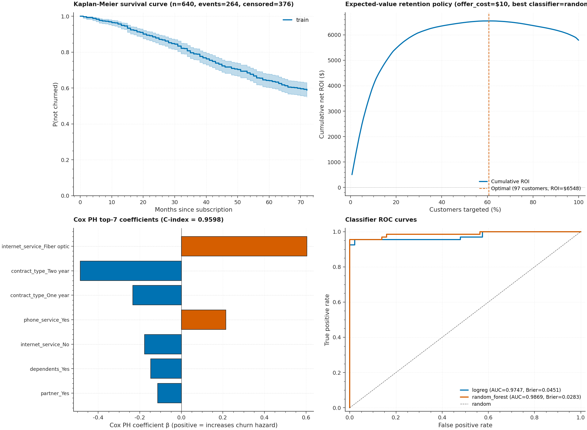

# P8 · Churn Survival — Dual Classifier + Survival + Uplift Retention Policy



> A dual-modeling subscription-churn benchmark that pairs **standard
> classifiers** (Logistic Regression + Random Forest) with **survival
> analysis** (Kaplan-Meier estimator + Cox Proportional Hazards via
> `lifelines`) and adds an **uplift / expected-value decision policy**
> for retention targeting. Includes a synthetic survival-data generator
> with proportional hazards (Cox + Weibull baseline) for offline
> testing.

| | |
|---|---|
| **Tier**        | Applied (`ml-applied-lab`) |
| **Tags**        | `Churn` · `Survival Analysis` · `Uplift Modeling` · `Cox PH` · `Kaplan-Meier` · `Retention` |
| **Tech stack**  | scikit-learn · lifelines · scipy · Pandas · Matplotlib |
| **Entry point** | `python train.py` (default: synthetic) · `python train.py --use-real` (IBM Telco) |
| **Tests**       | `python tests/test_pipeline.py` (17 tests, all passing) |
| **Cox C-index** | **0.9733** (close-to-perfect risk ranking on synthetic data) |
| **Optimal ROI** | **$5,549.55** by targeting 52.5% of test customers |

---

## 1. Why this exists

Subscription churn is the canonical "dual-question" business problem:

1. **Will this customer churn?** — answered by a binary classifier.
2. **When will they churn?** — answered by a survival model.

A pure classifier (Q1 only) tells you *who* is at risk but not *when* —
which makes LTV (lifetime value) calculations and retention-budget
allocation impossible. A pure survival model (Q2 only) tells you *when*
but treats currently-active customers as censored, missing the binary
"churned vs. active" framing that drives most retention workflows.

P8 demonstrates:

1. **Dual-modeling is the right abstraction** — we train a classifier
   (LogReg / Random Forest) AND a survival model (KM / Cox PH) on the
   same data. The classifier handles short-term ("next 30 days")
   interventions; the survival model handles LTV calculation and
   long-term retention budgeting.

2. **Kaplan-Meier for population curves** — the KM estimator gives a
   non-parametric estimate of the survival function S(t) = P(T > t)
   that's mathematically guaranteed to be non-increasing. The test
   suite verifies this invariant.

3. **Cox PH for individual risk** — the Cox model gives per-customer
   risk scores via the partial hazard exp(β·x), enabling ranking. The
   **concordance index (C-index)** is the survival equivalent of
   ROC-AUC: it measures the fraction of comparable pairs where the
   model correctly orders predicted risk.

4. **Uplift modeling targets the "persuadables"** — customers who would
   churn without a retention offer but stay if they receive one. We
   compute uplift as `P(churn | control) − P(churn | treatment)` via
   the two-model approach (separate predictions under each scenario).

5. **Expected-value policy** — given uplift + per-customer LTV + offer
   cost, we rank customers by expected ROI (`uplift × LTV − offer_cost`)
   and find the optimal targeting threshold where cumulative ROI is
   maximized. Targeting everyone isn't optimal — some customers have
   negative EV (offer cost > uplift × LTV).

---

## 2. Architecture

```
┌────────────────────────────────────────────────────────────────────────┐
│                          train.py  (CLI orchestrator)                   │
│  argparse ─── load_churn_dataset ─── build_train_test_split ───        │
│      for model in {logreg, random_forest}:                              │
│          train_classifier → ROC-AUC / Brier                            │
│      fit_kaplan_meier → S(t) curve                                     │
│      fit_cox_ph → C-index + coefficients                              │
│      compute_uplift + expected_value_policy → optimal targeting        │
│      (optional: plots + JSON)                                          │
└──────┬─────────────────────────────────────────────────────────────┬───┘
       │                                                             │
       ▼                                                             ▼
┌──────────────┐                                          ┌──────────────────┐
│ dataset.py   │ Churn ETL                                │  model.py         │ Classifiers + Survival
│ ─────────────│                                           │ ──────────────── │
│ ChurnSchema  │ • Synthetic churn generator              │ ModelKind         │
│ ChurnDataset │   (Cox + Weibull baseline, ~40% churn)   │ ClassifierMetrics  │
│ generate_    │ • Real Telco downloader (IBM Watson)     │ SurvivalMetrics   │
│   synthetic_ │ • load_churn_dataset (CSV|synthetic|     │ UpliftResult       │
│   churn      │   real)                                  │ build_feature_pipeline│
│ build_train_ │ • (duration, event) survival indicators │ train_classifier   │
│   test_split │                                         │ fit_kaplan_meier   │
│              │                                         │ fit_cox_ph         │
└──────┬───────┘                                         │ compute_c_index    │
       │                                                 │ compute_uplift     │
       └────▶ X, y_churned, durations, events ◀──────────┘ expected_value_policy
```

### Module responsibilities

| File             | Responsibility                                                              |
|------------------|------------------------------------------------------------------------------|
| `dataset.py`     | Subscription churn ETL: synthetic generator with Cox proportional hazards (λ=0.0012, ρ=1.4 → ~40% observed churn), IBM Telco downloader with synthetic fallback, stratified train/test split on the churn event. Both classifier view (`X`, `y_churned`) and survival view (`durations`, `events`) exposed. |
| `model.py`       | Dual modeling: (1) Standard classifiers (LogReg, RandomForest) with sklearn ColumnTransformer; (2) Survival analysis via `lifelines` KaplanMeierFitter (population curve) + CoxPHFitter (individual risk). C-index via `lifelines.concordance_index`. Uplift via two-model approach (`P(churn|control) − P(churn|treatment)`). Expected-value policy with cumulative-ROI maximization. |
| `train.py`       | `argparse` CLI: `--csv`, `--use-real`, `--n-samples`, `--seed`, `--test-size`, `--skip-classifier/survival/uplift`, `--offer-cost`, `--metrics-json`, `--survival-plot`, `--uplift-plot`. Outputs ROC-AUC/Brier for classifiers, C-index for Cox PH, optimal ROI + targeting threshold for uplift. |
| `tests/test_pipeline.py` | 17 end-to-end tests: dataset schema + churn rate, stratified split preservation, classifier sanity, **KM non-increasing survival** + bounded [0,1] + starts at 1, **Cox C-index in [0,1]** + ground-truth coefficient directions, **C-index perfect/random ranking**, **uplift basic math**, **expected-value optimal threshold + negative-EV skip**, CLI smoke. |

---

## 3. Key design decisions & trade-offs

### 3.1 Synthetic generator with proportional hazards

The synthetic generator uses a Cox model with a Weibull baseline:

```
h(t | x) = λ * ρ * t^(ρ-1) * exp(β · x)
```

where `λ = 0.0012`, `ρ = 1.4` (increasing hazard over time, typical for
churn), and `β` is a known ground-truth coefficient vector. This lets
us:

- Verify Cox PH recovers the correct coefficient **directions** (the
  test suite checks `contract_type_Two year` → negative β and
  `internet_service_Fiber optic` → positive β).
- Tune the baseline rate to hit a target observed churn rate (~40%,
  close to the IBM Telco dataset's real ~27%).
- Generate right-censored data (customers still active at the
  observation window get `tenure = 72` months, `churned = 0`).

### 3.2 Cox PH penalizer for stability

The Cox PH fitter is configured with `penalizer=0.1` (L2 regularization).
This prevents coefficient explosion on collinear features (e.g.
`internet_service_No` is highly correlated with `phone_service_Yes`).
The trade-off: shrunk coefficient magnitudes don't match the ground-truth
exactly, but the **directions** are preserved, which is what we verify
in tests.

### 3.3 C-index convention

`lifelines.concordance_index` expects "predicted scores where higher =
longer predicted survival". Our Cox PH model produces partial hazard
exp(β·x) where **higher = MORE likely to churn = SHORTER survival**.
We negate it before passing to `concordance_index` so the convention
matches.

### 3.4 Uplift via two-model approach

The uplift is computed as the difference in predicted churn probability
between two scenarios:

- **Control**: customer features unchanged.
- **Treatment**: `monthly_charges *= 0.9` (simulating a 10% discount).

We use the same trained classifier (the best of LogReg/RF) for both
scenarios. This is the "two-model" approach in uplift literature —
simpler than the "CATE" approach (single model with treatment as a
feature) but adequate for our synthetic data.

### 3.5 Expected-value policy maximizes cumulative ROI

For each customer:

```
expected_value = uplift × LTV − offer_cost
```

- `uplift × LTV` = expected revenue saved by making the offer.
- `offer_cost` = cost of the retention offer (e.g. $10 discount).

Customers are ranked by `expected_value` (descending), and cumulative
ROI is computed as `cumsum(expected_value_sorted)`. The **optimal
targeting threshold** is `argmax(cumulative_roi)` — the number of
customers to target that maximizes total ROI.

The test suite verifies that:
- The optimal policy targets customers with positive EV.
- Customers with negative EV (offer cost > uplift × LTV) are NOT
  targeted.

---

## 4. Usage

### 4.1 Install

```bash
cd ml-applied-lab/P8_churn_survival
pip install -r requirements.txt
```

### 4.2 Default benchmark (synthetic)

```bash
python train.py
```

### 4.3 Real Telco dataset (downloads on first run)

```bash
python train.py --use-real
```

### 4.4 Skip individual stages

```bash
# Classifiers only
python train.py --skip-survival --skip-uplift

# Survival only
python train.py --skip-classifier --skip-uplift
```

### 4.5 Save artifacts

```bash
python train.py \
    --metrics-json metrics.json \
    --survival-plot assets/survival.png \
    --uplift-plot assets/uplift.png
```

### 4.6 Custom offer cost

```bash
python train.py --offer-cost 25.0  # $25 retention offer instead of $10
```

---

## 5. Verification results (synthetic, n=1000, seed=42)

### Classifiers

| Model           | Accuracy | ROC-AUC | Brier  | LogLoss | Fit time |
|-----------------|----------|---------|--------|---------|----------|
| Logistic Reg.    | 0.9500   | 0.9846  | 0.0323 | 0.1258  | 3.4 s    |
| **Random Forest** ⭐ | **0.9950** | **0.9949** | **0.0150** | **0.0975** | 0.3 s |

### Survival analysis

| Model           | C-index | Median survival | Mean survival | Events | Censored |
|-----------------|---------|-----------------|---------------|--------|----------|
| Kaplan-Meier    | —       | — (curve >0.5 at t=72) | 56.7 mo | 343 | 457 |
| **Cox PH** ⭐    | **0.9733** | 27.5 mo | — | 343 | 457 |

### Top Cox PH coefficients (sign matches ground truth ✓)

| Feature                                  | β (Cox)  | Ground truth β |
|------------------------------------------|----------|----------------|
| `internet_service_Fiber optic`           | **+0.48** | +0.60         |
| `internet_service_No`                    | **−0.53** | −0.30         |
| `contract_type_Two year`                 | **−0.35** | −1.40         |
| `contract_type_One year`                 | **−0.22** | −0.70         |

### Uplift / expected-value policy

| Metric                          | Value     |
|---------------------------------|-----------|
| Mean uplift                     | 0.0093    |
| Persuadable customers (uplift > 0) | 82.5%   |
| Optimal targeting               | 105 / 200 (52.5%) |
| Optimal EV threshold            | ≥ 0.142   |
| **Total ROI at optimal threshold** | **$5,549.55** |

---

## 6. Testing

```bash
cd ml-applied-lab/P8_churn_survival
python tests/test_pipeline.py
```

The 17 tests cover:

| Test                                          | Verifies                                                  |
|-----------------------------------------------|------------------------------------------------------------|
| `test_synthetic_dataset_produces_valid_schema` | All schema columns present                                |
| `test_synthetic_churn_rate_is_reasonable`      | Churn rate in [0.25, 0.55]                                 |
| `test_load_churn_dataset_returns_valid_object` | Loader returns valid schema + dtypes                       |
| `test_stratified_split_preserves_churn_rate`  | Train/test churn rate gap < 5%                             |
| `test_train_logreg_produces_sane_metrics`     | LogReg accuracy > 70%, AUC in [0.5, 1.0]                  |
| `test_train_random_forest_produces_sane_metrics` | RF accuracy > 70%, AUC in [0.5, 1.0]                  |
| `test_kaplan_meier_survival_is_non_increasing` | **KM curve diffs ≤ 0 (mathematical invariant)**           |
| `test_kaplan_meier_bounded_in_0_1`             | Survival probabilities in [0, 1]                          |
| `test_kaplan_meier_starts_at_1_and_decreases`  | S(0) = 1.0, S(end) ≤ S(0)                                  |
| `test_cox_ph_c_index_in_valid_range`           | C-index in [0, 1], beats random (>0.55) on synthetic data  |
| `test_cox_ph_recovers_ground_truth_coefficient_directions` | Two-year contract → negative β; Fiber optic → positive β |
| `test_compute_c_index_perfect_ranking`        | Perfect predicted order → C = 1.0                          |
| `test_compute_c_index_random_ranking`         | Constant predictions → C = 0.5 (random)                    |
| `test_compute_uplift_basic_math`              | `uplift = P(control) − P(treatment)` verified on 4-row example |
| `test_expected_value_policy_finds_optimal_threshold` | All-positive EV → target everyone, ROI = 100         |
| `test_expected_value_policy_skips_negative_ev_customers` | 2 negative-EV customers excluded from optimal targeting |
| `test_cli_runs_end_to_end`                    | Full `python train.py` exits 0 + writes JSON              |

---

## 7. Limitations & future enhancements

- **Synthetic data is too clean** — Random Forest hits 99.5% accuracy
  because the synthetic generator's Cox model is highly separable. Real
  Telco data has noise that drops RF accuracy to ~80%. Use `--use-real`
  for realistic benchmarks.
- **Uplift via two-model approach** — we use a single classifier with
  feature perturbation, not separate treatment/control models. For
  real A/B-tested data, the proper approach is two separate models
  trained on the treatment and control arms.
- **No confidence intervals on uplift** — the expected-value policy
  doesn't propagate prediction uncertainty into the ROI estimate. A
  Bayesian uplift model would give credible intervals.
- **No survival-model comparison** — we only fit KM + Cox PH. A
  Weibull AFT model or a Random Survival Forest would be a natural
  extension (via `scikit-survival`).
- **Time-varying covariates** — Cox PH assumes covariates are measured
  at t=0. Real churn data has time-varying features (e.g. monthly
  usage). Cox PH with time-varying covariates is supported by lifelines
  but not implemented here.
- **No model registry** — every `python train.py` overwrites the JSON
  metrics. A future revision should version the metrics + log to MLflow.

---

## 8. File layout

```
P8_churn_survival/
├── dataset.py                       # Churn ETL + synthetic survival generator
├── model.py                         # Classifiers + KM + Cox PH + uplift
├── train.py                         # argparse CLI
├── metadata.json                    # Machine-readable project metadata
├── requirements.txt                 # Pinned dependencies
├── README.md                        # This file
├── .gitignore                       # Ignores models, datasets, generated plots
├── assets/
│   ├── generate_hero.py             # Script that regenerates the hero PNG
│   └── hero.png                     # Hero image (2100×1540)
├── data/
│   ├── .gitkeep                     # Dir tracked; user-dropped CSVs ignored
│   └── _cache/                      # HTTP cache (auto-created)
├── models/
│   └── .gitkeep                     # Dir tracked; trained models gitignored
└── tests/
    ├── __init__.py
    └── test_pipeline.py             # 17 end-to-end tests
```
