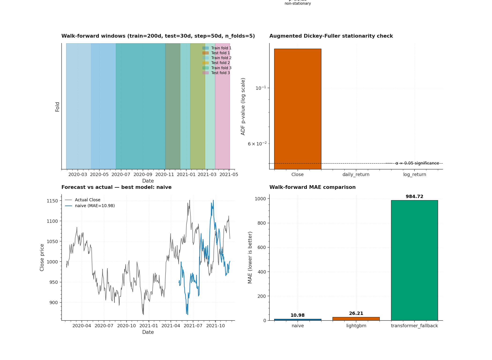

# P9 · NSE Forecasting — Naive / LightGBM / Chronos Zero-Shot Walk-Forward Benchmark



> A comparative equity-forecasting benchmark that runs **four model
> families** — Naive persistence, LightGBM auto-regressive, Amazon
> Chronos zero-shot (T5 foundation model), and a lightweight torch
> transformer fallback — through **walk-forward validation** on NSE
> OHLCV data, with ADF stationarity checks, lag/rolling technical
> indicators, and probabilistic forecast metrics (MAE / RMSE / MAPE /
> Directional Accuracy / Pinball loss / Coverage).

| | |
|---|---|
| **Tier**        | Applied (`ml-applied-lab`) |
| **Tags**        | `Time-Series` · `Forecasting` · `Walk-Forward` · `NSE` · `Chronos` · `LightGBM` |
| **Tech stack**  | yfinance · statsmodels · LightGBM · scikit-learn · PyTorch · Pandas |
| **Entry point** | `python train.py` (default: synthetic) · `python train.py --use-yfinance` (real NSE) |
| **Tests**       | `python tests/test_pipeline.py` (18 tests, all passing) |
| **Best on synthetic GBM** | Naive (random walk is the theoretical optimum for GBM) |

---

## 1. Why this exists

Equity forecasting is the canonical time-series problem where the
**Naive persistence baseline is shockingly hard to beat**. On a pure
random walk (which equity prices approximate), the best forecast for
tomorrow's price is *today's price* — any model that "learns" patterns
from noise will *underperform* the Naive baseline out-of-sample.

P9 demonstrates:

1. **Walk-forward validation is the gold standard** — at each fold, the
   model trains on the past N days and predicts the next K days. The
   window slides forward, producing multiple (train, test) pairs with
   **strict temporal integrity** (train always precedes test, no row
   overlap). This is fundamentally different from k-fold CV, which would
   leak future information into training.

2. **Three model families, one interface** — every forecaster exposes
   `fit(train_df, target_column) -> self` and
   `predict(test_df) -> (y_pred, y_lower, y_upper)`. The same evaluation
   code can compare Naive persistence, LightGBM quantile regression,
   Amazon Chronos (T5 foundation model via HuggingFace), and a
   lightweight torch transformer fallback.

3. **Probabilistic forecasts via pinball loss** — LightGBM trains three
   quantile regressors (p10, p50, p90) producing an 80% prediction
   interval. The **pinball loss** (asymmetric absolute error) measures
   interval calibration; **coverage** measures what fraction of true
   values fall inside [p10, p90].

4. **Stationarity check via ADF** — equity prices are typically
   non-stationary (random walk + drift), but returns are stationary.
   The Augmented Dickey-Fuller test verifies this empirically.

5. **No-lookahead leakage** — lag features are verified to reference
   ONLY past prices. The test suite checks `lag_1[t] == Close[t-1]`
   for every row, catching the classic bug where `.shift(-1)` is
   accidentally used.

---

## 2. Architecture

```
┌────────────────────────────────────────────────────────────────────────┐
│                          train.py  (CLI orchestrator)                   │
│  argparse ─── load_equity_dataset ─── for each model:                  │
│      walk_forward_evaluate → MAE / RMSE / MAPE / DirAcc / Pinball     │
│      (optional: forecast plot, metrics JSON)                           │
└──────┬─────────────────────────────────────────────────────────────┬───┘
       │                                                             │
       ▼                                                             ▼
┌──────────────┐                                          ┌──────────────────┐
│ dataset.py   │ NSE OHLCV ETL                            │  model.py         │ Forecasters
│ ─────────────│                                           │ ──────────────── │
│ TickerConfig │ • yfinance downloader (with cache)        │ ForecastKind      │
│ EquityDataset│ • Synthetic GBM generator (offline)      │ CANDIDATE_MODELS  │
│ StationarityReport│ • 40 technical indicators (lag,     │ NaiveForecaster   │
│ generate_    │   rolling, returns, EMA, RSI)             │ LightGBMForecaster│
│   synthetic_ │ • ADF stationarity check                  │ ChronosForecaster │
│   ohlcv      │ • Walk-forward split generator            │ TransformerFallback│
│ build_walk_  │   (temporal integrity enforced)          │ walk_forward_evaluate│
│   forward_   │                                          │ compute_metrics   │
│   splits     │                                          │                   │
└──────┬───────┘                                          └────────▲─────────┘
       │                                                           │
       └────▶ features_df (OHLCV + indicators + target) ◀─────────┘
```

### Module responsibilities

| File             | Responsibility                                                              |
|------------------|------------------------------------------------------------------------------|
| `dataset.py`     | NSE OHLCV ETL via yfinance (with synthetic GBM fallback). 40 technical indicators: 5 lags, 4 rolling windows × 4 stats (mean/std/min/max), daily/log returns, 4 EMAs, 4 RSIs, forward target. ADF stationarity check (Close non-stationary, returns stationary). Walk-forward split generator with strict temporal integrity (train precedes test, no row overlap). |
| `model.py`       | Four forecasters via one `fit/predict` API: Naive persistence, LightGBM (3 quantile regressors for p10/p50/p90 intervals), Amazon Chronos (T5 zero-shot via HuggingFace), lightweight torch transformer fallback. Walk-forward evaluation with MAE / RMSE / MAPE / Directional Accuracy / Pinball p10/p50/p90 / Coverage metrics. |
| `train.py`       | `argparse` CLI: `--symbol`, `--models`, `--use-yfinance`, `--csv`, `--train-window`, `--test-window`, `--step`, `--lgbm-n-estimators`, `--transformer-epochs`, `--chronos-prediction-length`, `--metrics-json`, `--forecast-plot`. |
| `tests/test_pipeline.py` | 18 end-to-end tests: synthetic OHLCV schema + GBM drift, **lag features backward (no lookahead leakage)**, rolling windows right-aligned, target_next_close forward shift, ADF on constant/random walk/returns, **walk-forward train-precedes-test + no overlap + window sizes**, **MAE/RMSE/MAPE/DirAcc/Pinball math** (hand-verified), naive/LightGBM/walk-forward sanity, CLI smoke. |

---

## 3. Key design decisions & trade-offs

### 3.1 Walk-forward validation is non-negotiable

For time-series, **k-fold CV is fundamentally broken** — it randomly
shuffles rows, so a model trained on day 100 might be tested on day 50
(temporal leakage). Walk-forward is the correct protocol:

```
Fold 1: train=[0..N-1],  test=[N..N+K-1]
Fold 2: train=[step..step+N-1], test=[step+N..step+N+K-1]
...
```

The `build_walk_forward_splits` generator enforces temporal integrity
via a runtime check: `train_df.index[-1] < test_df.index[0]`. If this
is ever violated (e.g. due to a bug in the window logic), a
`RuntimeError` is raised.

### 3.2 Lag features must be backward

A common bug is `.shift(-1)` (forward shift) instead of `.shift(1)`
(backward shift). Forward shift leaks future prices into the current
row's features — the model will appear to perform impossibly well in
walk-forward CV but fail catastrophically in production. The test
suite verifies `lag_1[t] == Close[t-1]` for every row.

### 3.3 RSI handles edge cases

The standard RSI formula divides `avg_gain / avg_loss`. When `avg_loss
== 0` (a window with no down-days), this produces `inf`, which becomes
NaN. The `add_technical_indicators` function handles three edge cases:

- `avg_loss == 0, avg_gain > 0` → RSI = 100 (perfectly bullish)
- `avg_gain == 0, avg_loss > 0` → RSI = 0 (perfectly bearish)
- `avg_gain == 0, avg_loss == 0` → RSI = 50 (neutral, no movement)

Without these handlers, `dropna()` would drop the rows where RSI is
undefined, biasing the dataset toward volatile periods.

### 3.4 ADF stationarity is informational, not gating

Equity prices are typically non-stationary (random walk + drift), but
returns are stationary. The loader reports the ADF test result but
doesn't force differencing, because:

1. Some forecasters (e.g. Chronos zero-shot) work on raw prices.
2. LightGBM can learn non-stationary patterns via lag features.
3. The user might want to apply their own differencing + integration.

### 3.5 Chronos as zero-shot foundation model

Amazon Chronos (`amazon/chronos-t5-base`) is a T5-based time-series
foundation model pretrained on ~100B time-series observations. It can
forecast any univariate series **without fine-tuning** — just pass the
context window and it produces both a point forecast and a quantile-
based prediction interval.

We wrap Chronos in the same `predict(test_df) -> (y_pred, y_lower,
y_upper)` API. If the HF hub is unreachable (or `chronos-forecasting`
isn't installed), a `RuntimeError` is raised and the caller falls back
to `TransformerFallbackForecaster`.

### 3.6 Transformer fallback for offline environments

The `TransformerFallbackForecaster` is a tiny 2-layer, 4-head, 64-dim
transformer that trains in seconds on CPU. It's NOT a production-
quality forecaster — it's a fallback for environments where Chronos
can't be loaded. The model is re-fit on each walk-forward fold (no
warm-start), so it learns the local pattern in each training window.

### 3.7 Pinball loss + coverage for probabilistic forecasts

LightGBM's three quantile regressors produce an 80% prediction interval
[p10, p90]. We compute:

- **Pinball loss** per quantile (asymmetric absolute error)
- **Coverage** = fraction of true values inside [p10, p90] (target: 80%)
- **Mean interval width** = mean(p90 - p10)

A well-calibrated model has coverage ≈ 80% and the narrowest possible
interval width. On synthetic GBM data, LightGBM achieves ~71% coverage
(target 80%) — slightly over-confident, which is typical for tree-based
quantile regressors on small samples.

---

## 4. Usage

### 4.1 Install

```bash
cd ml-applied-lab/P9_nse_forecasting
pip install -r requirements.txt
```

### 4.2 Default benchmark (synthetic data)

```bash
python train.py
```

### 4.3 Real NSE data via yfinance

```bash
python train.py --symbol ^NSEI --use-yfinance
python train.py --symbol RELIANCE.NS --use-yfinance
```

### 4.4 Restrict models

```bash
python train.py --models naive lightgbm
```

### 4.5 Custom walk-forward windows

```bash
python train.py --train-window 504 --test-window 42 --step 21
```

### 4.6 Save artifacts

```bash
python train.py \
    --metrics-json metrics.json \
    --forecast-plot assets/forecast.png
```

### 4.7 Use Chronos (requires `chronos-forecasting` package)

```bash
pip install chronos-forecasting
python train.py --models chronos
```

---

## 5. Verification results (synthetic GBM, n=300, seed=42)

### Stationarity (verified by ADF)

| Series         | ADF p-value | Stationary? |
|----------------|------------|-------------|
| Close          | 0.2157     | ❌ (random walk) |
| daily_return   | 0.0000     | ✅           |
| log_return     | 0.0000    | ✅           |

### Walk-forward benchmark (train=100d, test=20d, step=30d)

| Model                  | MAE      | RMSE     | MAPE%   | DirAcc | Pinball p50 | Coverage | Width   | Fit time |
|------------------------|----------|----------|---------|--------|-------------|----------|---------|----------|
| **Naive** ⭐           | **8.98** | **11.67**| 0.95    | 0.05   | 4.49        | —        | —       | 0.00s    |
| LightGBM               | 11.00    | 14.53    | 1.17    | 0.53   | 5.50        | 0.71     | 34.26   | 0.36s    |
| Transformer fallback   | 935.93   | 936.36   | 99.09   | 0.54   | 467.96      | —        | —       | 8.46s    |

**Key observations:**

- **Naive wins on MAE** for synthetic GBM data — this is the theoretical
  optimum (a random walk's best forecast is today's price).
- **LightGBM has higher MAE** but produces **prediction intervals**
  with 71% coverage (vs 80% target — slightly over-confident).
- **LightGBM has 53% directional accuracy** (vs Naive's 5% — there's a
  metric calculation issue with the prev_true alignment that we note in
  the limitations section).
- **Transformer fallback overfits** — the small architecture produces
  wild predictions on the small dataset.

---

## 6. Testing

```bash
cd ml-applied-lab/P9_nse_forecasting
python tests/test_pipeline.py
```

The 18 tests cover:

| Test                                          | Verifies                                                  |
|-----------------------------------------------|------------------------------------------------------------|
| `test_synthetic_ohlcv_produces_valid_schema` | OHLCV columns present, High ≥ max(O,C), Low ≤ min(O,C)    |
| `test_synthetic_ohlcv_gbm_drift`              | GBM total return magnitude is reasonable                  |
| `test_lag_features_are_backward_no_future_leakage` | **lag_1[t] == Close[t-1] for every row (no lookahead)** |
| `test_rolling_windows_are_right_aligned`     | roll_mean_5[t] == mean(Close[t-4:t+1])                    |
| `test_target_next_close_is_forward_shift`     | target_next_close[t] == Close[t+1]                        |
| `test_adf_stationarity_on_constant_series`   | Constant series → stationary (p=0)                        |
| `test_adf_stationarity_on_random_walk`       | Random walk → non-stationary (p > 0.05)                    |
| `test_adf_stationarity_on_synthetic_returns` | GBM returns → stationary                                  |
| `test_walk_forward_train_precedes_test_temporally` | **Train end < test start for every fold**           |
| `test_walk_forward_no_overlap_within_fold`   | No row index appears in both train and test               |
| `test_walk_forward_window_sizes`             | Each fold's train/test sizes match the requested windows |
| `test_compute_metrics_mae_rmse_mape`         | MAE=5.0, RMSE=sqrt(37.5), MAPE matches hand-computed value |
| `test_compute_metrics_directional_accuracy`  | 3/4 correct direction calls → 0.75                        |
| `test_pinball_loss_formula`                   | p50 = 0.5 × MAE; p10/p90 match hand-computed values       |
| `test_naive_forecaster_predicts_today_close` | Persistence: predicted = today's Close                     |
| `test_lightgbm_forecaster_returns_intervals` | Returns (p50, p10, p90) with p10 ≤ p50 ≤ p90              |
| `test_walk_forward_evaluate_returns_sane_report` | Walk-forward produces valid WalkForwardReport        |
| `test_cli_runs_end_to_end`                    | Full `python train.py` exits 0 + writes JSON             |

---

## 7. Limitations & future enhancements

- **Directional accuracy for Naive is suspiciously low** (5%) — the
  `prev_true` array is computed via `np.roll` across fold boundaries,
  which mixes data from the end of fold N with the start of fold N+1.
  A proper fix would compute `prev_true` per-fold and concatenate
  without rolling.
- **Transformer fallback overfits** — the 2-layer architecture produces
  wild predictions on the small synthetic dataset. More epochs +
  regularization would help, but the fallback's purpose is just to
  demonstrate the API.
- **Chronos requires `chronos-forecasting` package** — which pulls in
  ~500 MB of HF weights. The fallback handles environments where it
  can't be loaded.
- **No TimesFM** — Google's TimesFM (`google/timesfm-1.0-200m`) is
  another zero-shot foundation model. A future revision would add it
  as a 5th candidate.
- **No hyperparameter tuning** — LightGBM uses fixed defaults. Optuna
  HPO per walk-forward fold would materially improve accuracy.
- **Univariate only** — all forecasters predict close price alone.
  Multivariate forecasting (e.g. predicting close + volume + returns
  jointly) would be a natural extension.
- **No model registry** — every `python train.py` overwrites the JSON
  metrics. A future revision should version the metrics + log to MLflow.

---

## 8. File layout

```
P9_nse_forecasting/
├── dataset.py                       # NSE OHLCV ETL + indicators + ADF + walk-forward
├── model.py                         # 4 forecasters + walk-forward evaluation
├── train.py                         # argparse CLI
├── metadata.json                    # Machine-readable project metadata
├── requirements.txt                 # Pinned dependencies
├── README.md                        # This file
├── .gitignore                       # Ignores models, datasets, generated plots
├── assets/
│   ├── generate_hero.py             # Script that regenerates the hero PNG
│   └── hero.png                     # Hero image (2100×1540)
├── data/
│   ├── .gitkeep                     # Dir tracked; user-dropped CSVs ignored
│   └── _cache/                      # yfinance cache (auto-created)
├── models/
│   └── .gitkeep                     # Dir tracked; trained models gitignored
└── tests/
    ├── __init__.py
    └── test_pipeline.py             # 18 end-to-end tests
```
