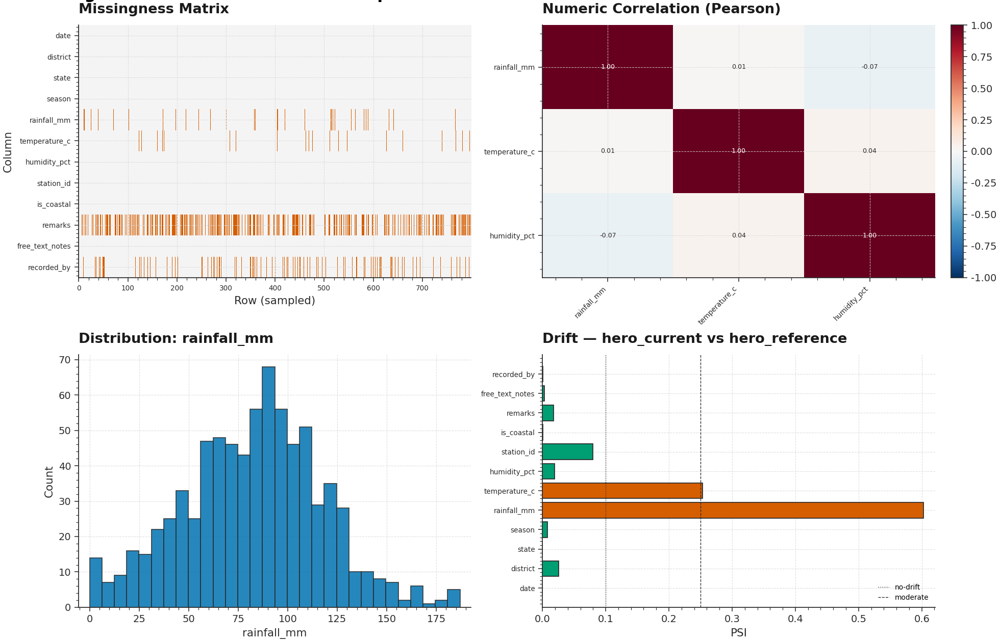

# P1 · AutoInsight — Automated EDA & Drift Report Generator



> **AutoInsight** is a CLI-driven, dependency-light EDA engine that ingests any
> CSV (local, HTTP, or `data.gov.in` resource) and produces a single
> self-contained HTML report with statistical distributions, a missingness map,
> numeric correlations, and PSI-based drift detection against an optional
> reference snapshot.

| | |
|---|---|
| **Tier**        | Foundational (`ml-foundations-lab`) |
| **Tags**        | `EDA` · `Automated Reporting` · `Drift Detection` · `Python` |
| **Tech stack**  | Pandas · NumPy · SciPy · Jinja2 · Plotly · Matplotlib |
| **Entry point** | `python train.py --data <csv> [--reference <ref>] --out <report.html>` |
| **Tests**       | `python tests/test_pipeline.py` (5 unit tests, all passing) |

---

## 1. Why this exists

The first 80 % of any ML project is understanding the data, and almost every
team reinvents the same Jupyter notebook: a `df.describe()` cell, a
missingness heatmap, a few histograms, and a correlation matrix. AutoInsight
collapses that boilerplate into a single CLI invocation that produces a
**portable** artifact (one HTML file, no external assets, emailable) which can
be diffed across data refreshes to detect distributional drift.

It is deliberately **not** a replacement for `pandas-profiling` / `ydata-profiling`.
Those tools produce excellent exploratory reports but are heavyweight (~80
MB install, ~30 s startup, require a Jupyter context for interactive viewing).
AutoInsight targets the *operational* use case: a CI job that runs every
night after the ETL refresh, compares the new snapshot against yesterday's,
and pages a human when PSI crosses 0.25 on any production feature.

---

## 2. Architecture

```
┌──────────────────────────────────────────────────────────────────────────┐
│                              train.py  (CLI)                              │
│  argparse ─── logging ─── load current ─── load reference ─── render ───▶│
└──────┬───────────────────────────────────────────────────────────────────┘
       │                                              │
       ▼                                              ▼
┌──────────────┐                            ┌──────────────────┐
│ dataset.py   │  ETL & type inference       │  report.py       │  HTML builder
│ ─────────────│                             │ ──────────────── │
│ Dataset ▶    │  • load_csv(path|URL)       │ HTMLReportBuilder│
│ ColumnType   │  • clean_dataframe          │ Jinja2 template  │
│ infer_types  │  • DataGovLoader            │ Plotly + base64  │
│              │  • SHA-256 provenance       │ Matplotlib PNGs  │
└──────┬───────┘                            └────────▲─────────┘
       │                                             │
       └────▶ DatasetProfile ◀────────── ProfileBuilder
                                            │
              ┌────────────────────────────┴─────────────────────────────┐
              │                       model.py                            │
              │  ─────────────────────────────────────────────────────    │
              │  ColumnProfile  ·  DatasetProfile  ·  DriftReport         │
              │  ProfileBuilder  ·  compute_drift (PSI + KS)              │
              └───────────────────────────────────────────────────────────┘

                       shared/plot_style.mplstyle  ◀── applies to every figure
```

### Module responsibilities

| File             | Responsibility                                                              |
|------------------|------------------------------------------------------------------------------|
| `dataset.py`     | The *only* module that touches the filesystem or network. Loads CSVs (local path, http(s) URL, `data.gov.in` resource), infers per-column semantic types, runs an idempotent cleaning pass, and returns an immutable `Dataset` value object with SHA-256 provenance. |
| `model.py`       | Pure-function profiling engine. Computes per-column `ColumnProfile` objects (univariate stats, top-K categories, normality test, skew/kurtosis), the dataset-level `DatasetProfile` roll-up (missingness matrix, correlation, duplicate stats), and a `DriftReport` comparing two profiles using PSI + KS. |
| `report.py`      | HTML renderer. Embeds Plotly figures (interactive histograms / bar / line charts) and matplotlib PNGs (missingness matrix, correlation heatmap, drift PSI bars) as base64 in a single self-contained HTML file. |
| `train.py`       | `argparse`-based CLI. Orchestrates `load → profile → (optional drift) → render → save`, with structured logging and non-zero exit codes for CI integration. |
| `tests/test_pipeline.py` | End-to-end smoke tests covering loader, type inference, profiling, drift, and HTML rendering. |
| `sample_data/make_sample_data.py` | Generates a synthetic 800-row weather dataset (Maharashtra districts) with intentional quirks (missing cells, duplicate rows, mixed-type injection, free-form text). |

---

## 3. Key design decisions & trade-offs

### 3.1 Why we did **not** use `ydata-profiling`

`ydata-profiling` (formerly `pandas-profiling`) is the de-facto standard for
one-shot EDA notebooks. We deliberately did not depend on it for three
reasons:

1. **Install weight** — ydata-profiling pulls in ~80 MB of transitive
   dependencies (including visions, tangled-up-in-unicode, phik, etc.).
   AutoInsight runs in CI on machines where install time matters; we kept
   the dependency tree to ~6 packages that the rest of the monorepo already
   uses.

2. **Drift-first** — ydata-profiling has no first-class notion of *comparing
   two snapshots*. AutoInsight treats drift detection as a first-class
   feature with PSI thresholds (0.10 / 0.25) that map to actionable
   "investigate now" / "page on-call" decisions.

3. **HTML portability** — ydata-profiling's output is a multi-file bundle
   that needs a static file server. AutoInsight embeds every figure as
   base64 inside a single HTML file so the report can be attached to an
   email, posted to Slack, or uploaded as a CI artifact without a server.

### 3.2 Type inference: conservative-by-default

A common EDA bug is labelling an ID column as `NUMERIC` because its values
happen to be integers. We avoid this by requiring **90 % of non-null values**
to parse as numeric before promoting an object column. The same rule applies
to datetimes (80 % threshold). The full decision tree is in
`dataset.infer_column_types`.

The trade-off: very small datasets (n < 10) may stay as `CATEGORICAL` even
when they're truly numeric. We consider this a feature: small columns are
not statistically interesting anyway, and avoiding false-positives on ID
columns is more valuable than perfect recall on toy datasets.

### 3.3 PSI over KL-divergence / Wasserstein

For drift detection we picked **Population Stability Index (PSI)** over
alternatives:

| Metric           | Pros                                  | Cons                                              |
|------------------|---------------------------------------|---------------------------------------------------|
| KL divergence    | Information-theoretic foundation      | Asymmetric (D(P‖Q) ≠ D(Q‖P)); thresholds unclear  |
| Wasserstein      | Smooth, captures distribution shape   | No industry-standard thresholds                   |
| **PSI**          | **Symmetric in practice** (we bin on reference), **well-known thresholds** (0.10/0.25), **audience-friendly** | Bin-count is a hyperparameter (we use 10)        |
| KS test          | Distribution-free, exact p-values     | Numeric-only; weak on small n                     |

We compute PSI for every column type (numeric, categorical, datetime, text)
by binning differently per type:
- **Numeric** — 10 quantile bins from the *reference* distribution (ensures
  cross-snapshot comparability).
- **Categorical** — union of categories as bins.
- **Datetime** — convert to nanoseconds-since-epoch, then numeric PSI.
- **Text** — PSI on the distribution of token-lengths.

KS is reported alongside PSI for numeric columns as a sanity check.

### 3.4 Plotly for interactivity, matplotlib for density

The report uses Plotly for per-column distributions (histograms, bar charts)
because the user wants to hover, zoom, and toggle series. It uses matplotlib
for the missingness matrix, correlation heatmap, and drift PSI bar chart
because those are dense static visualizations where Plotly's interactivity
adds latency without insight. Plotly JS is loaded from CDN — if you need a
fully offline report, swap `include_plotlyjs="cdn"` to `"inline"` in
`report.py`.

### 3.5 Caching for `data.gov.in` URLs

HTTP downloads stream into `~/.autoinsight_cache/` keyed by SHA-256 of the
URL. This makes re-runs instant (critical for iterative EDA) and tolerant
of network outages. The cache key is the URL (not the file contents) so
the SHA-256 in the report header always reflects the actual bytes — useful
for auditing which version of a dataset a given report was generated from.

---

## 4. Usage

### 4.1 Install

```bash
cd ml-foundations-lab/P1_autoinsight
pip install -r requirements.txt
```

### 4.2 Local CSV — basic EDA

```bash
python train.py --data ./my_data.csv --out report.html
```

### 4.3 data.gov.in resource (cached after first run)

```bash
python train.py \
    --data https://data.gov.in/sites/default/files/all_india_weekly_rainfall.csv \
    --name "India Weekly Rainfall" \
    --out rainfall.html
```

Subsequent runs with the same URL complete in <1 second because the
downloaded CSV is cached at `~/.autoinsight_cache/`.

### 4.4 Drift mode (current vs reference)

```bash
python train.py \
    --data ./snapshots/2026-08-18.csv \
    --reference ./snapshots/2026-08-11.csv \
    --out drift_week.html
```

The report's drift section shows a PSI bar chart colour-coded by severity
(green / amber / red) and a per-column table with PSI, KS statistic, KS
p-value, and sample sizes.

### 4.5 Force-refresh cached remote

```bash
python train.py --data <url> --no-cache --out fresh.html
```

### 4.6 Generate the sample data + hero image

```bash
python sample_data/make_sample_data.py
python assets/generate_hero.py
```

---

## 5. Output structure

The generated HTML contains these sections, in order:

1. **Header** — dataset name, row/col counts, missing %, memory, SHA-256.
2. **Overview cards** — six KPI cards (rows, cols, missing cells, duplicate
   rows, memory, SHA-256).
3. **Missingness Map** — matplotlib heatmap, amber = missing, grey = present.
   Sampled to 5,000 rows for very large datasets.
4. **Numeric Correlation** — Pearson correlation heatmap for numeric columns,
   with cell annotations (only when ≤ 14 numeric columns).
5. **Drift Report** (only if `--reference` is provided) — PSI bar chart +
   per-column table.
6. **Column Profiles** — sortable table with per-column type, missing %,
   unique %, mean/median, std, p05/p95, skew/kurtosis, top categories.
7. **Per-column Distributions** — Plotly histogram (numeric) / bar chart
   (categorical) / line chart (datetime). Capped at 50 figures to keep HTML
   size reasonable.
8. **Sample Rows** — collapsible first-5-rows preview.
9. **Footer** — generation timestamp + SHA-256 provenance.

---

## 6. Testing

```bash
cd ml-foundations-lab/P1_autoinsight
python tests/test_pipeline.py
```

The test suite covers five scenarios, all of which must pass before any
commit lands on `main`:

| Test                          | Verifies                                                       |
|-------------------------------|----------------------------------------------------------------|
| `test_dataset_loads`          | CSV loads with correct shape, SHA-256, source_kind             |
| `test_type_inference`         | Numeric / categorical / datetime / boolean / text detection    |
| `test_profile_built`          | `DatasetProfile` has correct row/col counts & missingness shape |
| `test_drift_report`           | Drift columns non-empty, max PSI ≥ 0, severe columns detected  |
| `test_html_report_renders`    | HTML file written with all expected section markers            |

---

## 7. Limitations & future enhancements

- **No Excel / Parquet input** — only CSV. Add `pyarrow` to support Parquet
  and `openpyxl` for Excel in a future revision.
- **No incremental profiling** — every run recomputes from scratch. For
  daily drift monitoring over a multi-GB warehouse, we'd want to persist
  per-column profiles (e.g. to SQLite) and only recompute the diff.
- **No outlier flagging** — the report shows distributions but does not
  annotate outliers. A future revision should add IQR / isolation-forest
  outlier flags on the per-column table.
- **PSI bins are fixed at 10** — for highly skewed distributions, adaptive
  binning (Freedman-Diaconis) may be more sensitive. Currently tunable via
  the `_psi_numeric` `n_bins` parameter.
- **Text columns get only length-PSI** — semantic drift (e.g. a review
  column shifting from positive to negative sentiment) is not detected.
  A future revision should plug in a sentence-embedding-based drift score.

---

## 8. File layout

```
P1_autoinsight/
├── dataset.py                       # ETL, type inference, Dataset value object
├── model.py                         # Profiling engine + drift detection
├── report.py                        # HTML report builder
├── train.py                         # argparse CLI
├── metadata.json                    # Project metadata (machine-readable)
├── requirements.txt                 # Pinned dependencies
├── README.md                        # This file
├── .gitignore                       # Ignores generated HTML & cached CSVs
├── assets/
│   ├── generate_hero.py             # Script that regenerates the hero PNG
│   └── hero.png                     # Hero image used by README + metadata
├── sample_data/
│   ├── make_sample_data.py          # Synthetic weather dataset generator
│   ├── sample_current.csv           # Generated sample (gitignored)
│   └── sample_reference.csv         # Generated sample (gitignored)
└── tests/
    ├── __init__.py
    └── test_pipeline.py             # 5 end-to-end tests
```
