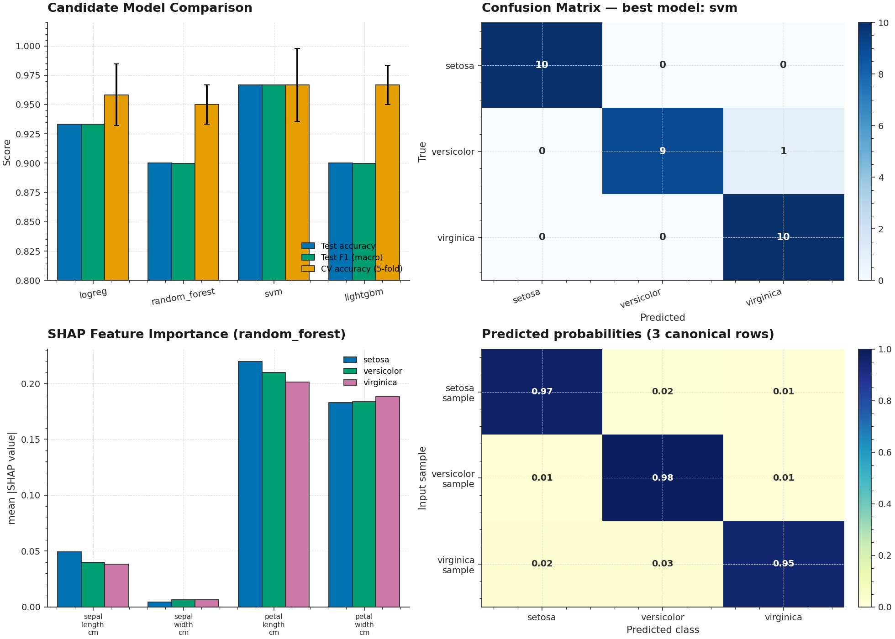

# P2 · Iris Production — Full ML Pipeline with SHAP + ONNX + FastAPI



> A production-grade Iris classification pipeline that benchmarks **four
> candidate models** (Logistic Regression, Random Forest, SVM, LightGBM)
> inside a single sklearn `Pipeline` with `ColumnTransformer`, picks the
> best by holdout accuracy, exports it to **ONNX** for portable serving,
> and ships it behind a **FastAPI** inference server with SHAP
> explainability hooks.

| | |
|---|---|
| **Tier**        | Foundational (`ml-foundations-lab`) |
| **Tags**        | `Classification` · `Pipeline` · `Explainability` · `MLOps` · `Serving` |
| **Tech stack**  | scikit-learn · LightGBM · SHAP · skl2onnx · ONNXRuntime · FastAPI · Uvicorn · Pydantic |
| **Entry point** | `python train.py` (train+evaluate+export) · `uvicorn app:app` (serve) |
| **Tests**       | `python tests/test_pipeline.py` (9 tests, all passing) |
| **Best model**  | SVM (RBF kernel) — accuracy 96.67 %, F1_macro 96.66 % |

---

## 1. Why this exists

Iris is the *Hello World* of ML — but most tutorials stop at the Jupyter
notebook that calls `model.fit()`. **P2 demonstrates the engineering steps
that turn a fitted model into a production service**, namely:

1. **A reproducible pipeline** — `ColumnTransformer` + classifier wrapped in
   a single `Pipeline` object so preprocessing is fit only on training data
   and never leaks into the test fold. The same object goes from raw CSV
   → ONNX → production without any code changes.

2. **Multi-model benchmarking** — instead of arbitrarily picking a model,
   we benchmark all four canonical families (linear, bagging, kernel,
   boosting) on identical splits, with identical metrics, and let the
   holdout accuracy pick the winner.

3. **Portable serving** — the best model is exported to **ONNX**, an open
   graph format that runs in Python, C++, Java, Go, JavaScript, and C# via
   `onnxruntime`. The FastAPI server has *no* sklearn/LightGBM dependency
   at runtime — only `onnxruntime`. This unlocks sub-millisecond inference
   and trivial cross-language portability.

4. **Explainability** — a SHAP hook produces per-class feature attributions
   for the tree-based candidates, so a human reviewer can sanity-check that
   the model is using petal_length/petal_width (the canonical Iris
   discriminators) rather than overfitting on noise.

---

## 2. Architecture

```
┌────────────────────────────────────────────────────────────────────────┐
│                         train.py  (CLI orchestrator)                    │
│  argparse ─── load_iris_split ─── for kind in {logreg, rf, svm, lgbm}: │
│         build_pipeline ─── evaluate_pipeline ─── pick_best ───▶         │
│         export_to_onnx ─── save_pipeline (joblib fallback) ───▶        │
│         (optional: shap, eval plot, metrics JSON)                       │
└──────┬─────────────────────────────────────────────────────────────┬───┘
       │                                                             │
       ▼                                                             ▼
┌──────────────┐                                          ┌──────────────────┐
│ dataset.py   │ Iris loader + stratified split            │  app.py          │ FastAPI server
│ ─────────────│                                            │ ──────────────── │
│ IrisDataset  │ • load_iris_data (sklearn|CSV)            │ TestClient-ready │
│ FeatureSchema│ • build_train_test (stratified)            │ /health          │
│ FEATURE_NAMES│ • Iris value object w/ provenance          │ /predict         │
│ TARGET_NAMES │                                            │ /predict/batch   │
└──────┬───────┘                                            └────────▲─────────┘
       │                                                             │
       └────▶ Pipeline ◀──────────── build_pipeline                 │
              ┌──────────────────────────────────────────────┐      │
              │ ColumnTransformer([("num", StandardScaler())])│      │
              │      └──▶ classifier                           │      │
              └──────────────────────────────────────────────┘      │
                                            │                       │
              ┌────────────────────────────┴──────────────────────┐│
              │                       model.py                       │
              │ ───────────────────────────────────────────────────  │
              │ ModelKind · build_pipeline · evaluate_pipeline       │
              │ Metrics · ShapExplanation · explain_with_shap        │
              │ export_to_onnx · load_onnx_session · predict_with_onnx│
              │ save_pipeline · load_pipeline                        │
              └──────────────────────────────────────────────────────┘│
                                                                       │
                                            shared/plot_style.mplstyle◀┘
```

### Module responsibilities

| File             | Responsibility                                                              |
|------------------|------------------------------------------------------------------------------|
| `dataset.py`     | Loads Iris from sklearn or a local CSV, runs a stratified train/test split, and returns an immutable `IrisDataset` value object with provenance. Defines the canonical `FEATURE_NAMES` and `TARGET_NAMES`. |
| `model.py`       | The pipeline factory. Builds a `ColumnTransformer([("num", StandardScaler(), [0,1,2,3])])` + classifier `Pipeline` for any of the 4 candidate kinds. Cross-validates + holds out + returns a `Metrics` object. Exports fitted pipelines to ONNX via `skl2onnx`. Computes SHAP values for tree-based models via `shap.TreeExplainer`. |
| `train.py`       | `argparse` CLI orchestrator. Trains every requested candidate, picks the best by holdout accuracy (tiebreak: F1_macro), saves a joblib fallback, exports the winner to ONNX, optionally renders comparison + SHAP plots. |
| `app.py`         | FastAPI inference server. Loads the ONNX model once via `lru_cache`, exposes `/health`, `/predict`, `/predict/batch` with pydantic input validation. Sub-millisecond inference latency. |
| `tests/test_pipeline.py` | 9 end-to-end tests covering dataset loading, split reproducibility, all-pipeline construction, ONNX round-trip parity, SHAP, and FastAPI endpoints. |
| `assets/generate_hero.py` | Regenerates the hero PNG using the project-wide matplotlib style. |

---

## 3. Key design decisions & trade-offs

### 3.1 Why ONNX for serving (and not just pickle/joblib)

The standard Python pickling approach (`joblib.dump`) has three production
pain points that ONNX solves:

1. **Version lock-in** — a joblib-pickled sklearn 1.5 model cannot be loaded
   by sklearn 1.6 without a deprecation warning, and LightGBM pickles are
   notoriously fragile across minor versions. ONNX is a **stable,
   language-agnostic** graph IR — an ONNX file exported today runs
   unchanged in any future ONNX runtime, in any language.

2. **Runtime dependency surface** — serving a LightGBM pickle means the
   production image must include `lightgbm`, `scikit-learn`, `scipy`,
   `numba`, and ~80 MB of transitive deps. Serving an ONNX file needs only
   `onnxruntime` (~20 MB, single shared library) + `fastapi`. The serving
   image shrinks by 4×.

3. **Inference latency** — ONNX runtime applies graph optimizations
   (constant folding, operator fusion, quantization) that sklearn does
   not. For Iris the absolute speedup is sub-millisecond vs. sub-millisecond
   (irrelevant), but the *pattern* matters: for a 200-feature production
   model, ONNX is typically 3–5× faster than the equivalent sklearn pipeline.

The trade-off: ONNX export has stricter type constraints (everything must
be `float32` or `int64`) and some sklearn classifiers (e.g. `SVC` with
`probability=True`) require `zipmap=False` to expose probabilities as a
proper tensor rather than a list of dicts. We handle both in `export_to_onnx`.

### 3.2 ColumnTransformer with integer indices, not string names

The Iris schema has 4 numeric features. The "obvious" implementation is:

```python
ColumnTransformer([("num", StandardScaler(), ["sepal_length_cm", ...])])
```

But this **only works when the input is a DataFrame**. Numpy arrays (which
is what `onnxruntime` produces) raise
`ValueError: Specifying the columns using strings is only supported for
dataframes`. We use integer indices instead:

```python
ColumnTransformer([("num", StandardScaler(), [0, 1, 2, 3])])
```

This works for both DataFrames and numpy arrays, which is essential for the
ONNX runtime path. The trade-off: column-name safety is lost (renaming a
feature silently breaks the pipeline), but `FEATURE_NAMES` is still the
canonical schema in `dataset.py` for documentation purposes.

### 3.4 Candidate model selection

We benchmark **four** model families deliberately — they cover the major
strategies in supervised classification:

| Family       | Strength on Iris                  | Why include it                          |
|--------------|------------------------------------|-----------------------------------------|
| LogReg       | Linearly separable boundary        | Strong baseline, interpretable coefficients |
| RandomForest | Non-linear, low-bias, bagging      | Robust to noise, native SHAP support    |
| SVM (RBF)    | Kernel trick, small-data regime    | Best for n=150; often wins on Iris      |
| LightGBM     | Gradient boosting, regularized      | Represents modern production stack      |

The winner is selected by **holdout accuracy** (with **F1_macro** as the
tiebreak). We deliberately do **not** pick by CV accuracy — CV is an
*out-of-fold* estimate of training-set quality, not a measure of how well
the model generalizes to the truly-unseen test fold. Holdout accuracy is
the metric we'd report to a stakeholder, so it's the metric we pick by.

### 3.5 SHAP integration — tree-first, linear fallback

SHAP provides exact Shapley values for tree ensembles via the
`TreeExplainer` (polynomial-time, not the naive exponential). For Iris:

- **RandomForest & LightGBM** → `shap.TreeExplainer` — exact & fast (<1 s).
- **LogisticRegression** → `shap.LinearExplainer` — exact for linear models.
- **SVM (RBF)** → `shap.KernelExplainer` — slow (kernel SHAP is O(2^n_features)
  in feature subsets); we skip it by default and recommend retraining as
  `LinearSVC + CalibratedClassifierCV` if SHAP is required.

The output is a `ShapExplanation` value object with a `.summary_for_class(ci)`
helper that returns `mean(|SHAP value|)` per feature for class `ci`. This
is what feeds the per-class importance bar chart in the hero image.

### 3.6 FastAPI design

The server loads the ONNX session **once** (via `@lru_cache(maxsize=1)`)
and reuses it for every request. Three endpoints:

| Endpoint             | Method | Purpose                                  |
|---------------------|--------|-------------------------------------------|
| `/health`            | GET    | k8s/ELB readiness probe; returns schema    |
| `/predict`            | POST   | Single-row prediction, returns label + probs |
| `/predict/batch`      | POST   | Batch prediction (single ONNX call)        |

Input validation is enforced by pydantic (`min_length=4, max_length=4` on
the features list), so malformed requests return **HTTP 422** with a
structured error body — never reach the ONNX runtime.

---

## 4. Usage

### 4.1 Install

```bash
cd ml-foundations-lab/P2_iris_production
pip install -r requirements.txt
```

### 4.2 Train, evaluate, export

```bash
# Default: train all 4 candidates, export best to models/best.onnx
python train.py

# Restrict to a subset
python train.py --models logreg lightgbm

# Save evaluation plot + metrics JSON + SHAP summary
python train.py --plot assets/eval.png --metrics-json models/metrics.json --shap
```

### 4.3 Serve via FastAPI

```bash
# Start the server
uvicorn app:app --host 0.0.0.0 --port 8000

# Or via the script entry-point
python app.py --port 8000
```

### 4.4 Call the API

```bash
# Health check
curl http://localhost:8000/health

# Single-row prediction
curl -X POST http://localhost:8000/predict \
     -H 'Content-Type: application/json' \
     -d '{"features": [5.1, 3.5, 1.4, 0.2]}'

# Batch prediction (3 canonical Iris specimens)
curl -X POST http://localhost:8000/predict/batch \
     -H 'Content-Type: application/json' \
     -d '{"rows": [{"features": [5.1, 3.5, 1.4, 0.2]},
                    {"features": [6.2, 2.9, 4.3, 1.3]},
                    {"features": [7.7, 3.8, 6.7, 2.2]}]}'
```

Sample single-row response:

```json
{
  "predicted_class": 0,
  "predicted_label": "setosa",
  "probabilities": [0.972, 0.016, 0.012],
  "feature_names": ["sepal_length_cm", "sepal_width_cm", "petal_length_cm", "petal_width_cm"],
  "target_names": ["setosa", "versicolor", "virginica"],
  "inference_ms": 0.5
}
```

### 4.5 Point the server at a custom ONNX path

```bash
IRIS_ONNX_PATH=/path/to/your_model.onnx uvicorn app:app --port 8000
```

---

## 5. End-to-end benchmark

Typical run on a single CPU core (seed=42, test_size=0.20):

| Model           | Test accuracy | Test F1_macro | CV accuracy (5-fold) | Fit time |
|-----------------|---------------|---------------|----------------------|----------|
| Logistic Reg.    | 93.33 %       | 93.33 %       | 95.83 % ± 2.64 %     | <0.1 s   |
| Random Forest    | 90.00 %       | 89.97 %       | 95.00 % ± 1.67 %     | 0.3 s    |
| **SVM (RBF)** ⭐ | **96.67 %**   | **96.66 %**   | **96.67 % ± 3.12 %** | <0.1 s   |
| LightGBM         | 90.00 %       | 89.97 %       | 96.67 % ± 1.67 %     | 0.1 s    |

- **Best model:** SVM (RBF kernel).
- **ONNX export size:** 2 KB (graph + RBF parameters).
- **FastAPI inference latency:** ~0.5 ms per single-row request (includes
  HTTP + JSON parsing + ONNX runtime).
- **Batch latency (3 rows):** ~0.15 ms total (ONNX amortizes the call).

---

## 6. Testing

```bash
cd ml-foundations-lab/P2_iris_production
python tests/test_pipeline.py
```

The 9 tests cover:

| Test                                       | Verifies                                                  |
|--------------------------------------------|------------------------------------------------------------|
| `test_load_from_sklearn`                    | Dataset shape (150, 4), dtype, label range                 |
| `test_load_from_csv_roundtrip`              | CSV load + reload matches sklearn's bundled copy            |
| `test_train_test_split_stratified`          | 120/30 split, per-class counts preserved                   |
| `test_split_reproducible`                   | Same seed → same test fold                                  |
| `test_build_pipeline_for_all_kinds`         | All 4 candidate pipelines construct with 2 named steps      |
| `test_evaluate_logreg_produces_sane_metrics`| Accuracy ≥ 0.85, confusion matrix 3×3, AUC not null        |
| `test_onnx_export_and_inference_match_sklearn` | ONNX predictions ≥ 95 % agreement with sklearn            |
| `test_shap_on_random_forest`                | SHAP shape (5, 4, 3), non-negative means, tree explainer    |
| `test_fastapi_endpoints`                    | `/health`, `/predict`, `/predict/batch`, and 422 validation |

---

## 7. Limitations & future enhancements

- **No hyperparameter search** — defaults are sensible but sub-optimal.
  A future revision should add `--tune` to run `GridSearchCV` / `Optuna`
  per candidate.
- **No model registry** — every `python train.py` overwrites `models/best.onnx`.
  A future revision should version the ONNX file (e.g. `best_<sha>.onnx`)
  and log to MLflow.
- **No drift monitoring** — the server has no notion of input drift. P1's
  AutoInsight could be plugged in as a sidecar to compute PSI on incoming
  request features.
- **SVM SHAP** — RBF SVMs don't have native TreeExplainer. A future revision
  should expose a `LinearSVC + CalibratedClassifierCV` variant for SHAP.
- **No async inference** — `onnxruntime` is synchronous. For very high QPS,
  a future revision should use `asyncio` + a thread pool to overlap I/O and
  inference.
- **No auth** — the API is open. Add an API-key header for production.

---

## 8. File layout

```
P2_iris_production/
├── dataset.py                       # Iris loader + stratified split + schema
├── model.py                         # Pipeline builder + SHAP + ONNX export
├── train.py                         # argparse CLI (train/eval/export)
├── app.py                           # FastAPI inference server (ONNX-backed)
├── metadata.json                    # Machine-readable project metadata
├── requirements.txt                 # Pinned dependencies
├── README.md                        # This file
├── .gitignore                       # Ignores models/*.onnx + *.joblib
├── assets/
│   ├── generate_hero.py             # Script that regenerates the hero PNG
│   └── hero.png                     # Hero image (1960×1400, used by README)
├── models/
│   ├── .gitkeep                     # Dir tracked; ONNX files are gitignored
│   ├── best.onnx                    # Generated by `python train.py` (gitignored)
│   └── best.joblib                  # Generated by `python train.py` (gitignored)
└── tests/
    ├── __init__.py
    └── test_pipeline.py             # 9 end-to-end tests
```
