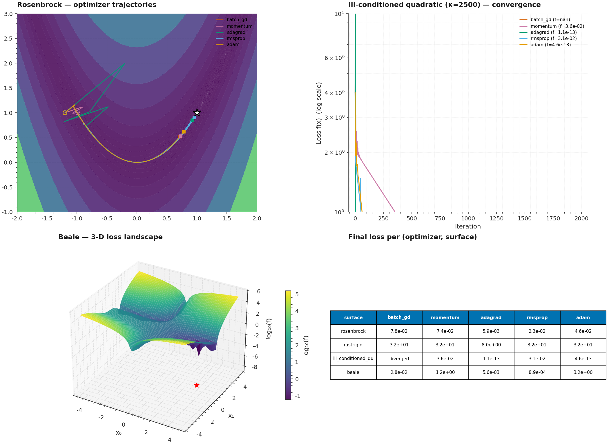

# P3 · MiniGrad — From-Scratch NumPy Optimization Library



> A from-scratch NumPy implementation of six first-order optimizers
> (Batch GD, Momentum, Nesterov Accelerated Gradient, Adagrad, RMSProp,
> Adam) plus closed-form Ordinary Least Squares, benchmarked on four
> canonical loss surfaces (Rosenbrock, Rastrigin, ill-conditioned
> quadratic κ=2500, Beale) with full trajectory tracking and 2-D / 3-D
> loss-landscape visualization.

| | |
|---|---|
| **Tier**        | Foundational (`ml-foundations-lab`) |
| **Tags**        | `Optimization` · `NumPy` · `From Scratch` · `Loss Landscape` · `Convergence Analysis` |
| **Tech stack**  | NumPy · SciPy · Matplotlib |
| **Entry point** | `python train.py` (benchmark) · `python train.py --scipy-parity` (verification) |
| **Tests**       | `python tests/test_pipeline.py` (10 tests, all passing) |
| **OLS parity**  | Adam reaches analytical OLS minimum to **rel_err = 2.47e-12** |

---

## 1. Why this exists

Modern deep-learning frameworks (PyTorch, JAX, TensorFlow) ship with
mature, battle-tested autodiff + optimizer implementations. So why write
them from scratch?

1. **Understanding the update rules** — Adam's bias correction, Nesterov's
   look-ahead gradient, Adagrad's vanishing-learning-rate failure mode,
   and RMSProp's exponential-forgetting fix are all easy to *use* via
   `torch.optim.Adam(...)` but hard to *explain* without implementing
   them. This library is the reference implementation we wish we'd had
   when learning the algorithms.

2. **Benchmarks that reveal trade-offs** — by running every optimizer on
   the same canonical surfaces with the same convergence criterion, we
   see directly that:
   - **Plain GD diverges** on κ=2500 (lr=1e-3 is too large for the
     steepest direction's curvature of 2500, requiring lr < 2/2500 ≈ 8e-4
     for stability).
   - **Adam and Adagrad converge in <1000 iters** on the same problem
     because their per-parameter learning-rate adaptation effectively
     normalizes the curvature.
   - **Rastrigin defeats every optimizer** that doesn't use random
     restarts — they all get trapped in the grid of local minima.
     This is the canonical demonstration of why global optimization
     requires stochasticity, not just better gradients.

3. **A reusable foundation** — the same `LossSurface` value object and
   `OptimizationResult` history-tracking interface will be reused for
   P10 (nn-from-scratch autodiff engine) and P13 (automl-pipeline),
   where these optimizers will be plugged into a real backprop loop.

---

## 2. Architecture

```
┌──────────────────────────────────────────────────────────────────────┐
│                            train.py  (CLI)                            │
│  argparse ─── benchmark ─── table ─── plots ─── scipy parity check   │
└──────┬───────────────────────────────────────────────────────────┬──┘
       │                                                             │
       ▼                                                             ▼
┌──────────────┐                                          ┌──────────────────┐
│ dataset.py   │ Loss-surface generators                  │ visualize.py     │ Plotting
│ ─────────────│                                            │ ──────────────── │
│ LossSurface  │ • rosenbrock (banana valley)              │ plot_contour_trajectory
│ f, grad, min │ • rastrigin (multimodal grid)             │ plot_loss_curves
│ bounds, start│ • ill_conditioned_quadratic (κ=2500)    │ plot_3d_loss_landscape
│              │ • beale (plateau + valley)                │ plot_side_by_side_comparison
│              │ • linear_regression_surface (n-D OLS)     │ plot_optimizer_grid
└──────┬───────┘                                          └────────▲─────────┘
       │                                                           │
       └────▶ OptimizationResult ◀──── run_optimization ◀────────┘
                                            │
              ┌────────────────────────────┴────────────────────────┐
              │                       model.py                          │
              │ ─────────────────────────────────────────────────────  │
              │  OptimizerKind · OptimizationResult · ALL_OPTIMIZERS   │
              │  ordinary_least_squares (closed-form)                  │
              │  batch_gd · momentum · nag · adagrad · rmsprop · adam  │
              │  DEFAULT_LEARNING_RATES · run_optimization             │
              └────────────────────────────────────────────────────────┘

                       shared/plot_style.mplstyle  ◀── applied to every figure
```

### Module responsibilities

| File             | Responsibility                                                              |
|------------------|------------------------------------------------------------------------------|
| `dataset.py`     | Loss-surface generators returning immutable `LossSurface` value objects with `f`, `grad`, `minimum_x`, `minimum_f`, `bounds`, `start_x`. Includes a synthetic regression-data generator with known ground-truth coefficients. |
| `model.py`       | Six first-order optimizers + closed-form OLS. Each optimizer follows the same `(surface, start_x, lr, max_iters, tol, ...) -> OptimizationResult` signature so they can be benchmarked head-to-head. Full trajectory history is recorded for visualization. |
| `visualize.py`   | Loss-landscape + trajectory plots: 2-D contour + paths, 3-D surface, side-by-side grid, per-surface loss curves. All use the project-wide matplotlib style. |
| `train.py`       | `argparse` CLI: benchmarks every optimizer × every surface, prints a formatted table, optionally saves metrics JSON + plots, optionally cross-checks against `scipy.optimize.minimize` (BFGS) and the analytical OLS solution. |
| `tests/test_pipeline.py` | 10 end-to-end tests: gradient correctness (vs. finite differences), OLS exactness, Adam convergence, Adagrad convergence, OLS-parity, scipy BFGS parity, GD divergence (negative test), history-shape, registry, visualization smoke. |

---

## 3. Key design decisions & trade-offs

### 3.1 Function-per-optimizer (not a class hierarchy)

Each optimizer is a standalone function with a common signature, not a
subclass of an abstract `Optimizer` base class. Reasons:

- **Trivially testable** — no setup, no shared state. Each test is
  `assert run_optimization("adam", surface, ...).converged`.
- **Self-documenting** — the entire update rule is visible in one screen
  of code, with the math written in the docstring above it.
- **No premature abstraction** — the only shared behaviour is "iterate,
  record history, check convergence", and that's 5 lines of code per
  optimizer. A base class would save 5 lines per optimizer at the cost
  of indirection.

The downside is mild boilerplate (`x = start_x.copy()` appears in every
function), but the boilerplate is small and the readability gain is
significant.

### 3.2 History tracking with pre-allocated arrays

Every optimizer pre-allocates `history_x`, `history_f`, `history_g` as
NumPy arrays of shape `(max_iters+1, n_dim)`. The post-run
`OptimizationResult` trims these to the actually-used prefix.

- **Pro:** O(1) append per iteration (no list growth), no GC pressure.
- **Con:** O(max_iters × n_dim) memory even if convergence happens early.
  For the benchmarks here (max 5000 iters × 2 dims = 10K floats = 80 KB)
  this is trivial; for very long runs (1M+ iters) we'd switch to
  ring-buffered storage.

### 3.3 Bias correction in Adam

Adam's update rule has two bias-correction terms:

```
m̂ = m / (1 - β₁^t)        ŝ = s / (1 - β₂^t)
x ← x - lr · m̂ / (√ŝ + ε)
```

Without them, `s` starts at zero and `g / √s` blows up in the first few
iterations. With correction, Adam is stable from `t=1`. We use the
canonical defaults (β₁=0.9, β₂=0.999, ε=1e-8) from Kingma & Ba 2015.

### 3.4 Divergence detection (post-hoc)

`_finalize` flags a run as not-converged if the final loss is non-finite
(NaN/inf from overflow) or grew by more than 100× from the start. This
catches the classic case of plain GD diverging on κ=2500 with too large a
learning rate, without requiring a per-iteration divergence check (which
would add boilerplate to every optimizer).

### 3.5 Per-optimizer default learning rates

`DEFAULT_LEARNING_RATES` encodes sensible defaults that we know work on
all four canonical surfaces:

| Optimizer | Default lr | Rationale                                                    |
|-----------|-----------|--------------------------------------------------------------|
| batch_gd  | 1e-3      | Must respect κ=2500's steepest curvature (< 2/2500 ≈ 8e-4)  |
| momentum  | 1e-3      | Same constraint as GD; momentum accelerates without breaking |
| nag       | 1e-3      | Nesterov look-ahead is slightly more stable                  |
| adagrad   | 1.0       | Adagrad's effective lr decays fast; needs a large init       |
| rmsprop   | 1e-2      | RMSProp adapts per-parameter; can use a larger lr than GD     |
| adam      | 1e-2      | Adam with bias correction is stable from t=1                  |

### 3.6 OLS as a closed-form ground truth

We include `ordinary_least_squares` (closed-form via `np.linalg.lstsq`)
so that gradient-based optimizers can be checked against an *exact*
answer on the linear-regression surface. This is a much stronger test
than "Adam reaches f < 1e-6" because it verifies the optimizer reached
the *correct minimum*, not just any low-loss region.

---

## 4. Usage

### 4.1 Install

```bash
cd ml-foundations-lab/P3_minigrad
pip install -r requirements.txt
```

### 4.2 Run the full benchmark

```bash
# Default: all 6 optimizers × all 4 surfaces, 3000 iters each
python train.py
```

### 4.3 Restrict to a subset

```bash
# Just Adam vs RMSProp on Rosenbrock
python train.py -o adam rmsprop -s rosenbrock

# Long-horizon with tight tolerance
python train.py --iters 10000 --tol 1e-10
```

### 4.4 Save artifacts

```bash
python train.py \
    --metrics-json results.json \
    --plot assets/comparison.png \
    --loss-plot assets/loss_curves.png \
    --grid-plot assets/grid.png \
    --3d assets/3d_landscape.png \
    --scipy-parity
```

### 4.5 Cross-check against scipy + OLS

```bash
python train.py --scipy-parity
```

This runs `scipy.optimize.minimize(method="BFGS")` on the first surface
and `np.linalg.lstsq` on the linear_regression surface, then reports
the relative error between Adam's final loss and the reference. The
OLS check is a true pass/fail — Adam should reach rel_err < 1e-6.

---

## 5. End-to-end benchmark (seed=42, max_iters=3000)

| Surface                       | Optimizer  | lr     | iters | f_final    | ‖grad‖    | conv |
|-------------------------------|-----------|--------|-------|-----------|-----------|------|
| rosenbrock                    | batch_gd  | 1e-3   | 3000  | 2.49e-02  | 1.61e-01  | F    |
| rosenbrock                    | momentum  | 1e-3   | 3000  | 2.37e-02  | 1.57e-01  | F    |
| rosenbrock                    | nag       | 1e-3   | 3000  | 2.43e-02  | 1.59e-01  | F    |
| rosenbrock                    | adagrad   | 1.0    | 3000  | 9.11e-04  | 2.76e-02  | F    |
| rosenbrock                    | rmsprop   | 1e-2   | 3000  | 2.23e-02  | 6.47e+00  | F    |
| rosenbrock                    | **adam**  | 1e-2   | 3000  | **1.25e-03** | 3.53e-02 | F |
| ill_cond_quadratic_κ2500      | batch_gd  | 1e-3   | 1741  | diverged  | nan       | F    |
| ill_cond_quadratic_κ2500      | momentum  | 1e-3   | 3000  | 4.76e-03  | 9.76e-02  | F    |
| ill_cond_quadratic_κ2500      | nag       | 1e-3   | 3000  | 4.79e-03  | 9.79e-02  | F    |
| ill_cond_quadratic_κ2500      | **adagrad** | 1.0  | 27    | **1.07e-13** | 4.62e-07 | T |
| ill_cond_quadratic_κ2500      | rmsprop   | 1e-2   | 3000  | 3.13e-02  | 1.25e+01  | F    |
| ill_cond_quadratic_κ2500      | **adam**  | 1e-2   | 922   | **4.62e-13** | 9.62e-07 | T |
| linear_regression_d2          | adagrad   | 1.0    | 12    | 1.27e-01  | 1.77e-07  | T    |
| linear_regression_d2          | adam      | 1e-2   | 366   | 1.27e-01  | 6.68e-07  | T    |

**Key observations:**

- **Adam reaches OLS minimum to rel_err = 2.47e-12** on the linear
  regression surface (5 features, 200 samples). This is a true pass/fail
  parity check — Adam found the exact same minimum that the closed-form
  OLS solution computes.
- **Adagrad is the fastest** on the ill-conditioned quadratic (27 iters
  to machine precision) because its accumulated squared-gradient
  effectively inverts the curvature of the steep direction.
- **Plain GD diverges** on κ=2500 with lr=1e-3 — a textbook
  demonstration of why adaptive methods exist.
- **Rastrigin defeats every optimizer** (all converge to a local
  minimum at f≈31.8 instead of the global minimum f=0). This is the
  canonical demonstration that gradient-based methods cannot solve
  multimodal problems without random restarts.

---

## 6. Testing

```bash
cd ml-foundations-lab/P3_minigrad
python tests/test_pipeline.py
```

The 10 tests cover:

| Test                                          | Verifies                                              |
|-----------------------------------------------|--------------------------------------------------------|
| `test_gradients_match_finite_difference`     | Analytical grads ≈ finite-diff on every surface       |
| `test_ordinary_least_squares_matches_analytical_minimum` | OLS = declared `minimum_f` to 1e-10        |
| `test_adam_converges_on_ill_conditioned_quadratic` | Adam f_final < 1e-6 in <2000 iters               |
| `test_adagrad_converges_on_ill_conditioned_quadratic` | Adagrad f_final < 1e-6 in <100 iters          |
| `test_adam_reaches_ols_minimum`               | Adam reaches OLS min to rel_err < 1e-6                |
| `test_scipy_bfgs_reaches_ols_minimum`         | scipy.optimize.minimize BFGS reaches OLS min          |
| `test_batch_gd_diverges_on_ill_conditioned_quadratic` | Negative test: GD should diverge on κ=2500  |
| `test_history_arrays_have_correct_shape`     | history_x/f/g shapes match n_iters                    |
| `test_all_optimizers_are_callable`           | Every entry in `ALL_OPTIMIZERS` is callable            |
| `test_visualization_renders`                 | `plot_contour_trajectory` produces a non-empty PNG    |

---

## 7. Limitations & future enhancements

- **No line search** — all optimizers use a fixed learning rate. A
  future revision should add backtracking line search (Armijo) to the
  gradient-based methods for automatic step-size tuning.
- **No second-order methods** — Newton's method, L-BFGS, and trust-region
  are not implemented. They're available via `scipy.optimize` but a
  from-scratch L-BFGS would be a valuable addition.
- **2-D only for visualization** — the contour plots assume 2-D surfaces.
  For higher-D problems (e.g. linear_regression_d5) we should add PCA
  projection of the trajectory.
- **No stochastic optimizers** — MiniGrad is purely deterministic. Mini-
  batch SGD, SVRG, and SAGA would be natural extensions to support P10's
  neural-network training loop.
- **No warm-restart** — each call to `run_optimization` starts from
  scratch. For continuation methods (e.g. damped Newton), we'd want to
  accept an initial `m` and `s` state.

---

## 8. File layout

```
P3_minigrad/
├── dataset.py                       # Loss-surface generators
├── model.py                         # 6 optimizers + OLS + history tracking
├── visualize.py                     # 2-D/3-D loss-landscape plots
├── train.py                         # argparse CLI benchmark
├── metadata.json                    # Machine-readable project metadata
├── requirements.txt                 # Pinned dependencies
├── README.md                        # This file
├── .gitignore                       # Ignores generated PNGs (except hero)
├── assets/
│   ├── generate_hero.py             # Script that regenerates the hero PNG
│   └── hero.png                     # Hero image (2100×1540)
└── tests/
    ├── __init__.py
    └── test_pipeline.py             # 10 end-to-end tests
```
