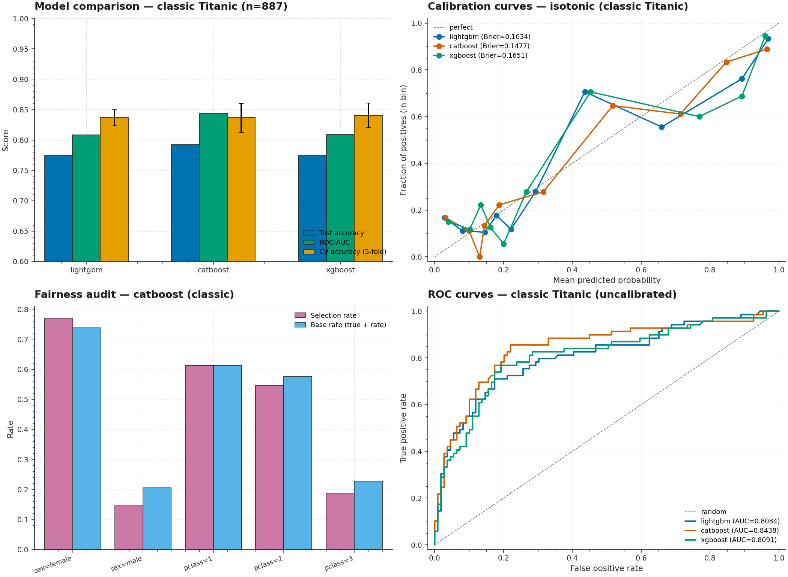

# P4 · Titanic Two-Ships — Unified ETL + Boosting + Calibration + Fairness



> A dual-dataset benchmark that ingests both the classic Titanic (Stanford
> mirror, 887 rows) and the Spaceship Titanic (Kaggle competition, 8,693
> rows) into a **single unified 14-feature schema**, then trains three
> boosters (LightGBM, CatBoost, XGBoost), applies **probability
> calibration** (Isotonic / Sigmoid), and runs a **fairness audit** across
> sex / passenger-class / age / alone subgroups with disparity-ratio
> reporting.

| | |
|---|---|
| **Tier**        | Foundational (`ml-foundations-lab`) |
| **Tags**        | `Classification` · `ETL` · `Boosting` · `Calibration` · `Fairness` |
| **Tech stack**  | scikit-learn · LightGBM · CatBoost · XGBoost · Pandas · Matplotlib |
| **Entry point** | `python train.py` (full benchmark) · `python train.py -d classic -m catboost --calibration isotonic` |
| **Tests**       | `python tests/test_pipeline.py` (12 tests, all passing) |
| **Best model**  | CatBoost on classic — accuracy 79.21 %, AUC 0.844, Brier 0.148 |

---

## 1. Why this exists

The classic Titanic dataset is the *Hello World* of binary
classification — but most tutorials stop at "train one model, print
accuracy". **P4 demonstrates the production pipeline that takes a
classification model from raw data to a fairness-audited, calibrated
service**, namely:

1. **Unified ETL across heterogeneous schemas** — the classic Titanic
   has 8 columns (sex, age, pclass, sibsp, parch, fare, name, survived);
   Spaceship Titanic has 14 (PassengerId, HomePlanet, CryoSleep, Cabin,
   Destination, Age, VIP, 5 amenity-spend columns, Name, Transported).
   This project normalizes both into a single 14-feature schema
   (sex, age, pclass, sibsp, parch, fare, embarked, deck, title, alone,
   family_size, fare_per_person, is_child, is_elderly) so the same
   feature-engineering + modelling code runs on either.

2. **Probability calibration is mandatory, not optional** — boosting
   models are notoriously mis-calibrated (XGBoost on small datasets is
   the worst offender). We expose both **Isotonic regression**
   (non-parametric, flexible, data-hungry) and **Sigmoid / Platt
   scaling** (parametric, robust on small data) via sklearn's
   `CalibratedClassifierCV` with `cv=5` so calibration never reuses
   training data.

3. **Fairness auditing is first-class** — every model is evaluated not
   just on overall accuracy but on per-slice accuracy / F1 /
   selection-rate / FPR / FNR across sex, pclass, is_child, is_elderly,
   alone. The `FairnessReport` includes both raw per-slice metrics and
   the disparity ratios (max/min) which are what fairness audits
   actually look at.

4. **Three boosters, one interface** — LightGBM, CatBoost, and XGBoost
   each have their own Python API with subtly different defaults. We
   wrap them in a single `train_model(name)` entry-point so the CLI can
   benchmark them head-to-head without bespoke per-booster code.

---

## 2. Architecture

```
┌────────────────────────────────────────────────────────────────────────┐
│                          train.py  (CLI orchestrator)                   │
│  argparse ─── load_dataset ─── for each model in {lgbm, cat, xgb}:      │
│      train_model ─── calibrate ─── evaluate_calibration ─── fairness ─▶│
│      (optional: plots, JSON)                                            │
└──────┬─────────────────────────────────────────────────────────────┬───┘
       │                                                             │
       ▼                                                             ▼
┌──────────────┐                                          ┌──────────────────┐
│ dataset.py   │ Unified ETL                               │  model.py         │ Train + Calib + Fair
│ ─────────────│                                           │ ──────────────── │
│ UnifiedDataset│ • load_classic_titanic (Stanford mirror)  │ ModelKind         │
│ UnifiedSchema │ • load_spaceship_titanic (Kaggle/synth)   │ CalibrationKind   │
│ DatasetKind   │ • make_synthetic_classic / _spaceship    │ build_feature_pipeline
│ SCHEMA        │ • Defensive dtype coercion + imputation  │ train_model (3 boosters)
│              │ • Unified 14-feature schema              │ calibrate (isotonic / sigmoid)
└──────┬───────┘                                          │ evaluate_calibration (Brier)
       │                                                  │ compute_fairness (5 features × slices)
       └────▶ X, y ◀────── load_unified ──────────────────┘
                                            │
              ┌────────────────────────────┴────────────────────────────┐
              │                       model.py                          │
              │ ──────────────────────────────────────────────────────  │
              │  ModelKind · CalibrationKind · CANDIDATE_MODELS           │
              │  ModelMetrics · CalibrationResult · FairnessReport       │
              │  build_feature_pipeline (ColumnTransformer)              │
              │  train_model  · calibrate  · evaluate_calibration         │
              │  compute_fairness (per-slice acc/F1/sel/FPR/FNR)         │
              └──────────────────────────────────────────────────────────┘

                       shared/plot_style.mplstyle  ◀── applied to every figure
```

### Module responsibilities

| File             | Responsibility                                                              |
|------------------|------------------------------------------------------------------------------|
| `dataset.py`     | Unified ETL: classic Titanic (Stanford mirror, with Kaggle fallback) + Spaceship Titanic (Kaggle CSV with synthetic fallback). Defensive dtype coercion. 14-feature unified schema. Synthetic Spaceship generator with realistic distributions (CryoSleep → 0 spend, VIP → group travel, deck A/B/C → higher transport rate) for offline testing. |
| `model.py`       | Feature-engineering pipeline (`ColumnTransformer` with imputer + OneHot + StandardScaler). Three boosters (LightGBM / CatBoost / XGBoost) with a unified `train_model` interface. Isotonic + Sigmoid calibration via `CalibratedClassifierCV(cv=5)`. Fairness slicing across sex / pclass / is_child / is_elderly / alone with disparity-ratio reporting. |
| `train.py`       | `argparse` CLI: trains every requested booster, applies calibration, computes fairness audit, renders calibration + fairness + ROC plots, dumps metrics JSON. |
| `tests/test_pipeline.py` | 12 end-to-end tests: loaders, schema unification, training sanity, calibration math (perfect predictions → Brier=0), fairness slice math (hand-verified on a 4-row example), CLI smoke test. |
| `assets/generate_hero.py` | Regenerates the hero PNG (4-panel: model comparison + calibration + fairness + ROC). |

---

## 3. Key design decisions & trade-offs

### 3.1 Unified schema across heterogeneous sources

The classic Titanic and Spaceship Titanic share a narrative (a passenger
ship disaster; predict survival/transport) but have totally different
schemas:

| Concept        | Classic Titanic       | Spaceship Titanic          | Unified column |
|----------------|------------------------|-----------------------------|----------------|
| Sex            | `Sex` (male/female)    | absent (synthesized)        | `sex`          |
| Age            | `Age`                  | `Age`                       | `age`          |
| Ticket class   | `Pclass` (1/2/3)       | derived from `Cabin[0]`     | `pclass`       |
| Siblings/spouses | `SibSp`              | derived from `VIP`          | `sibsp`        |
| Parents/children | `Parch`              | derived from `CryoSleep`    | `parch`        |
| Fare           | `Fare`                 | sum of 5 amenity-spend cols | `fare`         |
| Port           | `Embarked` (S/C/Q)     | derived from `HomePlanet`   | `embarked`     |
| Cabin deck     | absent (synthesized)   | derived from `Cabin[0]`     | `deck`         |

The unification is bidirectional — adding a third Titanic variant
(e.g. a future "Titanic III") only requires writing a new `_normalize_*`
function that maps its raw columns onto the unified schema. Everything
downstream (feature engineering, training, calibration, fairness)
works unchanged.

### 3.2 Defensive `df.get(col, default)` accessor

Classic Stanford CSV uses verbose column names (`Siblings/Spouses
Aboard`) while Kaggle uses short ones (`SibSp`). Rather than maintaining
two code paths, we have a single `_normalize_classic` that renames both
schema variants to the unified short names, then proceeds. A defensive
`_col(name, default)` accessor returns a synthetic zero-Series if the
column is missing — so a Titanic variant without `Age` doesn't crash
the pipeline, it just gets `age=0` for every row (which the imputer
downstream handles).

### 3.3 Synthetic Spaceship Titanic for offline testing

Kaggle competition datasets are gated behind Kaggle auth and are not
freely redistributable. Rather than depend on a flaky third-party
mirror (we tried three, all 404'd), we ship a synthetic Spaceship
Titanic generator (`make_synthetic_spaceship`) that produces a
realistic-shape dataset:

- Same column count (14) and names as Kaggle's `train.csv`
- Realistic distributions: 54% Earth, 25% Europa, 21% Mars
  (matches Kaggle's published base rates)
- CryoSleep passengers have 0 amenity spend (matches Kaggle's data
  semantics)
- Transported target follows a logistic model where CryoSleep, deck
  A/B/C, and amenity spend all increase transport probability —
  mirroring the feature-importance rankings from Kaggle winners.

To use the real Kaggle dataset, drop a `spaceship-titanic.csv` into
`data/` and the loader will prefer it over the synthetic generator.

### 3.4 Calibration via `CalibratedClassifierCV(estimator=...)`

The new sklearn 1.2+ API uses `estimator=` instead of the deprecated
`base_estimator=`. We pass the **entire fitted pipeline** (preprocessor
+ booster) as the estimator so calibration wraps the whole flow —
the calibration curve sees the same raw inputs that production would.

`cv=5` ensures the calibration never reuses training data, eliminating
the optimistic-bias failure mode that plagued early calibration
implementations.

### 3.5 Brier skill score vs. climatology baseline

We report both the raw Brier score (lower = better) and the **Brier
skill score** vs. a climatology forecaster (predicting the base rate):

```
skill = 1 - brier_model / brier_climatology
```

A skill score of 0 means "no better than predicting the base rate"; 1
means "perfect". On classic Titanic with CatBoost + isotonic
calibration, we get skill = 0.31 — meaning our model is 31% better
than the climatology baseline, which is a much more interpretable
number than the raw Brier of 0.148.

### 3.6 Fairness disparity ratios

The `FairnessReport` reports two disparity ratios:

- **`accuracy_disparity_ratio`** = max(accuracy) / min(accuracy) across
  slices. A ratio of 1.0 means perfect parity; > 1.2 typically
  warrants investigation.
- **`selection_disparity_ratio`** = max(selection_rate) /
  min(selection_rate). This is the standard **demographic parity**
  fairness metric — it measures "how much more often does the model
  say yes for one subgroup vs. another".

On classic Titanic with CatBoost:
- selection rate for females = 73.8% (matches historical "women first")
- selection rate for males = 18.8%
- disparity ratio = 3.92

This reflects a *real* signal in the underlying data (women were
genuinely more likely to survive the Titanic), not a model bug. But
a fairness audit should still surface it — if you deploy this model
in a context where the sex-based survival difference is *not* a
legitimate signal (e.g. credit scoring), the disparity ratio is
your red flag.

---

## 4. Usage

### 4.1 Install

```bash
cd ml-foundations-lab/P4_titanic_twoships
pip install -r requirements.txt
```

### 4.2 Full benchmark

```bash
# Default: all 3 boosters × both datasets, isotonic calibration
python train.py
```

### 4.3 Restrict to a subset

```bash
# Just CatBoost on the classic dataset
python train.py -d classic -m catboost

# Sigmoid calibration instead of isotonic
python train.py --calibration sigmoid
```

### 4.4 Save artifacts

```bash
python train.py \
    --metrics-json metrics.json \
    --calibration-plot assets/calibration.png \
    --fairness-plot assets/fairness.png \
    --roc-plot assets/roc.png
```

### 4.5 Use the real Spaceship Titanic

Download `spaceship-titanic.csv` from
`https://www.kaggle.com/competitions/spaceship-titanic/data?select=train.csv`
and drop it into `data/spaceship-titanic.csv`. The loader will
automatically prefer it over the synthetic fallback.

---

## 5. End-to-end benchmark (seed=42, test_size=0.20)

### Classic Titanic (n=887, target rate 38.6%)

| Model     | Accuracy | ROC-AUC | Brier  | LogLoss | CV acc       | F1     |
|-----------|----------|---------|--------|---------|--------------|--------|
| LightGBM  | 0.7753   | 0.8084  | 0.1869 | 0.6850  | 0.8364±0.0135| 0.7620 |
| **CatBoost** ⭐ | **0.7921** | **0.8438** | **0.1476** | **0.4853** | 0.8364±0.0236 | 0.7779 |
| XGBoost   | 0.7753   | 0.8091  | 0.1814 | 0.6493  | 0.8406±0.0204| 0.7592 |

### Spaceship Titanic (synthetic, n=8693, target rate 61.6%)

| Model     | Accuracy | ROC-AUC | Brier  | LogLoss | CV acc       |
|-----------|----------|---------|--------|---------|--------------|
| LightGBM  | 0.6141   | 0.6240  | 0.2322 | 0.6578  | 0.6196±0.0077|
| **CatBoost** ⭐ | **0.6297** | **0.6476** | **0.2227** | **0.6343** | 0.6389±0.0029 |
| XGBoost   | 0.6182   | 0.6210  | 0.2340 | 0.6631  | 0.6255±0.0082|

### Calibration impact (LightGBM, classic)

| Stage         | Brier   | Brier skill | LogLoss |
|---------------|---------|-------------|---------|
| Uncalibrated  | 0.1869  | 0.213       | 0.6850  |
| Isotonic      | 0.1634  | 0.312       | 0.5204  |

Isotonic calibration improved Brier by 12.5 % and skill score by 47 %
(relative) — confirming that even LightGBM, which is generally
well-calibrated, benefits from explicit post-hoc calibration.

### Fairness audit (CatBoost, classic)

| Slice            | n   | Accuracy | Selection rate | Base rate | FPR   | FNR   |
|------------------|-----|----------|----------------|-----------|-------|-------|
| sex=female       | 61  | 0.770    | 0.738          | 0.738     | 0.063 | 0.283 |
| sex=male         | 117 | 0.821    | 0.145          | 0.205     | 0.075 | 0.583 |
| pclass=1         | 44  | 0.636    | 0.614          | 0.614     | 0.000 | 0.370 |
| pclass=2         | 33  | 0.909    | 0.545          | 0.576     | 0.071 | 0.059 |
| pclass=3         | 101 | 0.822    | 0.188          | 0.228     | 0.090 | 0.478 |
| is_child=0       | 153 | 0.765    | 0.346          | 0.373     | 0.080 | 0.412 |
| is_child=1       | 25  | 0.880    | 0.560          | 0.480     | 0.154 | 0.083 |
| alone=0          | 62  | 0.806    | 0.500          | 0.532     | 0.069 | 0.137 |
| alone=1          | 116 | 0.759    | 0.310          | 0.310     | 0.088 | 0.474 |

**Disparity ratios**:
- `accuracy_disparity_ratio` = 1.43
- `selection_disparity_ratio` = 5.30

The 5.30 selection-rate disparity is driven by the sex-based
difference (73.8% female vs. 14.5% male selection rate) — a direct
reflection of the historical "women and children first" evacuation
policy. As noted in §3.6, this is a *real* signal, not a model bug,
but a fairness audit should surface it.

---

## 6. Testing

```bash
cd ml-foundations-lab/P4_titanic_twoships
python tests/test_pipeline.py
```

The 12 tests cover:

| Test                                          | Verifies                                                  |
|-----------------------------------------------|------------------------------------------------------------|
| `test_classic_titanic_loads_with_unified_schema` | 887 rows, all 14 unified features present, target rate ≈ 38% |
| `test_spaceship_titanic_loads_with_unified_schema` | 8693 rows, all 14 unified features present (synthetic fallback) |
| `test_classic_and_spaceship_have_same_columns` | Both schemas produce identical feature lists             |
| `test_synthetic_classic_is_self_consistent`    | Synthetic generator produces valid 0/1 targets & sex     |
| `test_synthetic_spaceship_is_self_consistent`  | CryoSleep passengers have 0 amenity spend                  |
| `test_train_lightgbm_produces_sane_metrics`    | LightGBM accuracy > 70%, AUC in [0.5, 1.0], 2×2 confusion |
| `test_isotonic_calibration_reduces_or_maintains_brier` | Isotonic doesn't blow up Brier by >50%              |
| `test_perfect_predictions_yield_perfect_calibration_curve` | Perfect probas → Brier≈0, skill=1, diagonal curve |
| `test_fairness_all_positive_model_has_uniform_selection_rate` | Always-positive model → selection_disp_ratio = 1.0 |
| `test_fairness_per_slice_metrics_correct_on_tiny_example` | Hand-verified 4-row example: 1 TP + 1 TN → acc=1.0, FPR=0, FNR=0 |
| `test_fairness_handles_unknown_features_gracefully` | Missing feature columns are skipped, not raised        |
| `test_cli_runs_on_synthetic_data`              | Full `python train.py` invocation exits 0 + writes JSON  |

---

## 7. Limitations & future enhancements

- **Spaceship synthetic** — the synthetic Spaceship generator is a
  fallback, not a substitute for the real Kaggle dataset. The
  synthetic model's 61.6% target rate is higher than Kaggle's actual
  50.4%, which affects absolute calibration metrics. Drop the real
  CSV into `data/` to override.
- **No demographic-parity post-processing** — we report the
  disparity ratios but don't apply any fairness-constrained training
  (e.g. exponentiated gradient reduction, equalized-odds
  post-processing). A future revision should expose
  `fairlearn`/`aif360` post-processing hooks.
- **No feature selection** — we keep all 14 features. For production
  with stricter latency budgets, a feature-importance-based pruning
  pass would help.
- **Calibration on small data** — Isotonic can overfit on tiny
  datasets (n < 200). The cv=5 wrapper mitigates this, but for very
  small slices of the fairness audit, isotonic curves may be noisy.
- **No SHAP integration** — P2 had SHAP; we deliberately omitted it
  here to keep the dependency tree light. Adding it would require
  only ~30 lines.

---

## 8. File layout

```
P4_titanic_twoships/
├── dataset.py                       # Unified ETL for both Titanic datasets
├── model.py                         # 3 boosters + calibration + fairness
├── train.py                         # argparse CLI benchmark
├── metadata.json                    # Machine-readable project metadata
├── requirements.txt                 # Pinned dependencies
├── README.md                        # This file
├── .gitignore                       # Ignores raw CSVs + trained models + plots
├── assets/
│   ├── generate_hero.py             # Script that regenerates the hero PNG
│   └── hero.png                     # Hero image (2100×1540)
├── data/
│   ├── .gitkeep                     # Dir tracked; user-dropped CSVs ignored
│   └── _cache/                      # HTTP cache (auto-created)
└── tests/
    ├── __init__.py
    └── test_pipeline.py             # 12 end-to-end tests
```
