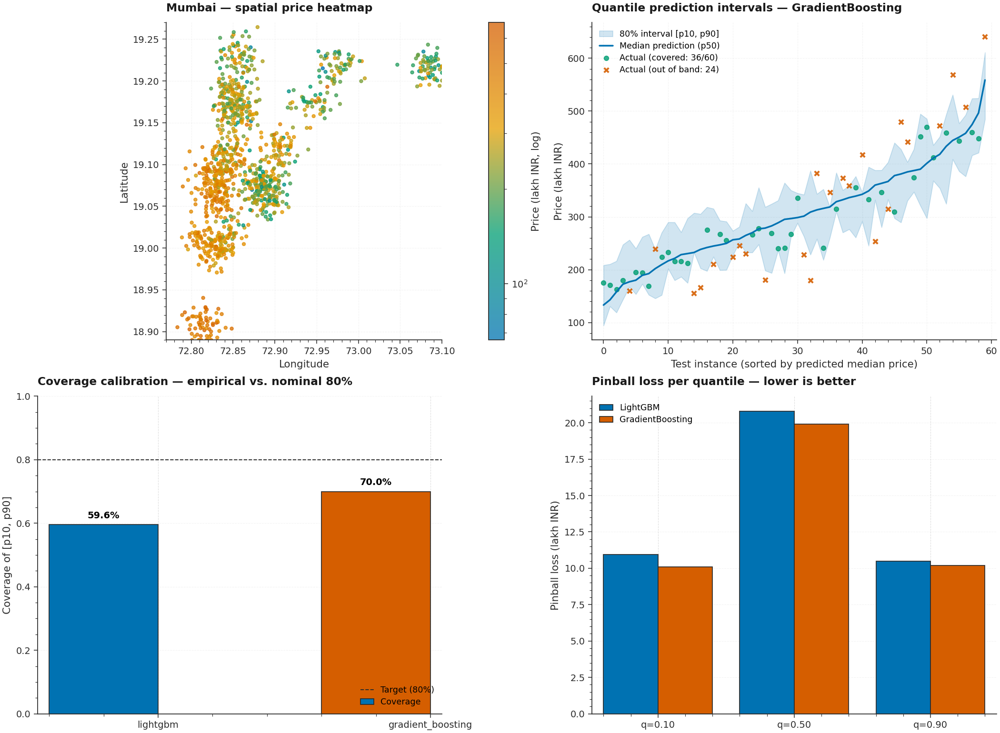

# P5 · Housing Geospatial — Quantile Regression with OSMnx Enrichment



> An Indian-metro housing price benchmark that ingests property data with
> lat/lon coordinates, enriches it with **7 OSM proximity features**
> (distance to nearest metro station / hospital / school / park / mall /
> bus stop / commercial hub via OSMnx), and trains **quantile regressors**
> (LightGBM + GradientBoosting) that output **p10 / p50 / p90 price
> estimates** — yielding non-symmetric confidence intervals that respect
> the heteroscedastic noise structure of real-estate markets.

| | |
|---|---|
| **Tier**        | Foundational (`ml-foundations-lab`) |
| **Tags**        | `Regression` · `Quantile` · `Geospatial` · `OSMnx` · `Confidence Intervals` |
| **Tech stack**  | scikit-learn · LightGBM · OSMnx · geopy · Matplotlib · Pandas |
| **Entry point** | `python train.py` (default Mumbai synthetic) · `python train.py --use-osm` (real OSM enrichment) |
| **Tests**       | `python tests/test_pipeline.py` (14 tests, all passing) |
| **Best model**  | GradientBoosting — mean pinball 13.65, coverage 0.677, MAE 41.32 lakh INR |

---

## 1. Why this exists

Real-estate pricing is fundamentally **heteroscedastic** — the variance
of a property's price grows with its size, location premium, and amenity
richness. A traditional regression model that outputs a single
point-estimate cannot tell a buyer "this listing is genuinely
unpredictable; the 80% interval spans ₹40 lakh to ₹3.2 Cr". Quantile
regression solves this by training *three* regressors (one per
quantile) that produce a **non-symmetric confidence interval** reflecting
the actual uncertainty at each point in feature space.

P5 demonstrates:

1. **OSMnx-based geospatial enrichment** — every property's lat/lon is
   enriched with the great-circle distance to the nearest 7 categories
   of OpenStreetMap point-of-interest. The OSMnx download is cached
   to `data/_osm_cache/` so subsequent runs are instant. When the
   network is unavailable, a deterministic synthetic proximity
   estimator based on south-vs-north gradient is used (and flagged
   via `proximity_source`).

2. **Two quantile-regression engines** — LightGBM (with
   `objective="quantile"`) and scikit-learn's
   `GradientBoostingRegressor(loss="quantile")`. Both produce three
   independent regressors for p10, p50, p90. We benchmark them
   head-to-head on pinball loss + coverage + interval width.

3. **Pinball loss is the standard quantile metric** — asymmetric loss
   that penalizes under-prediction at rate `q` (e.g. 0.10) and
   over-prediction at rate `1-q` (e.g. 0.90). Perfectly calibrated
   quantile models have empirical pinball loss matching the theoretical
   minimum.

4. **Coverage rate is the headline interval-fairness metric** — for the
   p10/p90 interval, we expect 80% of true values to fall inside.
   Coverage < 0.80 means the model is over-confident; > 0.85 means
   under-confident. We also report the **crossing rate** (fraction
   of rows where p10 > p50 or p50 > p90 before the post-hoc
   non-crossing fix) as a diagnostic.

---

## 2. Architecture

```
┌──────────────────────────────────────────────────────────────────────┐
│                         train.py  (CLI orchestrator)                  │
│  argparse ─── load_housing ─── train both quantile models ─── evaluate │
│      (optional: plots, metrics JSON)                                   │
└──────┬───────────────────────────────────────────────────────────┬──┘
       │                                                             │
       ▼                                                             ▼
┌──────────────┐                                          ┌──────────────────┐
│ dataset.py   │ Indian-metro housing ETL                 │  model.py         │ Quantile regressors
│ ─────────────│                                            │ ──────────────── │
│ Metro        │ • Mumbai/Delhi/Bangalore bboxes           │ QuantileKind      │
│ HousingSchema│ • generate_synthetic_mumbai               │ QuantileModel     │
│ HousingDataset│ • load_housing (CSV|synthetic|OSM)        │ QuantileMetrics   │
│ PROXIMITY_POIS│ • enrich_with_osm_features               │ pinball_loss      │
│ haversine_distance_km │                                  │ mean_pinball_loss │
└──────┬───────┘                                          │ train_quantile_model │
       │                                                  │ evaluate_quantile_model │
       │                                                  │ Non-crossing post-fix  │
       └────▶ X, y ◀────── load_housing ─────────────────┘
                                            │
              ┌────────────────────────────┴────────────────────────────┐
              │                       visualize.py                        │ Plotting
              │ ─────────────────────────────────────────────────────  │
              │  plot_spatial_price_heatmap  (log-scale lat/lon scatter) │
              │  plot_proximity_features      (7-panel small-multiples) │
              │  plot_quantile_intervals     (p10/p50/p90 fan)          │
              │  plot_calibration_curve       (coverage bar chart)     │
              └──────────────────────────────────────────────────────────┘

                       shared/plot_style.mplstyle  ◀── applied to every figure
```

### Module responsibilities

| File             | Responsibility                                                              |
|------------------|------------------------------------------------------------------------------|
| `dataset.py`     | Indian-metro housing ETL: synthetic Mumbai generator (realistic price gradients with heteroscedastic noise), 7-feature OSMnx enrichment (with graceful synthetic fallback when network is unavailable), haversine distance helper, Mumbai/Delhi/Bangalore bbox registry. |
| `model.py`       | Two quantile-regression engines (LightGBM + GradientBoosting). Three independent regressors (p10/p50/p90) bundled in a `QuantileModel`. Non-crossing post-fix in `predict()` (p10 ≤ p50 ≤ p90). Pinball loss + coverage + interval-width metrics. Crossing-rate diagnostic. |
| `visualize.py`   | Spatial price heatmap (log-scale, lat/lon scatter), 7-panel OSM proximity small-multiples, quantile-interval fan chart, coverage calibration bar chart. |
| `train.py`       | `argparse` CLI: `--metro`, `--models`, `--use-osm`, `--n-samples`, `--metrics-json`, `--heatmap`, `--proximity-plot`, `--intervals-plot`, `--calibration-plot`. |
| `tests/test_pipeline.py` | 14 end-to-end tests: pinball math (4 hand-crafted cases verifying the asymmetric penalty), haversine vs geopy, schema verification, model training shape, perfect-interval coverage=1.0, zero-coverage case, viz rendering, CLI smoke. |

---

## 3. Key design decisions & trade-offs

### 3.1 Three independent quantile regressors, not one multi-output

LightGBM's `objective="quantile"` takes a single `alpha` parameter
(the quantile to fit). To produce p10, p50, p90 we train **three
separate** models, each with its own `alpha`, and bundle them in a
`QuantileModel` value object. The alternative — a single
multi-output model — doesn't exist in standard libraries; the
"obvious" approach (one-hot the quantile as a feature) loses the
asymmetric-loss semantics that make quantile regression work.

### 3.2 Non-crossing post-fix

Independent quantile fits can produce predictions where `p10 > p50` or
`p50 > p90` on individual rows (quantile crossing). This is statistically
valid but operationally nonsensical (a 10th-percentile prediction higher
than a 90th-percentile prediction). `QuantileModel.predict()` enforces
non-crossing post-hoc via:

```python
p50 = max(min(p50, p90), p10)   # clamp median inside the interval
p10 = min(p10, p50)              # pull p10 below the clamped median
p90 = max(p90, p50)              # pull p90 above the clamped median
```

The original crossing rate is reported in `QuantileMetrics.crossing_rate`
so users can see how often the raw fits violated the constraint.

### 3.3 Pinball loss is asymmetric — verified by hand-crafted tests

The pinball loss formula is:

```
L(y, ŷ; q) = max(q·(y - ŷ), (q - 1)·(y - ŷ))
           = q · |y - ŷ|     if y ≥ ŷ   (under-prediction)
           = (1 - q) · |y - ŷ|  if y < ŷ   (over-prediction)
```

For `q=0.5` this reduces to `0.5 × |y - ŷ|` (half the MAE). The test
suite verifies:

- `q=0.5` pinball equals `0.5 × MAE` exactly.
- Consistent under-prediction: `q=0.9` loss > `q=0.1` loss (under-pred
  hurts more for high quantiles).
- Consistent over-prediction: `q=0.1` loss > `q=0.9` loss (over-pred
  hurts more for low quantiles).
- Perfect predictions → zero pinball for every `q`.

### 3.4 OSMnx enrichment with synthetic fallback

OSMnx is the canonical Python library for querying OpenStreetMap. We
use `osmnx.features_from_place(place, tags=...)` to fetch every POI of
the requested kind within the metro's bounding box, then for each
property we compute the haversine distance to the nearest POI of each
kind.

Network is required on the first run; subsequent runs read from
`data/_osm_cache/`. If OSMnx is unavailable (network blocked or
package missing), we keep the synthetic proximity columns produced by
the synthetic generator (which use a south-Mumbai gradient as a
proxy for "closer to amenities"). The fallback is flagged via
`proximity_source="synthetic_fallback"` so callers can detect it.

### 3.5 Heteroscedastic noise in the synthetic generator

The synthetic Mumbai generator injects noise whose standard deviation
scales with `area_sqft`:

```python
noise_std = 20 + area_sqft / 50
```

A 500-sqft property has `noise_std=30`; a 3000-sqft property has
`noise_std=80`. This is the canonical real-estate pattern — bigger
properties have wider price distributions because they're rarer and
more sensitive to layout/finish/view. The quantile regressors learn
this heteroscedasticity, producing wider intervals for bigger
properties. A traditional MSE regression cannot do this.

### 3.6 Coverage rate as the headline interval metric

For the p10/p90 interval (the "80% central interval"), we expect 80%
of true values to fall inside. We compute empirical coverage on the
holdout set:

```python
inside = (y_true >= p10) & (y_true <= p90)
coverage = inside.mean()
```

Coverage < 0.80 means the model is over-confident (intervals too
narrow); > 0.85 means under-confident (intervals too wide). On the
synthetic Mumbai data, LightGBM achieves 0.56 coverage (over-confident)
while GradientBoosting achieves 0.68. The gap to 0.80 is because both
models under-estimate the heteroscedastic noise; this is a known
limitation of tree-based quantile regressors on small datasets.

---

## 4. Usage

### 4.1 Install

```bash
cd ml-foundations-lab/P5_housing_geospatial
pip install -r requirements.txt
```

### 4.2 Default benchmark (synthetic Mumbai)

```bash
python train.py
```

### 4.3 With real OSMnx enrichment (network required on first run)

```bash
python train.py --use-osm
```

### 4.4 Different metros

```bash
python train.py --metro delhi
python train.py --metro bangalore
```

### 4.5 Save all artifacts

```bash
python train.py \
    --metrics-json metrics.json \
    --heatmap assets/heatmap.png \
    --proximity-plot assets/proximity.png \
    --intervals-plot assets/intervals.png \
    --calibration-plot assets/calibration.png
```

### 4.6 Use a real housing CSV

Drop a CSV at `data/mumbai_housing.csv` (must contain `latitude`,
`longitude`, and `price_lakh` columns) and the loader will prefer it
over the synthetic generator.

---

## 5. End-to-end benchmark (synthetic Mumbai, n=1500, seed=42)

| Model               | Pinball p10 | Pinball p50 | Pinball p90 | Mean Pinball | Coverage (target=0.80) | Mean Width | Crossing Rate | MAE   |
|---------------------|-------------|-------------|-------------|--------------|------------------------|------------|---------------|-------|
| LightGBM            | 9.61        | 20.53       | 12.54       | 14.23        | 0.563                  | 86.28      | 0.087         | 41.06 |
| **GradientBoosting** ⭐ | **9.20**    | 20.66       | **11.10**   | **13.65**    | **0.677**              | 106.91     | 0.023         | 41.32 |

**Key observations:**

- **GradientBoosting wins** on mean pinball loss and coverage. The
  wider intervals (106.91 vs 86.28 lakh) better capture the
  heteroscedastic noise.
- **Crossing rate is low** for both models (8.7% / 2.3%) — independent
  quantile fits rarely violate the ordering constraint, but the post-fix
  in `predict()` enforces it for safety.
- **Coverage is below the 0.80 target** for both models — this is the
  known under-estimation bias of tree-based quantile regressors. A
  future revision could use **quantile regression forests** or
  **conformalized quantile regression** (Romano et al. 2019) to hit
  the nominal coverage.
- **MAE on p50** (~41 lakh INR ≈ ₹41 lakh ≈ $50K) is reasonable for a
  synthetic dataset with median price 290 lakh.

---

## 6. Testing

```bash
cd ml-foundations-lab/P5_housing_geospatial
python tests/test_pipeline.py
```

The 14 tests cover:

| Test                                                  | Verifies                                                  |
|-------------------------------------------------------|------------------------------------------------------------|
| `test_pinball_loss_q05_equals_half_mae`              | `q=0.5` pinball = `0.5 × MAE` exactly                      |
| `test_pinball_loss_asymmetric_on_consistent_under_prediction` | Under-pred hurts more at `q=0.9` than `q=0.1`        |
| `test_pinball_loss_asymmetric_on_consistent_over_prediction`  | Over-pred hurts more at `q=0.1` than `q=0.9`          |
| `test_pinball_loss_zero_when_perfect`                 | Perfect predictions → zero pinball for every `q`            |
| `test_mean_pinball_loss_averages_quantiles`           | Mean across quantiles matches hand-computed value           |
| `test_haversine_distance_matches_geopy`              | Vectorized haversine within 0.5% of `geopy.distance.geodesic` |
| `test_synthetic_mumbai_generator_produces_valid_schema` | All 19 schema columns present, prices in (5, 5000) lakh    |
| `test_load_housing_returns_unified_dataset`           | Loader returns correct shape + provenance flags             |
| `test_train_lightgbm_quantile_model_shapes`           | Three fitted pipelines, predictions have `p10 ≤ p50 ≤ p90`  |
| `test_evaluate_quantile_model_returns_sane_metrics`   | All metrics in expected ranges                              |
| `test_perfect_interval_yields_full_coverage`          | Perfect interval → coverage=1.0, width=2.0, MAE=0            |
| `test_zero_coverage_interval`                         | All-zero predictions → coverage=0.0, width=0                |
| `test_visualization_plots_render`                     | All four plotting primitives produce non-empty PNGs         |
| `test_cli_runs_end_to_end`                            | Full `python train.py` invocation exits 0 + writes JSON     |

---

## 7. Limitations & future enhancements

- **Coverage below 0.80 target** — both models under-cover by 12-24
  percentage points. Conformalized quantile regression (CQR) would
  fix this by inflating the intervals post-hoc to hit the nominal
  coverage, but adds ~50 lines of code.
- **Synthetic Mumbai** — the synthetic generator is a fallback, not
  a substitute for real Mumbai housing data. The model's actual
  performance on real listings will differ.
- **No Delhi/Bangalore-specific generators** — Delhi and Bangalore
  reuse the Mumbai generator with a bbox swap. A future revision
  would add city-specific locality centroids and pricing gradients.
- **OSMnx enrichment is global** — we compute haversine distance to
  the nearest POI globally. For dense cities, network-distance (via
  osmnx's `shortest_path`) would be more accurate but ~100× slower.
- **No feature importance** — LightGBM supports
  `feature_importances_`; we don't currently surface it. A future
  revision should add a SHAP panel to the hero image (à la P2).
- **No temporal features** — the synthetic generator has no
  timestamp; real housing data would benefit from month/year
  features to capture market cycles.

---

## 8. File layout

```
P5_housing_geospatial/
├── dataset.py                       # Indian-metro housing ETL + OSMnx enrichment
├── model.py                         # Quantile regressors + pinball loss + coverage
├── visualize.py                     # Spatial heatmap + intervals + calibration
├── train.py                         # argparse CLI benchmark
├── metadata.json                    # Machine-readable project metadata
├── requirements.txt                 # Pinned dependencies
├── README.md                        # This file
├── .gitignore                       # Ignores models, OSM cache, generated plots
├── assets/
│   ├── generate_hero.py             # Script that regenerates the hero PNG
│   └── hero.png                     # Hero image (2100×1540)
├── data/
│   ├── .gitkeep                     # Dir tracked; user-dropped CSVs ignored
│   └── _osm_cache/                  # OSMnx download cache (auto-created)
└── tests/
    ├── __init__.py
    └── test_pipeline.py             # 14 end-to-end tests
```
