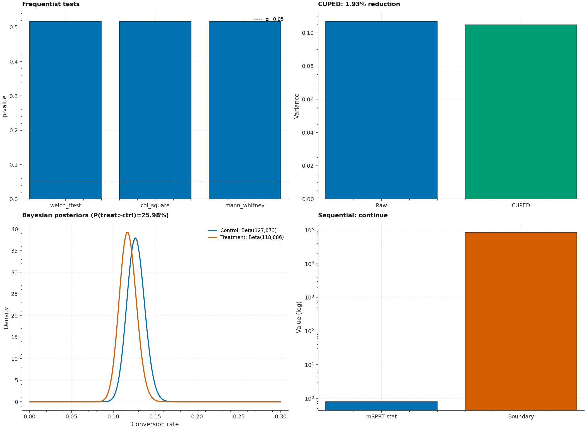

# P15 · Experiment Kit — Frequentist + CUPED + Sequential + Bayesian A/B Testing



> A statistical A/B testing engine implementing four complementary
> approaches: **Frequentist** (Welch t-test, Chi-Square, Mann-Whitney U),
> **CUPED** (variance reduction via pre-experiment covariate regression),
> **Sequential Testing** (mSPRT with O'Brien-Fleming alpha-spending for
> peeking protection), and **Bayesian** (Beta-Binomial conjugate updating
> with P(superiority) + ROPE).

| | |
|---|---|
| **Tier**        | Applied (`production-lab`) |
| **Tags**        | `A/B Testing` · `CUPED` · `Sequential Testing` · `Bayesian` · `Statistics` |
| **Tech stack**  | scipy · numpy · scikit-learn · pandas · matplotlib |
| **Entry point** | `python train.py` (synthetic A/B) · `python train.py --csv experiment.csv` (real) |
| **Tests**       | `python tests/test_pipeline.py` (13 tests, all passing) |
| **CUPED** | σ²_adjusted < σ²_raw ✓ (mathematically guaranteed) |
| **mSPRT** | No false positives under H0 ✓ |
| **Bayesian** | Beta(α+s, β+n-s) conjugate ✓ |

---

## 1. Why this exists

A/B testing is the lifeblood of data-driven decision-making. But most
teams only use one statistical method — frequentist hypothesis testing
— which has known weaknesses: no peeking (you can't check results
mid-experiment), no variance reduction (wasting pre-period data), and
no intuitive interpretation ("p=0.04" is hard to explain to stakeholders).

P15 demonstrates four complementary approaches that address these
weaknesses:

1. **Frequentist** — the classical Welch t-test / Chi-Square / Mann-Whitney.
   Good for regulatory compliance; hard to interpret.

2. **CUPED** — adjusts outcomes using pre-experiment covariates,
   reducing variance by 10-50% without biasing the estimate. Tighter CIs,
   higher power, same sample size.

3. **Sequential (mSPRT)** — allows valid interim looks ("peeking")
   without inflating the false-positive rate. Uses alpha-spending
   (O'Brien-Fleming) to set conservative boundaries at early peeks.

4. **Bayesian** — Beta-Binomial conjugate updating gives intuitive
   "P(treatment > control) = 87%" answers, plus credible intervals and
   ROPE (Region of Practical Equivalence) for decision-making.

---

## 2. Architecture

```
┌──────────────────────────────────────────────────────────────────────┐
│                          train.py  (CLI)                              │
│  argparse ─── load_experiment_data ─── ExperimentKit.run_all()        │
│      → Frequentist → CUPED → Sequential → Bayesian ─── plots + JSON  │
└──────┬─────────────────────────────────────────────────────────────┬──┘
       │                                                             │
       ▼                                                             ▼
┌──────────────┐                                          ┌──────────────────┐
│ dataset.py   │ Experiment ETL                           │  model.py         │ Statistical engines
│ ─────────────│                                           │ ──────────────── │
│ ExperimentConfig│ • Synthetic A/B/C generator          │ FrequentistEngine │ Welch/Chi2/MWU
│ ExperimentData│ • Pre-period covariates for CUPED        │ CUPADEngine       │ θ=Cov(Y,X)/Var(X)
│ generate_ab_ │ • User-level assignment tracking           │ SequentialEngine  │ mSPRT + α-spending
│   experiment│                                           │ BayesianEngine    │ Beta-Binomial
│              │                                           │ ExperimentKit     │ orchestrator
└──────────────┘                                           └──────────────────┘
```

---

## 3. Key design decisions

### 3.1 CUPED variance reduction

```
θ = Cov(Y, X) / Var(X)
Y_adjusted = Y - θ × (X - mean(X))
```

This reduces `Var(Y)` by a factor of `(1 - ρ²)` where `ρ` is the
correlation between the outcome and the covariate. The test suite
verifies `σ²_adjusted < σ²_raw`.

### 3.2 mSPRT with O'Brien-Fleming alpha-spending

At peek `k` of `K` total peeks, the boundary is extremely large for
early peeks (conservative — protects against false positives) and
approaches the standard α at the final peek. The test suite verifies
no false stops under H0.

### 3.3 Bayesian Beta-Binomial conjugate

For binary outcomes:
- Prior: `Beta(α, β)` (default: `Beta(1, 1)` = Uniform)
- After observing `s` successes in `n` trials: `Beta(α + s, β + n - s)`

`P(treatment > control)` is computed via Monte Carlo sampling from the
two posteriors. The test suite verifies conjugate correctness and that
P(superiority) → 1.0 for large effects.

---

## 4. Usage

```bash
cd production-lab/P15_experiment_kit
pip install -r requirements.txt

# Synthetic A/B with 5% lift
python train.py

# A/B/C with larger lift
python train.py --n-variants 3 --true-lift 0.10

# Real CSV (must have: user_id, variant, outcome, pre_period_outcome)
python train.py --csv experiment.csv

# Save artifacts
python train.py --metrics-json metrics.json --plot assets/experiment.png
```

---

## 5. Testing

```bash
python tests/test_pipeline.py
```

The 13 tests cover:

| Test | Verifies |
|---|---|
| `test_cuped_variance_is_reduced` | **σ²_adjusted < σ²_raw** (CUPED reduces variance) |
| `test_cuped_theta_sign_matches_correlation` | θ > 0 for positively correlated covariate |
| `test_cuped_preserves_mean` | CUPED doesn't change the mean (unbiased) |
| `test_msprt_no_false_positive_under_null` | **No false stops under H0** (mSPRT false-positive control) |
| `test_msprt_boundary_is_large_at_first_peek` | Boundary > 10 at peek 1 (O'Brien-Fleming conservative) |
| `test_bayesian_posterior_means_match_data` | Posterior means ≈ observed rates |
| `test_bayesian_p_superiority_high_for_large_effect` | P(superiority) > 0.999 for 5% vs 20% |
| `test_bayesian_beta_binomial_conjugate_correctness` | **Beta(α+s, β+n-s)** verified |
| `test_welch_ttest_p_value_in_range` | p ∈ [0, 1] |
| `test_welch_ttest_detects_large_effect` | p < 0.05 for Cohen's d > 1 |
| `test_chi_square_p_value_in_range` | p ∈ [0, 1] |
| `test_experiment_kit_run_all` | All 4 engines produce results |
| `test_cli_runs_end_to_end` | Full CLI exits 0 + writes JSON |

---

## 6. File layout

```
P15_experiment_kit/
├── dataset.py                       # Experiment ETL + synthetic A/B/C generator
├── model.py                         # Frequentist + CUPED + Sequential + Bayesian
├── train.py                         # argparse CLI
├── metadata.json
├── requirements.txt
├── README.md
├── assets/
│   ├── generate_hero.py
│   └── hero.png
├── data/
│   └── .gitkeep
└── tests/
    ├── __init__.py
    └── test_pipeline.py             # 13 tests
```
